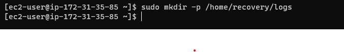
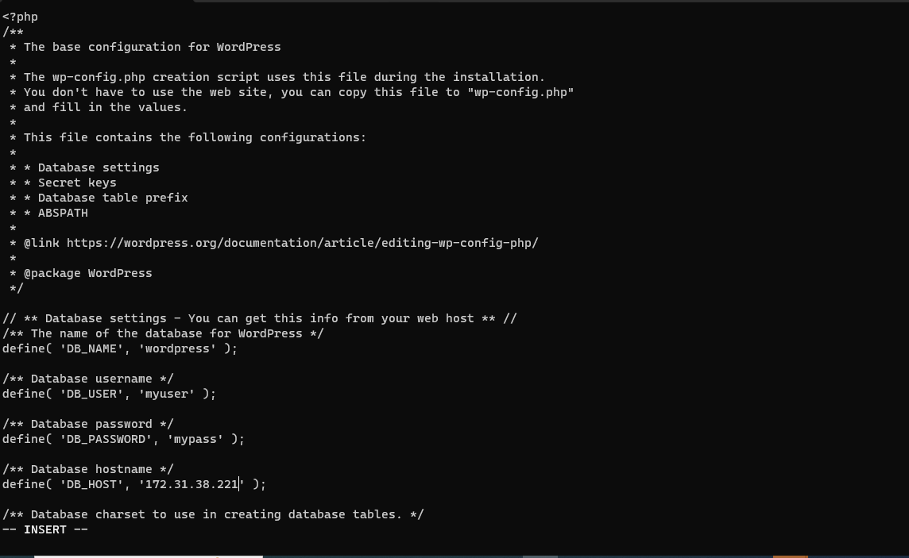
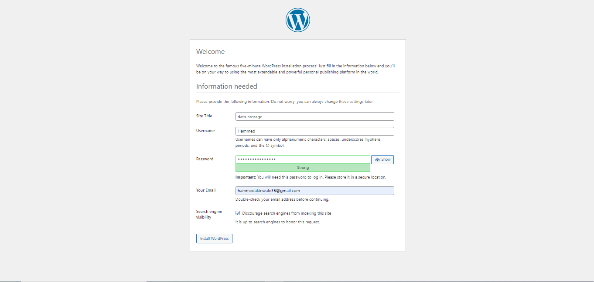

# Implementing Wordpress Website With LVM

## **STEP 1.** Preparing Web Server

**1.** Launch an EC2 instance that will server as "Web server". Create 3 volumes in the same AZ as your Web Server EC2, each of 10GB.


+ Attach all volumes to the web server EC2 instance


+ SSH into webserver EC2 instance


+ and view the disks attached to the instance with `lsblk` command.


+ use `df -h` To see all mounts and free spaces on the server


use `gdisk` to create single partitions on each volume on the server.


Install `LVM2` with `sudo yum install lvm2` the package for creating logical volumes on a linux server.


+ use `sudo pvcreate <partition_path>` to to march each of the disks as a physical volume.


+ verify if the physical volume has been created with `sudo pvs`


+ Next we will use vgcreate to add up each of the 3 physical volumes into a volume group name webdata-vg.


use `lvcreate` utility to create two logical volumes with the below commands:

```
sudo lvcreate -n apps-lv -L 14G webdata-vg

sudo lvcreate -n logs-lv -L 14G webdata-vg
```


verify that your logical volume has been created with `sudo lvs`


+ use mkfs.ext4 to format the logical volumes with ext4 filesystem with the command below:

```
sudo mkfs -t ext4 /dev/webdata-vg/apps-lv
sudo mkfs -t ext4 /dev/webdata-vg/logs-lv
```


+ create /var/www/html with `sudo mkdir -p /var/www/html` to store website files


+ create /home/recovery/logs with `sudo mkdir -p /home/recovery/logs` to store backups of log data



+ Mount /var/www/html on apps-lv logical volume with the below command:

`sudo mount /dev/webdata-vg/apps-lv /var/www/html/
`


use rsync utility to backup all the log directory /var/log into /home/recovery/logs (this is requred before mounting the file system)


+ Mount /var/log on logs-lv logical volume with `sudo mount /dev/webdata-vg/logs-lv /var/log
` (note that all the existing data on /var/log will be deleted)


+ restore log files back into /var/log directory with `sudo rsync -av /home/recovery/logs/log/. /var/log
`


update `/etc/fstab` file with `sudo blkid` so that the mount configuration will persist after restarting the server


update /etc/fstab file with `sudo vi /etc/fstab`


test the configuration and reload the daemon with `sudo mount -a
sudo systemctl and daemon-reload
` respectively

verify your setup by running `df -h`


# installing wordpress and configuring to use mysql data base

**STEP 2.** Preparing The DataBase Server

+ all the steps taken to configure web-server are repeated here. but changed apps-lv logical volume to db-lv


**STEP 3.** Installing wordpress on webserver

+ install the epel-repository with the command below:

`sudo dnf install https://dl.fedoraproject.org/pub/epel/epel-release-latest-8.noarch.rpm`


+ and install the remi-repository with the command below:

`sudo dnf install dnf-utils http://rpms.remirepo.net/enterprise/remi-release-8.rpm`

+ check the available php to be install and install them with and commands below:

```
sudo dnf module list php
sudo dnf module reset php
sudo dnf module enable php:remi-7.4
sudo dnf install php php-opcache php-gd php-curl php-mysqlnd
```


+ and verify with `php -v `


+ start and enable `php` with:

```
sudo systemctl start php-fpm
sudo systemctl enable php-fpm
```


+ check `php` status with 

`sudo systemctl status php-fpm`


+ To instruct SELinux to allow Apache to execute the PHP code via PHP-FPM run the command below:

`setsebool -P httpd_execmem 1`

+ install httpd with

`sudo yum -y install wget httpd php php-mysqlnd php-fpm php-json`


+ Finally, restart Apache web server for PHP to work with Apache web server. with:

`sudo systemctl restart httpd`


+ then load the public ip on browser


+ install wordpress
    1. makedirectory with `mkdir wordpress` and `cd wordpress`

    2. install wordpress with `sudo wget http://wordpress.org/latest.tar.gz`

    3. extract with `sudo tar xzvf latest.tar.gz`

    3. a new directory is created called `wordpress. cd into `wordpress/`

    3. copy contents of wp-config-sample.php to wp-config.php with `sudo cp -R wp-config-sample.php wp-config.php`

    4. copy wordpress to /var/www/html/

    5. copy the content of wordpress/ to /var/www/html with `sudo cp -R wordpress/. /var/www/html`

**STEP4** Installing MySQL on DB Server EC2 with:

`sudo yum install mysql-server`


to verify that system is up and running we reboot and enable with:

`sudo systemctl start mysqld

sudo systemctl enable mysqld
`

+ check the status with `sudo systemctl status mysqld`


run `sudo mysql_secure_installation` to activate secure installation

**STEP5** Set Up DB Server to work with wordpress

```
sudo mysql
CREATE DATABASE wordpress;
CREATE USER `myuser`@`<Web-Server-Private-IP-Address>` IDENTIFIED BY 'mypass';
GRANT ALL ON wordpress.* TO 'myuser'@'<Web-Server-Private-IP-Address>';
FLUSH PRIVILEGES;
SHOW DATABASES;
exit
```


+ set the bind address with `sudo vi /etc/my.cnf`


+ Ensured that port 3306 is enabled on our db server to allow our web server to access the database server.


### Connect Web Server to DB Server

on webserver edit /var/www/html with `sudo vi wp-config.php` 



runn ` sudo mv /etc/httpd/conf.d/welcome.conf /etc/httpd/conf.d/welcome.conf_backup` to disable apache default page

+ Install mySQl client on the web server to connect to the db server

run `sudo yum install mysql

sudo mysql -u admin -p -h <DB-Server-Private-IP-address>
`


+ then configure bind and configure.php and load the webserver public ip address





