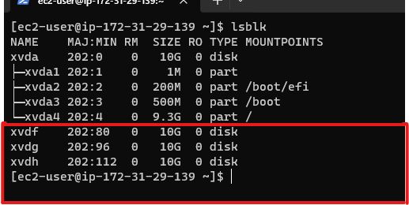
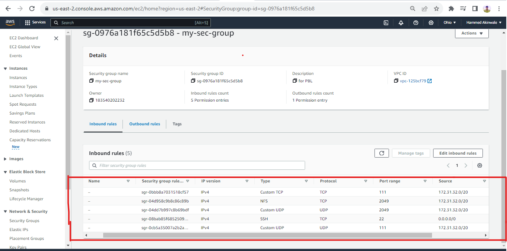

# DevOps-Website-Solution

In previous project [Implementing wordpress solution](https://github.com/hammedakinwale/Devops-projects/tree/main/9-implementing-wordpress-website) I implemented a WordPress based solution that is ready to be filled with content and can be used as a full fledged website or blog. Moving further I will add some more value to my solution for members of a DevOps team to utilize it.

In this project we be will implementing a solution that consists of following components:

+ Infrastructure: AWS

+ Webserver Linux: Red Hat Enterprise Linux 8

+ Database Server: Ubuntu 20.04 + MySQL

+ Storage Server: Red Hat Enterprise Linux 8 + NFS Server

+ Programming Language: PHP

+ Code Repository: Github

## Achitectural Design:


## implementing business wiebsite using`NFS` as it backend file storage

**STEP1.** prepare `NFS` server

1. Spin up a new EC2 instance with `RHEL` Linux 8 Operating System.


2. Based on the LVM experience from Project 6, we will Configure LVM on the Server.
    
+ we will create volumes for the NFS server




+ create partitiond with the gdisk utility 


+  install lvm2 with `sudo yum install lvm2`


+ Instead of formating the disks as ext4 we will to format them as `xfs`

```
sudo mkfs -t xfs /dev/webdata-vg/lv-apps
sudo mkfs -t xfs /dev/webdata-vg/lv-logs
sudo mkfs -t xfs /dev/webdata-vg/lv-opt
```


3. Create mount points on /mnt directory for the logical volumes as follow:

+ Mount lv-apps on /mnt/apps – To be used by webservers

+ Mount lv-logs on /mnt/logs – To be used by webserver logs

+ Mount lv-opt on /mnt/opt – To be used by Jenkins server in Project 8.

by using the commands below:

```
sudo mkdir /mnt/apps

sudo mkdir /mnt/logs

sudo mkdir /mnt/opt

sudo mount /dev/webdata-vg/lv-apps /mnt/apps

sudo mount /dev/webdata-vg/lv-logs /mnt/logs

sudo mount /dev/webdata-vg/lv-opt /mnt/opt
```

+ when done run sudo `blkid` to get the UUID of the mount part, open and paste the UUID in the fstab file.

by `sudo vi /etc/fstab`

```
sudo mount -a 
sudo systemctl daemon-reload
```


4. Install NFS server, configure it to start on reboot and make sure it is u and running

```
sudo yum -y update

sudo yum install nfs-utils -y

sudo systemctl start nfs-server.service

sudo systemctl enable nfs-server.service

sudo systemctl status nfs-server.service
```

5. Export the mounts for webservers subnet cidr to connect as clients. For simplicity, you will install your all three Web Servers inside the same subnet, but in production set up you would probably want to separate each tier inside its own subnet for higher level of security. To check your subnet cidr – open your EC2 details in AWS web console and locate ‘Networking’ tab and open a Subnet link:


+ we will set up permissions that will allow our Web servers read, write and execute files on NFS:

```sudo chown -R nobody: /mnt/apps

sudo chown -R nobody: /mnt/logs

sudo chown -R nobody: /mnt/opt

sudo chmod -R 777 /mnt/apps

sudo chmod -R 777 /mnt/logs

sudo chmod -R 777 /mnt/opt

sudo systemctl restart nfs-server.service```

+ Configure access to NFS for clients within the same subnet (example of Subnet CIDR – `172.31.32.0/20`):

```sudo vi /etc/exports

/mnt/apps <Subnet-CIDR>(rw,sync,no_all_squash,no_root_squash)
/mnt/logs <Subnet-CIDR>(rw,sync,no_all_squash,no_root_squash)
/mnt/opt <Subnet-CIDR>(rw,sync,no_all_squash,no_root_squash)

Esc + :wq!  to exit vim

sudo exportfs -arv
```


6. Check which port is used by NFS and open it using Security Groups (add new Inbound Rule) rpcinfo -p | grep nfs

**NOTE**: In order for NFS server to be accessible from your client, you must also open following ports: **TCP 111**, **UDP 111**, **UDP 2049**

`rpcinfo -p | grep nfs
`




# congigure backend database as part of 3 tier architecture

**STEP2.** CONFIGURE THE DATABASE SERVER

1. Install MySQL server with `sudo yum install mysql-server`

to verify that system is up and running we reboot and enable with:

```
sudo systemctl start mysqld
sudo systemctl enable mysqld
```

+ check the status with `sudo systemctl status mysqld`

2. Create a database and name it `tooling`

```
sudo mysql -u root -p
create database tooling;
```

3. Create a database user and name it `webaccess`

`create user 'webaccess'@'%' identified by 'password';`

4. Grant permission to webaccess user on tooling database to do anything only from the webservers `subnet cidr`
`grant all privileges on tooling.* to 'webaccess'@'%';`


**STEP3.** PREPARE THE WEB SERVERS

+ During the next steps we will do following:

+ Configure NFS client (this step must be done on all three servers)

+ Deploy a Tooling application to our Web Servers into a shared NFS folder

+ Configure the Web Servers to work with a single MySQL database

1. Launch a new EC2 instance with RHEL 8 Operating System

2. Install NFS client

`sudo yum install nfs-utils nfs4-acl-tools -y`


3. Mount `/var/www`/ and target the NFS server’s export for apps

```
sudo mkdir /var/www
sudo mount -t nfs -o rw,nosuid <NFS-Server-Private-IP-Address>:/mnt/apps /var/www
```


4. Verify that NFS was mounted successfully by running df -h. Make sure that the changes persist on Web Server after reboot:

```
sudo vi /etc/fstab

add following line;


<NFS-Server-Private-IP-Address>:/mnt/apps /var/www nfs defaults 0 0
```


5. Install Remi’s repository, Apache and PHP

```
sudo yum install httpd -y

sudo yum install https://dl.fedoraproject.org/pub/epel/epel-release-latest-8.noarch.rpm

sudo yum install dnf-utils http://rpms.remirepo.net/enterprise/remi-release-8.rpm

sudo yum module  list php -y

sudo yum module reset php -y

sudo yum module enable php:remi-7.4 -y

sudo yum install php php-opcache php-gd php-curl php-mysqlnd -y

sudo systemctl start php-fpm

sudo systemctl enable php-fpm

sudo setsebool -P httpd_execmem 1

sudo systemctl restart httpd
```

## Repeat steps 1-5 for another 2 Web Servers.

6. Verify that Apache files and directories are available on the Web Server in `/var/www` and also on the NFS server in `/mnt/apps`. If you see the same files – it means NFS is mounted correctly. You can try to create a new file touch test.txt from one server and check if the same file is accessible from other Web Servers.

7. Locate the log folder for Apache on the Web Server and mount it to NFS server’s export for logs. Repeat step 4 under the 'prepare web servers' to make sure the mount point will persist after reboot.


sudo vi /etc/fstab


8. Fork the tooling source code from Darey.io Github Account to your Github account.


9. Deploy the tooling website’s code to the Webserver. Ensure that the html folder from the repository is deployed to /var/www/html


**NOTE1:** Note 1: Do not forget to open TCP port 80 on the Web Server.

**NOTE2:** Note 2: If you encounter 403 Error – check permissions to your `/var/www/html` folder and also disable SELinux `sudo setenforce 0`

To make this change permanent – open following config file `sudo vi /etc/sysconfig/selinux` and set `SELINUX=disabled` then restart httpd.


```
sudo systemctl restart httpd
sudo systemctl status httpd
```

10. Update the website’s configuration to connect to the database `(in /var/www/html/functions.php file)`. Apply tooling-db.sql script to your database using this command `mysql -h <database-private-ip> -u <db-username> -p <db-password> < tooling-db.sql`


11. create a new admin user with username `myuser` and password `password` and connect to it from web-server

edit the bind rule by running

```
sudo vi /etc/mysql/mysql.conf.d//mysqld.cnf

sudo systemctl restart mysql

sudo systemctl status mysql
```


incase there is an error or the server didn't load cd int `html` and run `curl localhost/index.php` this should help

12. Open the website in your browser http:///index.php and make sure you are able to login into the website with myuser user.


