# Jenkins CI/CD on a 3-tier application && Ansible Configuration Management Dev and UAT servers using Static Assignments

## ANSIBLE REFACTORING AND STATIC ASSIGNMENTS (IMPORTS AND ROLES)

Code Refactoring

Refactoring is a general term in computer programming. It means making changes to the source code without changing expected behaviour of the software. The main idea of refactoring is to enhance code readability, increase maintainability and extensibility, reduce complexity, add proper comments without affecting the logic.

### Step 1 – Jenkins job enhancement

Before we begin, let us make some changes to our Jenkins job – now every new changes in the codes creates a separate directory which is not very convenient when we want to run some commands from one place. Besides, it consumes space on Jenkins serves with each subsequent change. Let us enhance it by introducing a new Jenkins project/job – we will require Copy Artifact plugin.

1. Go to your Jenkins-Ansible server and create a new directory called ansible-config-artifact – we will store there all artifacts after each build.

`sudo mkdir /home/ubuntu/ansible-config-artifact`

2. Change permissions to this directory, so Jenkins could save files there – `chmod -R 0777 /home/ubuntu/ansible-config-artifact`

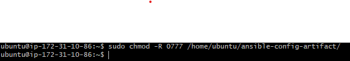

3. Go to Jenkins web console -> Manage Jenkins -> Manage Plugins -> on `Available` tab search for `Copy Artifact` and install this plugin without restarting Jenkins

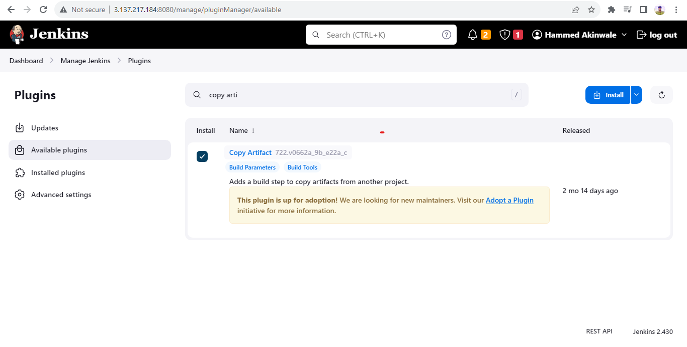

4. Create a new Freestyle project (you have done it in Project 9) and name it `save_artifacts`.

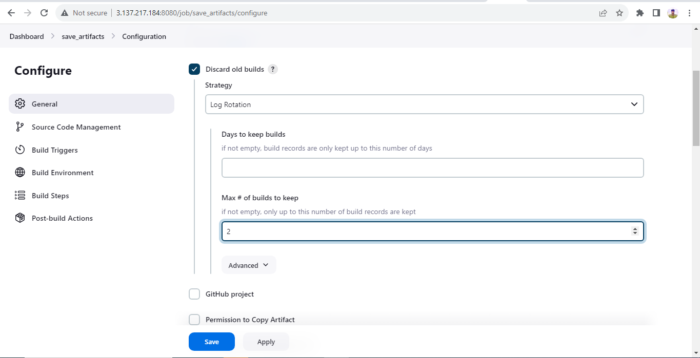
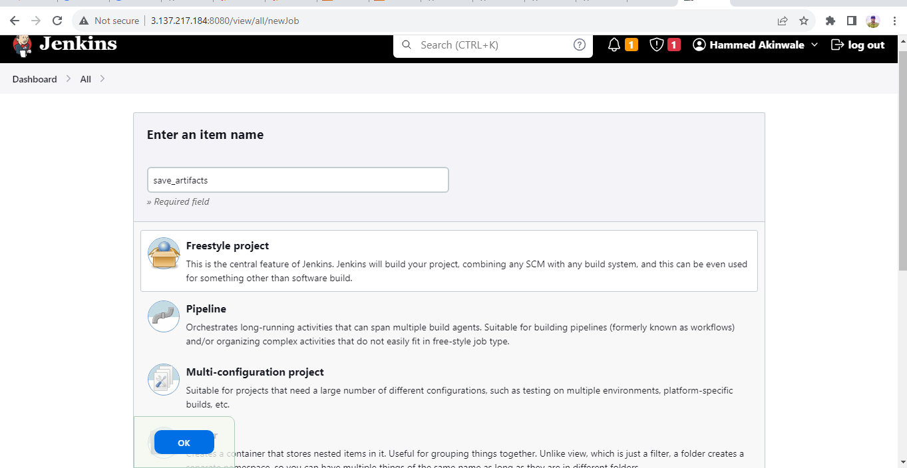

5. This project will be triggered by completion of your existing ansible project. Configure it accordingly:

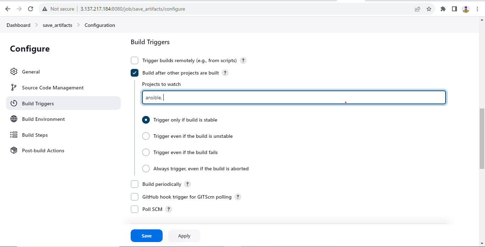

Note: You can configure number of builds to keep in order to save space on the server, for example, you might want to keep only last 2 or 5 build results. You can also make this change to your ansible job.

6. The main idea of save_artifacts project is to save artifacts into `/home/ubuntu/ansible-config-artifact` directory. To achieve this, create a `Build` step and choose `Copy artifacts` from other project, specify `ansible` as a source project and `/home/ubuntu/ansible-config-artifact` as a target directory.

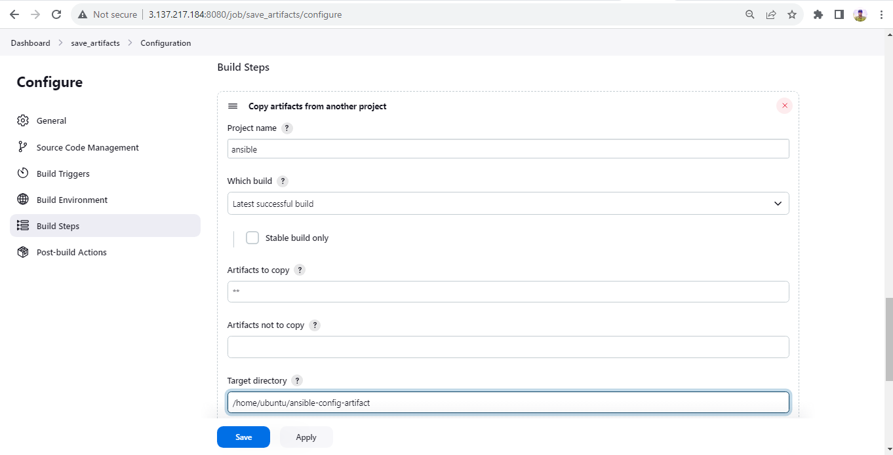

7. Test your set up by making some change in `README.MD` file inside your `ansible-config-mgt` repository (right inside master branch).

+ in case the artifacts is not successful run `sudo chmod -R 777 /home/ubuntu` before and `sudo chmod -R 755 /home/ubuntu`

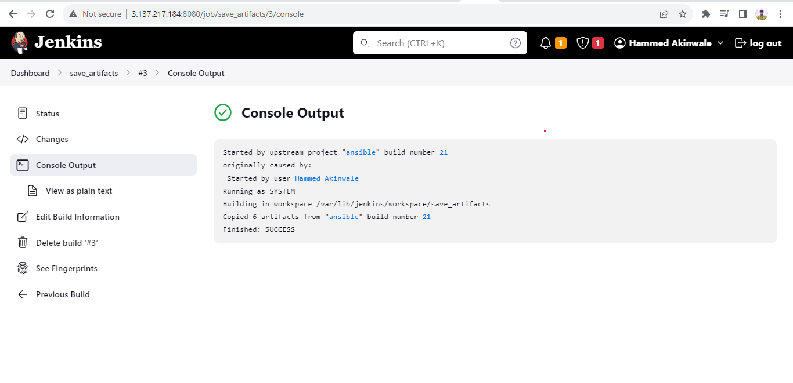

Now your Jenkins pipeline is more neat and clean.

# REFACTORING ANSIBLE CODE BY IMPORTING OTHER PLAYBOOKS INTO SITE.YML

### Step 2 – Refactor Ansible code by importing other playbooks into site.yml

Before starting to refactor any codes, ensure that you have pulled down the latest code from `master` (main) branch, and created a new branch, name it `refactor`.

1. Within playbooks folder, create a new file and name it `site.yml` – This file will now be considered as an entry point into the entire infrastructure configuration. Other playbooks will be included here as a reference. In other words, `site.yml` will become a parent to all other playbooks that will be developed. Including `common.yml` that you created previously.

2. Create a new folder in root of the repository and name it `static-assignments`. The static-assignments folder is where all other children playbooks will be stored. This is merely for easy organization of your work. It is not an Ansible specific concept, therefore you can choose how you want to organize your work. You will see why the folder name has a prefix of static very soon. For now, just follow along.

3. Move `common.yml` file into the newly created static-assignments folder.

4. Inside site.yml file, import common.yml playbook.

```
---
- hosts: all
- import_playbook: ../static-assignments/common.yml
```

The code above uses built in import_playbook Ansible module.

The folder structure looks like this;

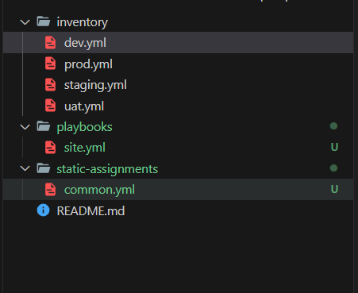

5. Since we need to apply some tasks to your `dev` `servers` and wireshark is already installed – we can go ahead and create another playbook under `static-assignments` and name it `common-del.yml`. In this `playbook`, configure deletion of `wireshark` utility.

```
---
- name: update web and nfs servers
  hosts: webservers and nfs
  remote_user: ec2-user
  become: yes
  become_user: root
  tasks:
  - name: delete wireshark
    yum:
      name: wireshark
      state: removed

- name: update LB and DB servers
  hosts: lb, db 
  remote_user: ubuntu
  become: yes
  become_user: root
  tasks:
  - name: delete wireshark
    apt:
      name: wireshark-qt
      state: absent
      autoremove: yes
      purge: yes
      autoclean: yes
```

+ We updated `site.yml` with `- import_playbook: ../static-assignments/common-del.yml` instead of `common.yml` and run it against `dev `servers

+ first of all check with each private ip

```
ssh ec2-user@private-IP address
ansible all -m ping -i inventory/dev.yml
```


```
cd /home/ubuntu/ansible-config-mgt/


ansible-playbook -i inventory/dev.yml playbooks/site.yaml
```

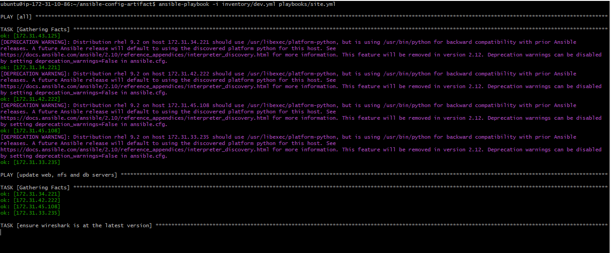

# CONFIGURE UAT WEBSERVERS WITH A ROLE ‘WEBSERVER’

### Step 3 – Configure UAT Webservers with a role ‘Webserver’

1. Launch 2 fresh EC2 instances using RHEL 8 image, we will use them as our uat servers, so give them names accordingly – `Web1-UAT` and `Web2-UAT`.

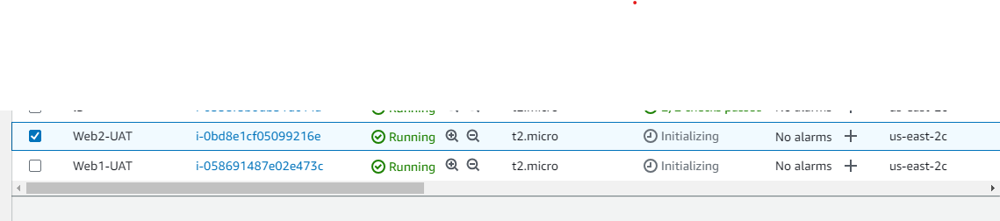

2. To create a role, you must create a directory called roles/, relative to the playbook file or in /etc/ansible/ directory.

+ Create the directory/files structure manually

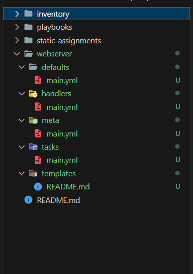

3. Update your inventory ansible-config-mgt/inventory/uat.yml file with IP addresses of your 2 UAT Web servers

```
[uat-webservers]
<Web1-UAT-Server-Private-IP-Address> ansible_ssh_user='ec2-user' 

<Web2-UAT-Server-Private-IP-Address> ansible_ssh_user='ec2-user'
```

4. In `/etc/ansible/ansible.cfg` file uncomment `roles_path `string and provide a full path to your roles directory `roles_path    = /home/ubuntu/ansible-config-mgt/roles`, so Ansible could know where to find configured roles.

5. It is time to start adding some logic to the webserver role. Go into tasks directory, and within the main.yml file, start writing configuration tasks to do the following:

+ Install and configure Apache (httpd service)

+ Clone Tooling website from GitHub https://github.com/<your-name>/tooling.git.

+ Ensure the tooling website code is deployed to /var/www/html on each of 2 UAT Web servers.

+ Make sure httpd service is started

```
---
- name: Install apache
  become: true
  ansible.builtin.yum:
    name: "httpd"
    state: present

- name: Install git
  become: true
  ansible.builtin.yum:
    name: "git"
    state: present

- name: clone a repo
  become: true
  ansible.builtin.git:
    repo: https://github.com/Tonybesto/tooling.git
    dest: /var/www/html
    force: yes

- name: copy html content to one level up
  become: true
  command: cp -r /var/www/html /var/www/

- name: Start service httpd, if not started
  become: true
  ansible.builtin.service:
    name: httpd
    state: started

- name: recursively remove /var/www/html directory
  become: true
  ansible.builtin.file:
  path: /var/www/html
  state: absent
```

# REFERENCE WEBSERVER ROLE

### Step 4 – Reference ‘Webserver’ role

Within the static-assignments folder, create a new assignment for `uat-webservers` and call it `uat-webservers.yml`. This is where you will reference the role.

+ Remember that the entry point to our ansible configuration is the `site.yml` file. Therefore, you need to refer your `uat-webservers.yml` role inside `site.yml.`

So, we should have this in `site.yml`

```
---
- hosts: all
- import_playbook: ../static-assignments/common.yml

- hosts: uat-webservers
- import_playbook: ../static-assignments/uat-webservers.yml
```

### Step 5 – Commit & Test

Commit your changes, create a Pull Request and `merge` then to master branch, make sure webhook triggered two consequent Jenkins jobs, they ran successfully and copied all the files to your `Jenkins-Ansible` server into `/home/ubuntu/ansible-config-mgt/` directory.

Now run the playbook against your `uat` inventory and see what happens:

`ansible-playbook -i /home/ubuntu/ansible-config-mgt/inventory/uat.yml /home/ubuntu/ansible-config-mgt/playbooks/site.yaml`

