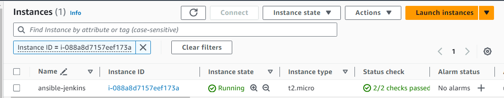
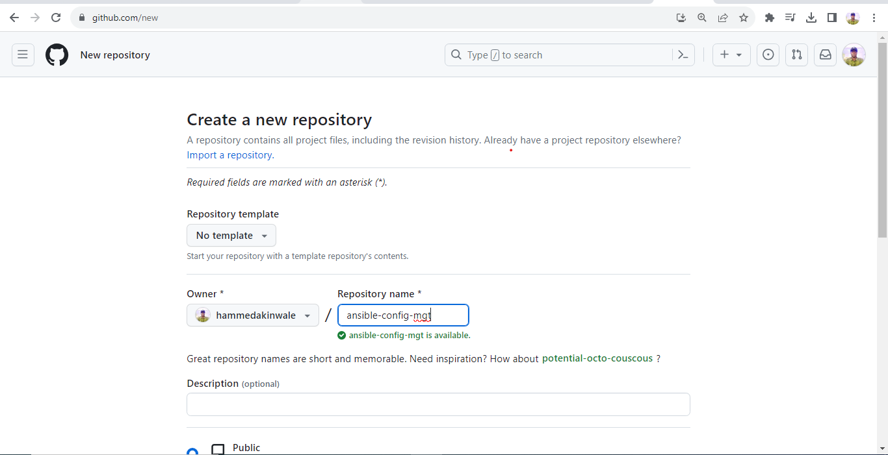
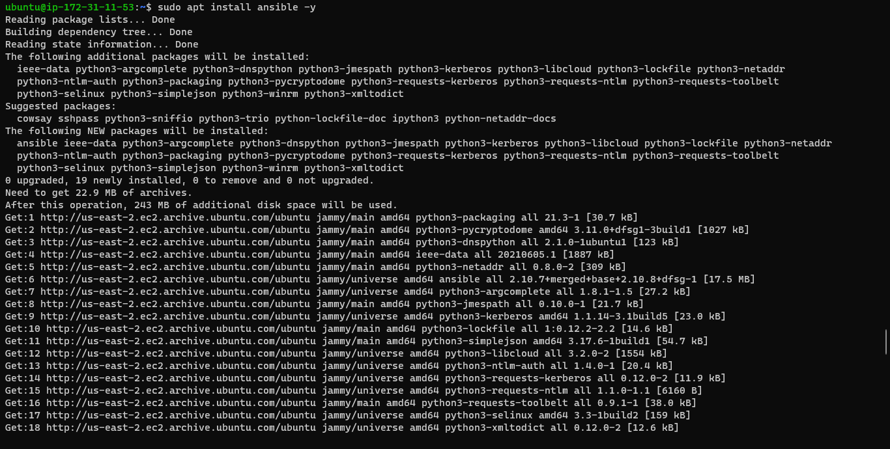
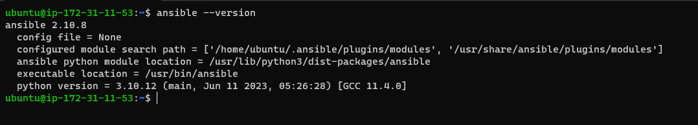

# ANSIBLE CONFIGURATION MANAGEMENT(AUTOMATING PROJECT 7 TO 10)

Ansible Client as a Jump Server (Bastion Host)

A Jump Server (sometimes also referred to as Bastion Host) is an intermediary server through which access to internal network can be provided. If you think about the current architecture you are working on, ideally, the webservers would be inside a secured network which cannot be reached directly from the Internet. That means, even DevOps engineers cannot SSH into the Web servers directly and can only access it through a Jump Server – it provide better security and reduces attack surface.

On the diagram below the Virtual Private Network (VPC) is divided into two subnets – Public subnet has public IP addresses and Private subnet is only reachable by private IP addresses.

**Step 1.** INSTALL AND CONFIGURE ANSIBLE ON EC2 INSTANCE

1. Update `Name` tag on your `Jenkins` EC2 Instance to `Jenkins-Ansible`. We will use this server to run playbooks.

2. In your GitHub account create a new repository and name it `ansible-config-mgt`.

3. Install Ansible with 

`sudo apt update -y`

`sudo apt install ansible -y`

Check your Ansible version by running `ansible --version`

4. Configure Jenkins build job to save your repository content every time you change it – this will solidify your Jenkins configuration skills acquired in **Project 9**.

Create a new Freestyle project ansible in Jenkins and point it to your ‘ansible-config-mgt’ repository.

Configure Webhook in GitHub and set webhook to trigger ansible build.