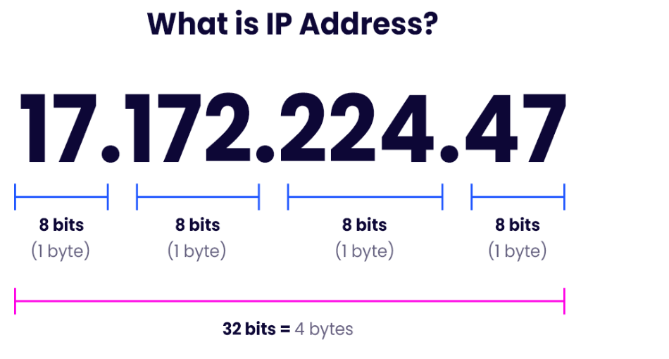
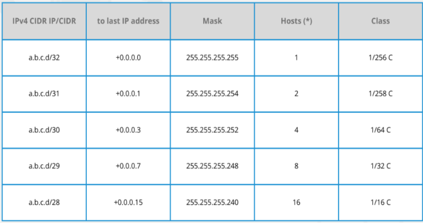
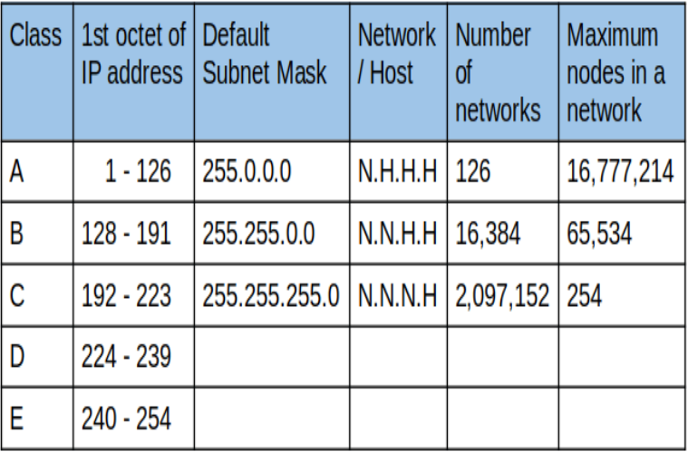
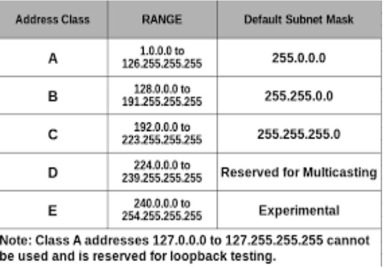

# INTRODUCTION TO IP ADDRESS

An IP address is a unique address that identifies a device on the internet or a local network. IP stands for "Internet Protocol," which is the set of rules governing the format of data sent via the internet or local network. In essence, IP addresses are the identifier that allows information to be sent between devices on a network: they contain location information and make devices accessible for communication. The internet needs a way to differentiate between different computers, routers, and websites. IP addresses provide a way of doing so and form an essential part of how the internet works.

### What is an IP Address?
An IP address is a string of numbers separated by periods. IP addresses are expressed as a set of four numbers - an example address might be 192.158.1.38. Each number in the set can range from 0 to 255. So, the full IP addressing range goes from 0.0.0.0 to 255.255.255.255. IP addresses are not random. They are mathematically produced and allocated by the Internet Assigned Numbers Authority (IANA), a division of the Internet Corporation for Assigned Names and Numbers (ICANN). ICANN is a non- profit organization that was established in the United States in 1998 to help maintain the security of the internet and allow it to be usable by all. Each time anyone registers a domain on the internet, they go through a domain name registrar, who pays a small fee to ICANN to register the domain.

### Subneting and subnet masks

What is Subnetting?
Subnetting is the practice of dividing a network into two or smaller networks. It increases routing efficiency, which helps to enhance the security of the network and reduces the size of the broadcast domain.
IP
Subnetting designates high-order bits from the host as part of the network prefix. This method divides a network into smaller
subnets.
It also helps you to reduce the size of the routing tables, which is stored in routers. This method also helps you to extend the
existing IP address base & restructures the IP address.[]

What is Subnet Mask? A subnet mask is a 32 bits address used to distinguish between a network address and a host address in IP identifies which part of an IP address is the network address and the host address. They are not shown traversing the Internet. They carry the destination IP address, which a router will match with a subnet.
address. A subnet mask
inside the data packets

# CIDR Notation and Address Aggregation

What is CIDR?
Classless Inter-Domain Routing (CIDR) is an IP address allocation method that improves data routing efficiency on the internet. Every machine, server, and end-user device that connects to the internet has a unique number, called an IP address, associated with it. Devices find and communicate with one another by using these IP addresses. Organizations use CIDR to allocate IP addresses flexibly and efficiently in their networks.

IP Address Aggregator
IP Address Aggregator is a utility developed to automate minimization process and convert bunch of IPv4 addresses into smallest continuous range(s) possible. IP aggregation is commonly performed by network engineers working with BGP & routers. This utility will help webmasters to configure server firewalls, apache.htaccess files, address masks and so on.
Basic Usage
IP Address Aggregation Tool accepts various IP address formats for input (scroll to Input Format Examples for more details). Enter
IP Address list in a block of text (one IP Address or range per line) into IP Address Ranges input area. Select desired output format and click submit button. It will automatically discard any non-recognized or invalid address text.
Once processed click on Copy To Clipboard button to directly copy results into memory and paste it anywhere else

# IP Address Classes and Private IP Address Ranges

What is Classful Addressing?
Classful addressing is a network addressing the Internet's architecture from 1981 till Classless Inter-Domain Routing was introduced in 1993.
This addressing method divides the IP address into five separate classes based on four address bits.
Here, classes A, B, C offers addresses for networks of three distinct network sizes. Class D is only used for multicast, and class E reserved exclusively for experimental purposes.

Let's see each of the network classes in detail:
Class A Network
This IP address class is used when there are a large number of hosts. In a Class A type of network, the first 8 bits (also called the first octet) identify the network, and the remaining have 24 bits for the host into that network.
An example of a Class A address is 102.168.212.226. Here, "102" helps you identify the network and 168.212.226 identify the host.
Class A addresses 127.0.0.0 to 127.255.255.255 cannot be used and is reserved for loopback and diagnostic functions.
Class B Network
In a B class IP address, the binary addresses start with 10. In this IP address, the class decimal number that can be between 128 to 191. The number 127 is reserved for loopback, which is used for internal testing on the local machine. The first 16 bits (known as two octets) help you identify the network. The other remaining 16 bits indicate the host within the network.
An example of Class B IP address is 168.212.226.204, where 168 212 identifies the network and 226.204 helps you identify the Hut network host.
Class C Network
Class C is a type of IP address that is used for the small network. In this class, three octets are used to indent the network. This IP ranges between 192 to 223.
In this type of network addressing method, the first two bits are set to be 1, and the third bit is set to 0, which makes the first 24 bits of the address them and the remaining bit as the host address. Mostly local area network used Class C IP address to connect with the network.

Example for a Class C IP address:
192.168.178.1
Class D Network
Class D addresses are only used for multicasting applications. Class D is never used for regular networking operations. This class addresses the first three bits set to "1" and their fourth bit set to use for "0". Class D addresses are 32-bit network addresses. All the values within the range are used to identify multicast groups uniquely.
Therefore, there is no requirement to extract the host address from the IP address, so Class D does not have any subnet mask.
Example for a Class D IP address: 227.21.6.173
Class E Network
Class E IP address is defined by including the starting four network address bits as 1, which allows you two to incorporate addresses from 240.0.0.0 to 255.255.255.255. However, E class is reserved, and its usage is never defined. Therefore, many network implementations discard these addresses as undefined or illegal.
Example for a Class E IP address:
243.164.89.28
Limitations of classful IP addressing
Here are the drawbacks/cons of the classful IP addressing method:
Risk of running out of address space soon Class boundaries did not encourage efficient allocation of address space Rules for assigning Network ID: The network ID will be assigned based on the below-given rules:

The network ID cannot start with 127 because 127 belongs to class A address and is reserved for internal loopback functions. All bits of network ID set to 1 are reserved for use as an IP broadcast address and cannot be used. All bits of network ID are set to 0. They are used to denote a particular host on the local network and should not be routed.
Advanced Topics in IP Addressing
Advanced Topics in IP Addressing
Advanced topics in TCP/IP networking involve the study of advanced technologies and techniques for managing and optimizing network performance. These may include routing protocols, which are used to exchange information about network destinations between devices on a network; Virtual Private Networks (VPNs), which enable users to securely connect to a private network over the internet; Quality of Service (QoS), which is a set of technologies and techniques that are used to manage and optimize network performance; the Domain Name System (DNS), which is a hierarchical, distributed database that is used to translate human- readable domain names into machine-readable IP addresses; and Network Address Translation (NAT), which is a technique that is used to allow devices on a private network to communicate with devices on a public network.
Routing Protocols Virtual Private Networks (VPNs) Quality of Service (QoS) Domain Name System (DNS) Network Address Translation (NAT)
By understanding these and other advanced topics in TCP/IP networking, organizations can more effectively design, manage, and optimize their networks.
Routing Protocols Routing protocols exchange information about network destinations between devices on a network. They are an important component of advanced TCP/IP networking topics, as they play a key role in determining the best path for data to travel from one device to another

There are several key components of DNS, including:
Domain names: These are the human-readable names used to identify websites and other resources on the internet. DNS servers: These are the servers that store and manage the DNS database and respond to DNS queries from clients. DNS records are the entries in the DNS database that map domain names to IP addresses and other information. DNS protocols: These are the protocols that are used to communicate between DNS servers and clients. By understanding how DNS works, organizations can more effectively manage their online presence, optimize their use of DNS resources, and improve the performance and reliability of their networks.
Network Address Translation (NAT)
Network Address Translation (NAT) is a technique that allows devices on a private network to communicate with devices on a public network, such as the internet. It is often used to allow devices on a local network to access the internet without needing a public IP address.
There are several benefits to using NAT, including:
Security: NAT can help to improve security by hiding the IP addresses of devices on the private network from the public network. This can make it more difficult for attackers to target specific devices. Resource conservation: NAT can help to conserve resources by allowing multiple devices on a private network to share a single public IP address. This can be useful when a limited number of public IP addresses are available. Improved performance: NAT can help improve a network's performance by reducing the number of IP addresses that need to be routed over the internet. This can reduce the load on the network and improve overall performance. NAT is a useful technique for allowing devices on a private network to communicate with devices on a public network while maintaining security and conserving resources.