# AWS CLOUD SOLUTION FOR 2 COMPANY WEBSITES USING A REVERSE PROXY TECHNOLOGY

**WARNING:** This infrastructure set up is NOT covered by AWS free tier. Therefore, ensure to DELETE  ALL the resources created immediately after finishing the project. Monthly cost may be shockingly high if resources are not deleted. Also, it is strongly recommended to set up a budget and configure notifications when your spendings reach a predefined limit. Watch this video to learn how to configure AWS budget.

In this project, we will build a secure infrastructure inside AWS VPC (Virtual Private Cloud) network for a fictitious company (Choose an interesting name for it) that uses WordPress CMS for its main business website, and a Tooling Website [tooling](https://github.com/hammedakinwale/tooling) for their DevOps team. As part of the company’s desire for improved security and performance, a decision has been made to use a reverse proxy technology from NGINX to achieve this.

```
Cost, Security, and Scalability are the major requirements for this project. Hence, implementing the architecture designed below, ensure that infrastructure for both websites, WordPress and Tooling, is resilient to Web Server’s failures, can accomodate to increased traffic and, at the same time, has reasonable cost.
```

## Project Design Architecture Diagram


## Starting Off AWS Project

1. Properly configure your AWS account and Organization Unit [Watch How To Do This here](https://www.youtube.com/watch?v=9PQYCc_20-Q)

+ Create an AWS Master account. (Also known as Root Account)

+ Within the Root account, create a sub-account and name it DevOps. (You will need another email address to complete this)

+ Within the Root account, create an AWS Organization Unit (OU). Name it Dev. (We will launch Dev resources in there) Move the DevOps account into the Dev OU.

+ Login to the newly created AWS account using the new email address.

Create a free domain name for your fictitious company at Freenom domain registrar here.

+ Create a hosted zone in AWS, and map it to your free domain from Freenom. Watch how to do that here [Watch how to do that here](https://www.youtube.com/watch?v=IjcHp94Hq8A)

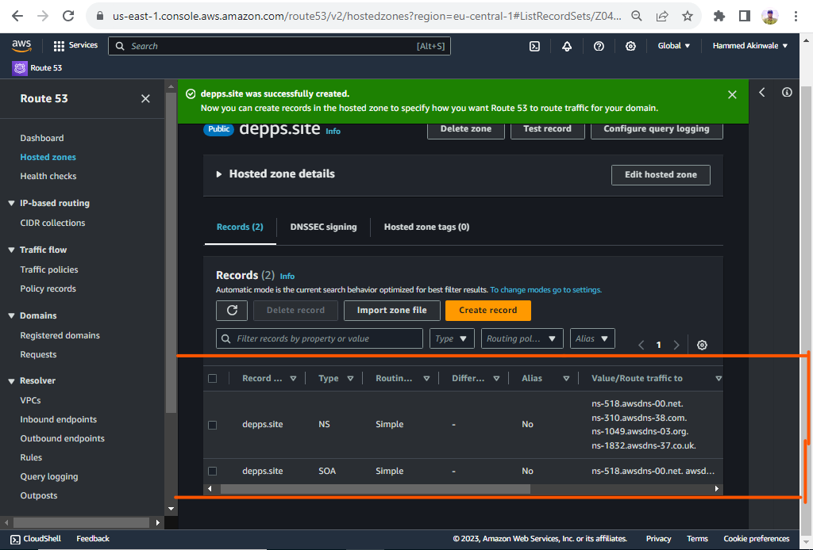

**NOTE :** As you proceed with configuration, ensure that all resources are appropriately tagged, for example:

+ Project:`<Give your project a name>`

+ Environment:`<dev>`

+ Automated: (If you create a recource using an automation tool, it would be )

## Setting Up Infrastucture

1. Create a VPC

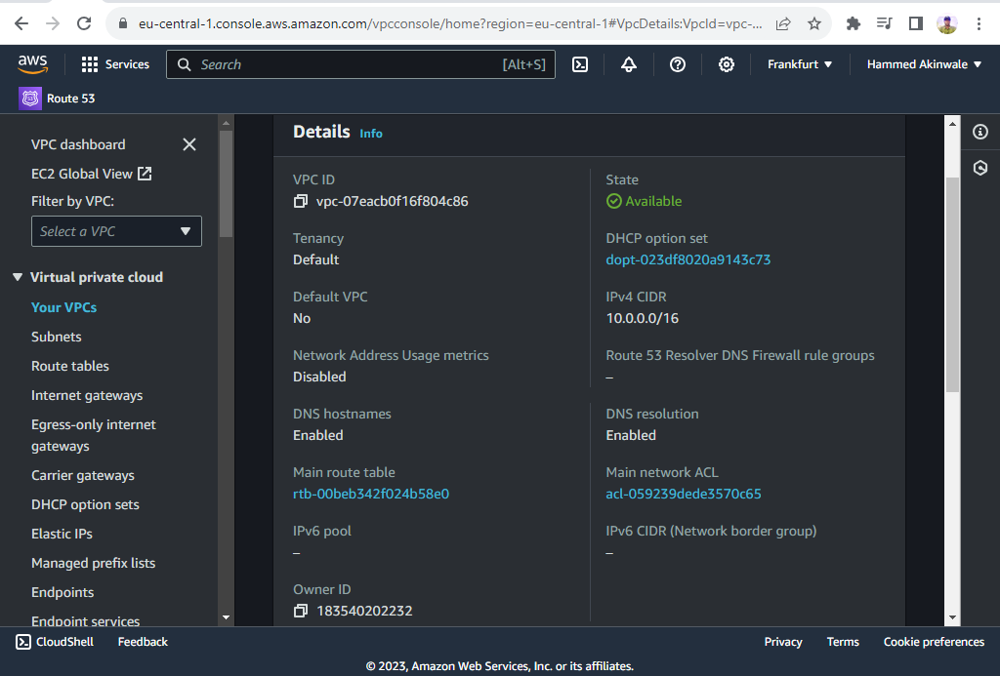

2. Create subnets as shown in the architecture

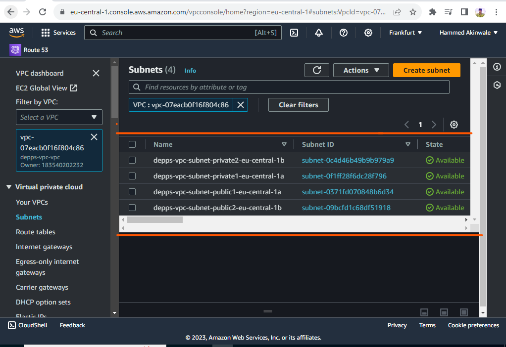

3. Create a route table and associate it with public subnets

4. Create a route table and associate it with private subnets

5. Edit routes of both public and private route-table

6. Create an Internet Gateway

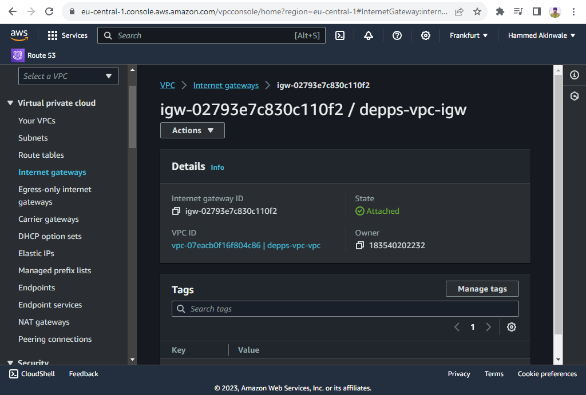

7. Edit a route in public route table, and associate it with the Internet Gateway. (This is what allows a public subnet to be accisble from the Internet)

8. Create an Elastic IP

9. Create a Nat Gateway and assign one of the Elastic IPs (*The other 2 will be used by Bastion hosts)

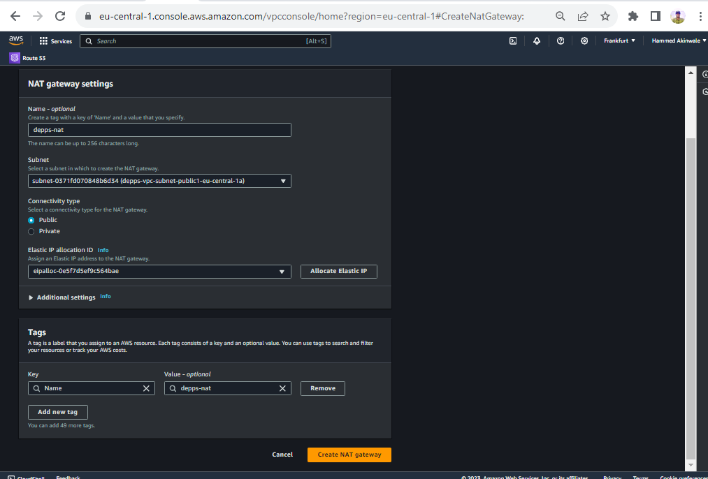

10. Create a Security Group for:

+ Nginx Servers: Access to Nginx should only be allowed from a Application Load balancer (ALB). At this point, we have not created a load balancer, therefore we will update the rules later. For now, just create it and put some dummy records as a place holder.

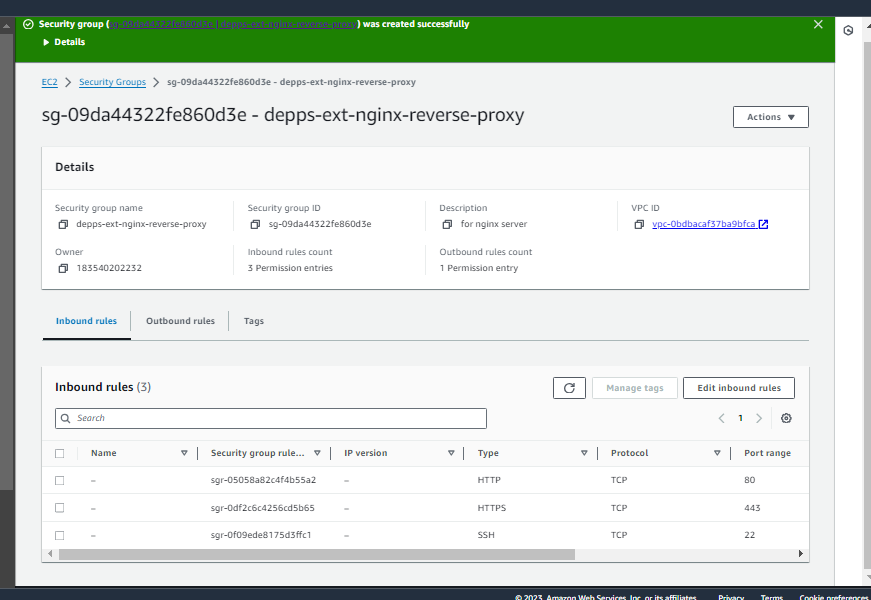

+ Bastion Servers: Access to the Bastion servers should be allowed only from workstations that need to SSH into the bastion servers. Hence, you can use your workstation public IP address. To get this information, simply go to your terminal and type curl www.canhazip.com

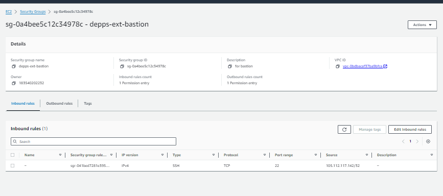

+ Application Load Balancer: ALB will be available from the Internet Webservers: Access to Webservers should only be allowed from the Nginx servers. Since we do not have the servers created yet, just put some dummy records as a place holder, we will update it later.

external ALB
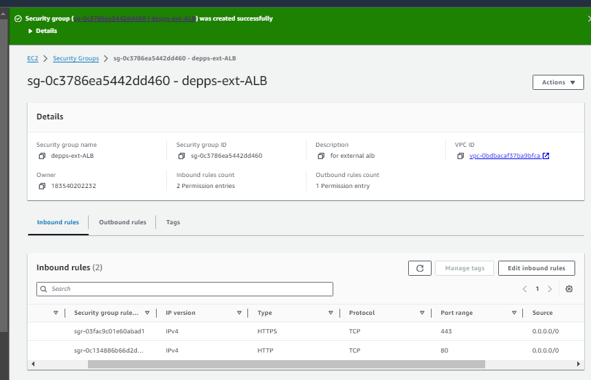

internal ALB
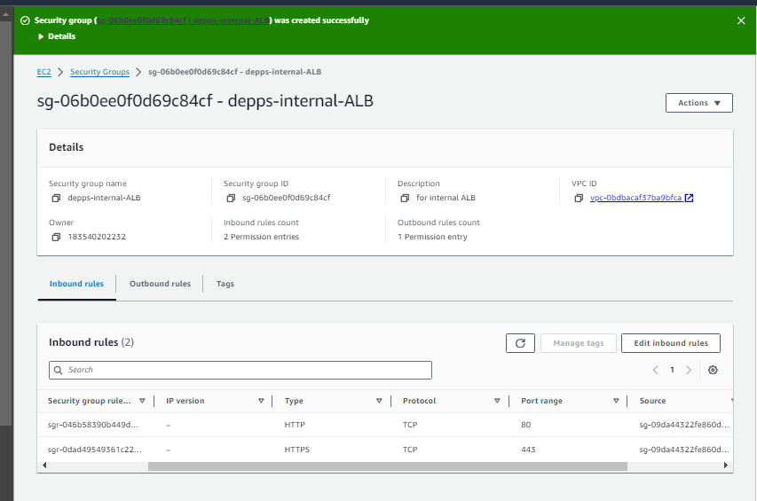

webserver
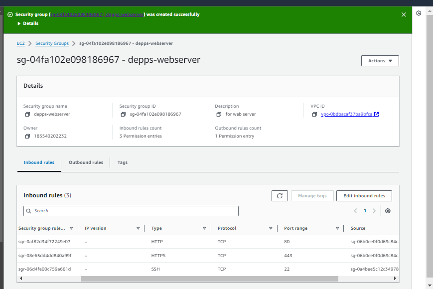

+ Data Layer: Access to the Data layer, which is comprised of Amazon Relational Database Service (RDS) and Amazon Elastic File System (EFS) must be carefully desinged – only webservers should be able to connect to RDS, while Nginx and Webservers will have access to EFS Mountpoint.

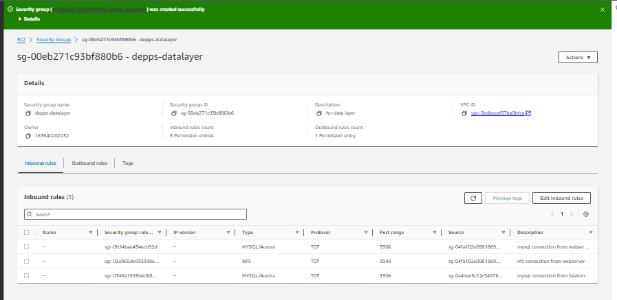

### Setup EFS

Amazon Elastic File System (Amazon EFS) provides a simple, scalable, fully managed elastic Network File System (NFS) for use with AWS Cloud services and on-premises resources. In this project, we will utulize EFS service and mount filesystems on both Nginx and Webservers to store data.

1. Create an EFS filesystem
2. Create an EFS mount target per AZ in the VPC, associate it with  both subnets dedicated for data layer
3. Associate the Security groups created earlier for data layer.

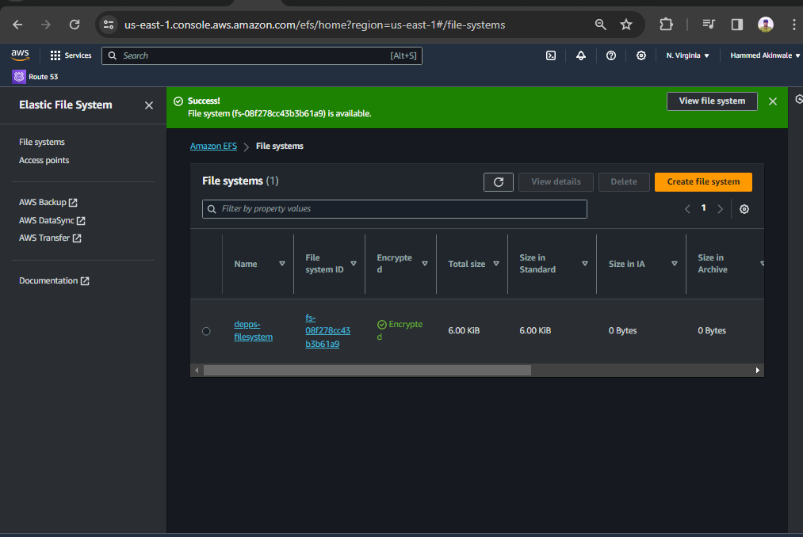

4. Create an EFS access point. (Give it a name and leave all other settings as default)

access point for wordpress
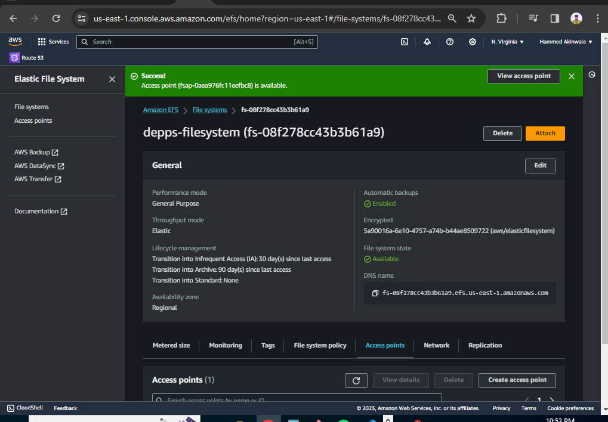
access point for tooling
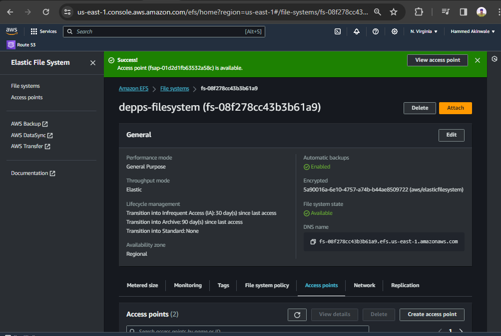
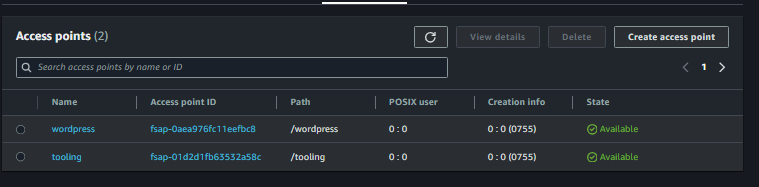

### Setup RDS

`Pre-requisite:` Create a KMS key from Key Management Service (KMS) to be used to encrypt the database instance.

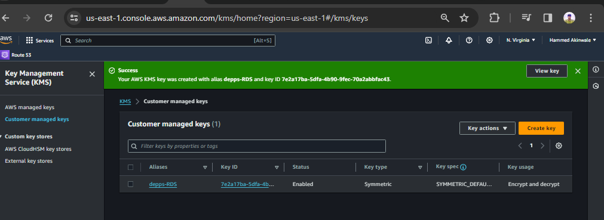

Amazon Relational Database Service (Amazon RDS) is a managed distributed relational database service by Amazon Web Services. This web service running in the cloud designed to simplify setup, operations, maintenans & scaling of relational databases. Without RDS, Database Administrators (DBA) have more work to do, due to RDS, some DBAs have become jobless

To ensure that yout databases are highly available and also have failover support in case one availability zone fails, we will configure a multi-AZ set up of RDS MySQL database instance. In our case, since we are only using 2 AZs, we can only failover to one, but the same concept applies to 3 Availability Zones. We will not consider possible failure of the whole Region, but for this AWS also has a solution - this is a more advanced concept that will be discussed in following projects.

To configure RDS, follow steps below:

1. Create a subnet group and add 2 private subnets (data Layer)

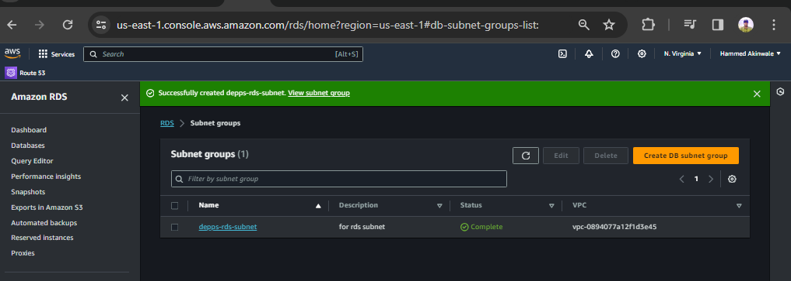

2. Create an RDS Instance for mysql 8.*.*
3. To satisfy our architectural diagram, you will need to select either Dev/Test or Production Sample Template. But to minimize AWS cost, you can select the Do not create a standby instance option under Availability & durability sample template (The production template will enable Multi-AZ deployment)
4. Configure other settings accordingly (For test purposes, most of the default settings are good to go). In the real world, you will need to size the database appropriately. You will need to get some information about the usage. If it is a highly transactional database that grows at 10GB weekly, you must bear that in mind while configuring the initial storage allocation, storage autoscaling, and maximum storage threshold.
5. Configure VPC and security (ensure the database is not available from the Internet)
6. Configure backups and retention
7. Encrypt the database using the KMS key created earlier
8. Enable CloudWatch monitoring and export Error and Slow Query logs (for production, also include Audit)

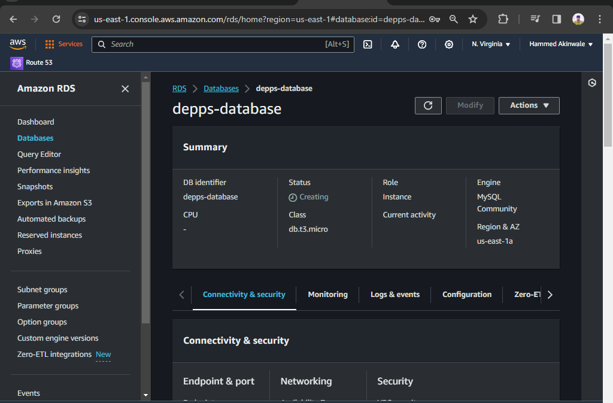

## Proceed With Compute Resources

You will need to set up and configure compute resources inside your VPC. The recources related to compute are:

+ EC2 Instances
+ Launch Templates
+ Target Groups
+ Autoscaling Groups
+ TLS Certificates
+ Application Load Balancers (ALB)

### Set Up Compute Resources for Nginx

Provision EC2 Instances for Nginx

1. Create an EC2 Instance based on CentOS Amazon Machine Image (AMI) in any 2 Availability Zones (AZ) in any AWS Region (it is recommended to use the Region that is closest to your customers). Use EC2 instance of T2 family (e.g. t2.micro or similar)

[you can find the configuration to these servers here](https://github.com/hammedakinwale/ACS-project-config)

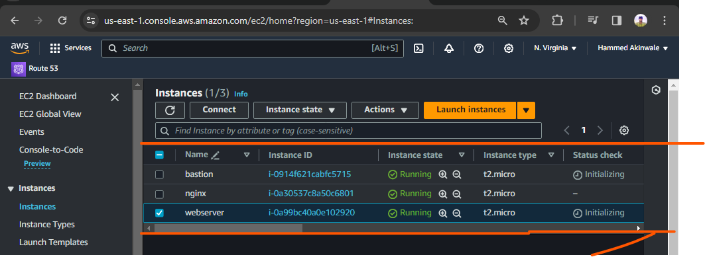

2. Ensure that it has the following software installed:


+ `python`
+ ` ntp`
+ `net-tools`
+ `vim`
+ `wget`
+ `telnet`
+ `epel-release`
+ `htop`

3. Create an AMI out of the EC2 instance

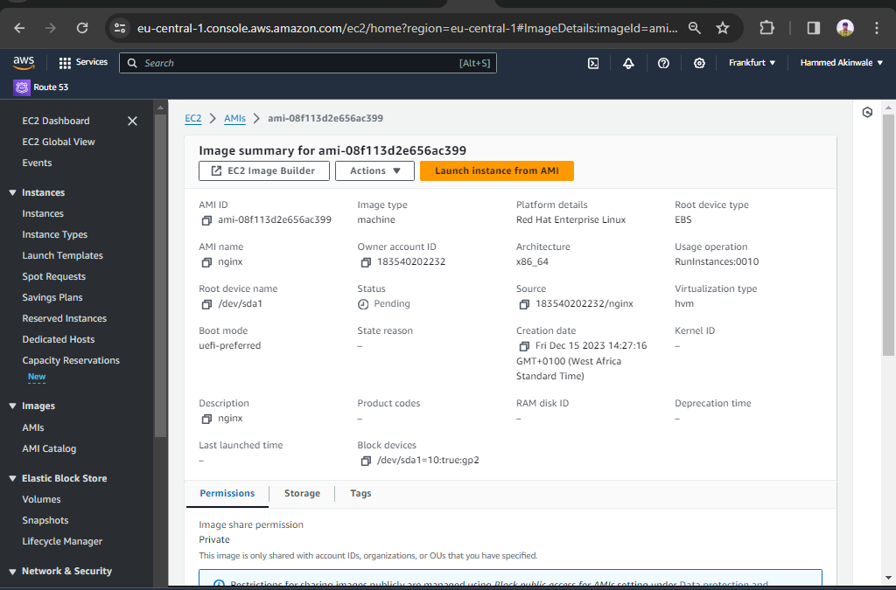

**Prepare Launch Template For Nginx (One Per Subnet)**

1 Make use of the AMI to set up a launch template
2 Ensure the Instances are launched into a public subnet
3 Assign appropriate security group
4 Configure Userdata to update yum package repository and install nginx

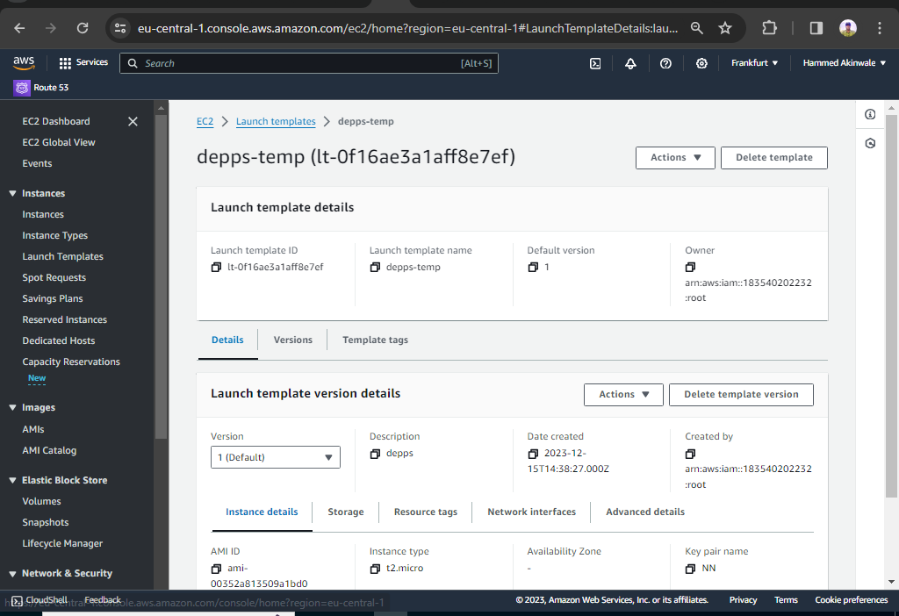
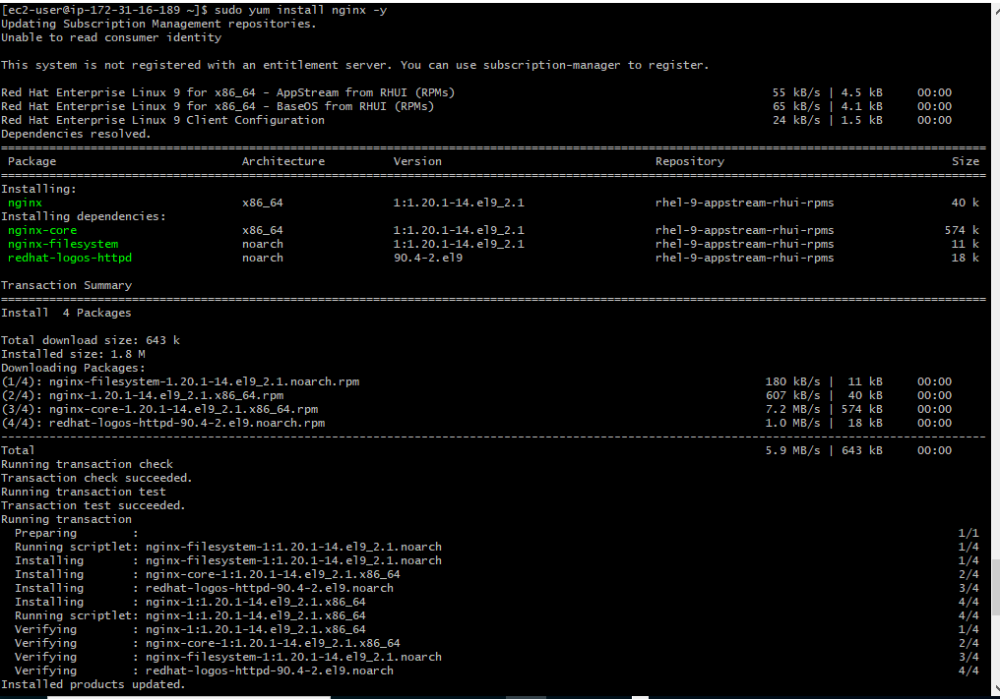

**Configure Target Groups**

1. Select Instances as the target type
2. Ensure the protocol HTTPS on secure TLS port 443
3. Ensure that the health check path is /healthstatus
4. Register Nginx Instances as targets
5. Ensure that health check passes for the target group

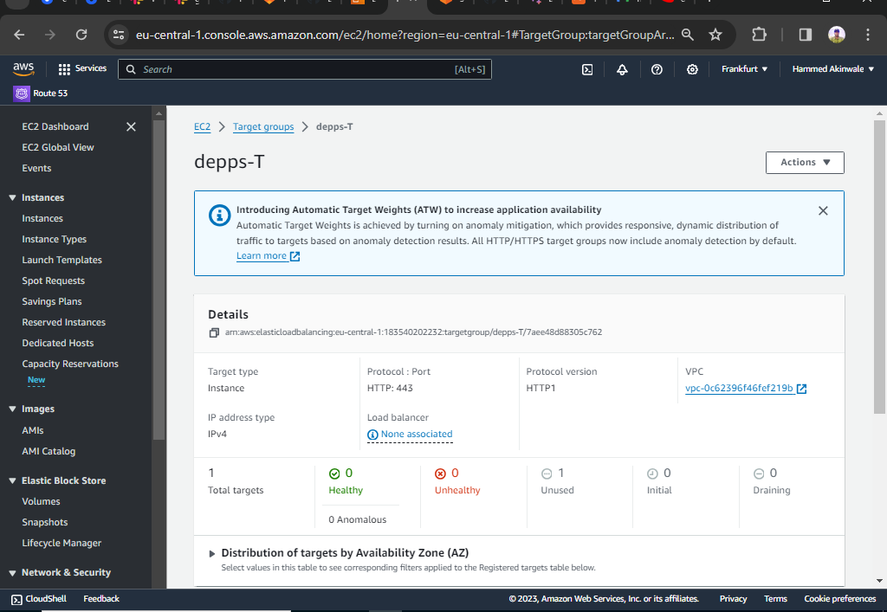

**Configure Autoscaling For Nginx**

1. Select the right launch template
2. Select the VPC
3. Select both public subnets
4. Enable Application Load Balancer for the AutoScalingGroup (ASG)
5. Select the target group you created before
6. Ensure that you have health checks for both EC2 and ALB
7. The desired capacity is 2
8. Minimum capacity is 2
9. Maximum capacity is 4
10. Set scale out if CPU utilization reaches 90%
11. Ensure there is an SNS topic to send scaling notifications

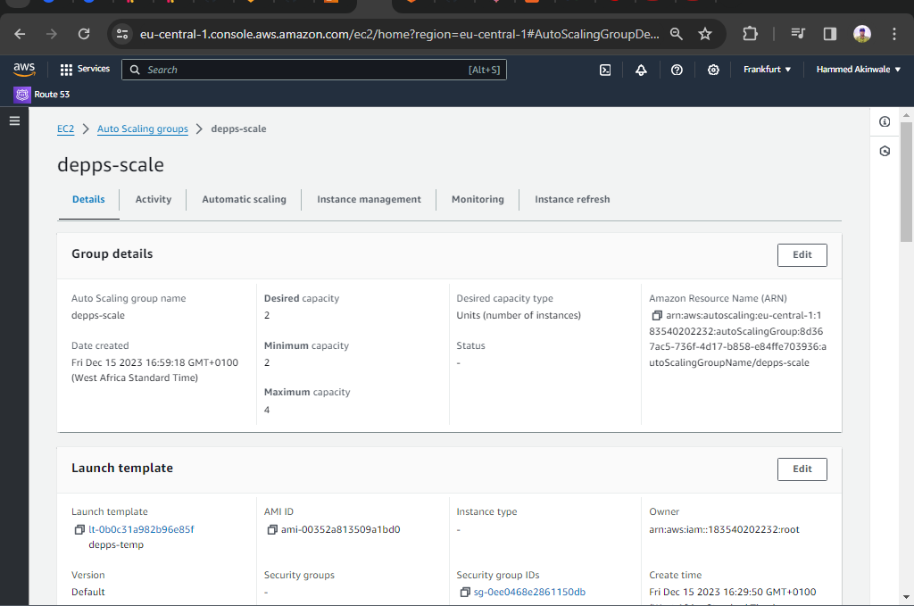

### Set Up Compute Resources for Bastion

**Provision the EC2 Instances for Bastion**

1. Create an EC2 Instance based on CentOS Amazon Machine Image (AMI) per each Availability Zone in the same Region and same AZ where you created Nginx server

2. Ensure that it has the following software installed

+ `python`
+ `ntp`
+ `net-tools`
+ `vim`
+ `wget`
+ `telnet`
+ `epel-release`
+ `htop`

3. Create an AMI out of the EC2 instance

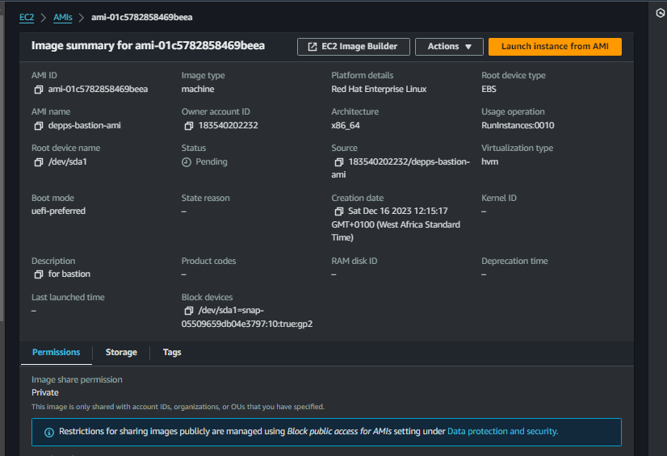

4. Launch Templates
5. Target Groups
6. Autoscaling Groups
7. Application Load Balancers (ALB)

### set Up Compute Resources for Webservers

**Provision the EC2 Instances for Webservers**

Now, you will need to create 2 separate launch templates for both the WordPress and Tooling websites


1. Create an EC2 Instance (Centos) each for WordPress and Tooling websites per Availability Zone (in the same Region).


2. Ensure that it has the following software installed

+ `python`
+ `ntp`
+ `net-tools`
+ `vim`
+ `wget`
+ `telnet`
+ `epel-release`
+ `htop`
+ `php`

3. Create an AMI out of the EC2 instance

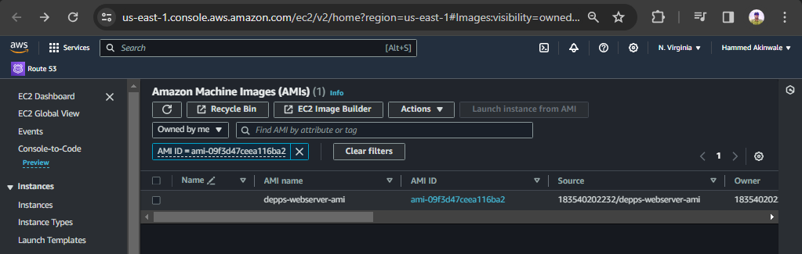

4. Launch Templates
5. create Target Groups
6. create Autoscaling Groups
7. Application Load Balancers (ALB)

### log in to mysql server and create databases on bastion server

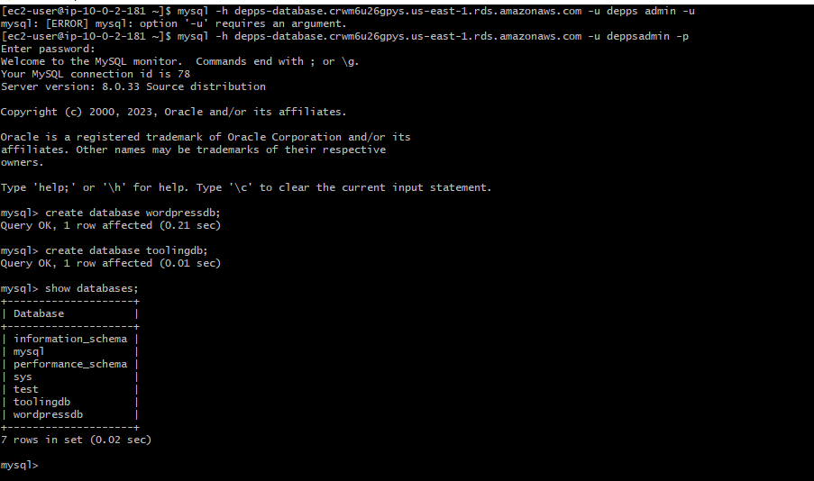


### Configuring DNS with Route53

Earlier in this project you registered a free domain with Freenom and configured a hosted zone in Route53. But that is not all that needs to be done as far as DNS configuration is concerned.

You need to ensure that the main domain for the WordPress website can be reached, and the subdomain for Tooling website can also be reached using a browser.

Create other records such as `CNAME`, `alias` and A `records`.

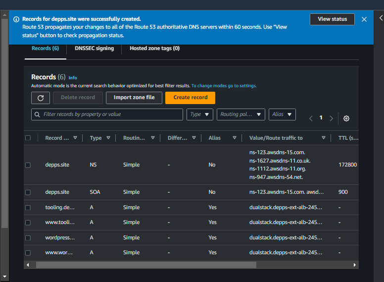
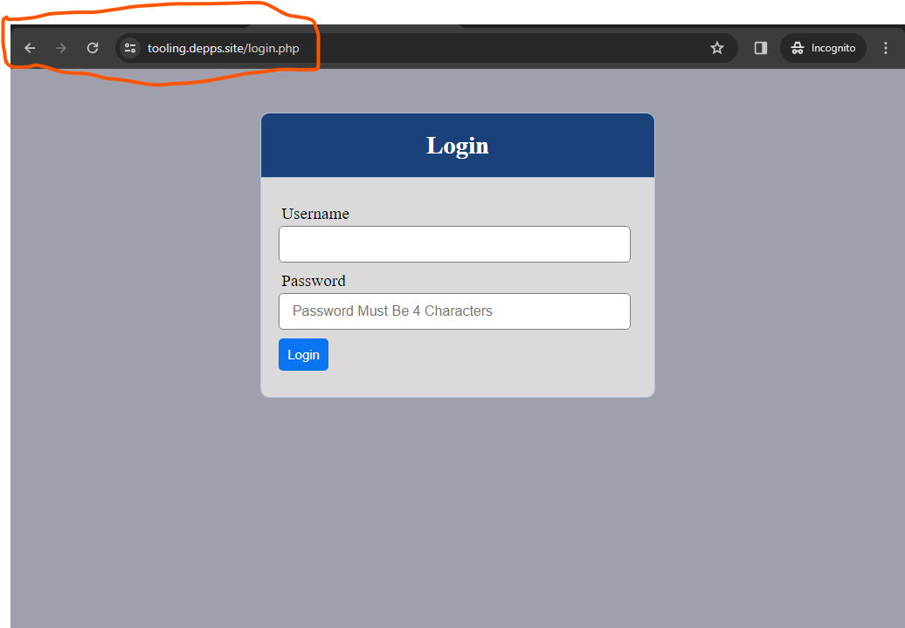
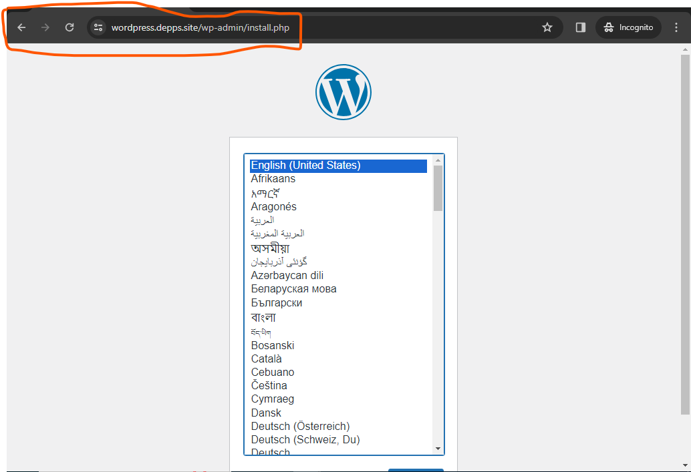