# MIGRATING TO THE СLOUD WITH CONTAINERIZATION. PART 1 - DOCKER & DOCKER COMPOSE

Until now we have been using Ec2 instance to install and deploy our softwares. While this is easy and fast, it has its own challenges. Consider that you have the requirement into two set of softwares with both needing different version of a dependency say java. This will lead to conflict. In software speaks it is called dependency matrix.

Another problem encountered in software development is the problem of IT WORKS ON MY COMPUTER . This problem arises from the configuration drift between the developers computer and the testers computer.

All the problem highlighted above is solved by containerization. Container solves this problem by creating an isolated environmentment using Linux features like NAMESPACE and CGROUP for a process.

+ Containers are used to package application code, app configuration, dependencies and runtime environment required for running an application. This garanties to a large extent that the application runs efficiently and predictably on any environment it is deployed provider it has a container runtime.

+ In this project, we will learn how to solve this problem and practice the technology that revolutionized application distribution and deployment back in 2013! We are talking of Containers and imply Docker. Even though there are other application containerization technologies, Docker is the standard and the default choice for shipping your app in a container!

## Install Docker and prepare for migration to the Cloud

First, we need to install Docker Engine, which is a client-server application that contains:

+ A server with a long-running daemon process dockerd.

+ APIs that specify interfaces that programs can use to talk to and instruct the Docker daemon.

+ A command-line interface (CLI) client docker.
You can learn how to install Docker Engine on your PC [here](https://docs.docker.com/engine/install/)

### MySQL in container

Let us start assembling our application from the Database layer – we will use a pre-built MySQL database container, configure it, and make sure it is ready to receive requests from our PHP application.

### **Step 1:** Pull MySQL Docker Image from Docker Hub Registry

Start by pulling the appropriate Docker image for MySQL. You can download a specific version or opt for the latest release, as seen in the following command:

`docker pull mysql/mysql-server:latest`

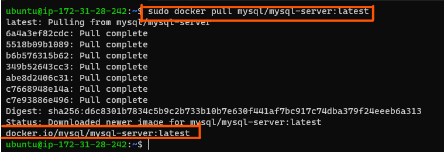

If you are interested in a particular version of MySQL, replace latest with the version number. Visit Docker Hub to check other tags here

List the images to check that you have downloaded them successfully:

`docker image ls`

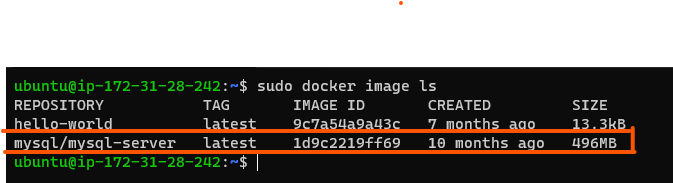

### **Step 2:** Deploy the MySQL Container to your Docker Engine

1. Once you have the image, move on to deploying a new MySQL container with:

`docker run --name <container_name> -e MYSQL_ROOT_PASSWORD=<my-secret-pw> -d mysql/mysql-server:latest`

+ Replace <container_name> with the name of your choice. If you do not provide a name, Docker will generate a random one

+ The -d option instructs Docker to run the container as a service in the background

+ Replace with your chosen password

+ In the command above, we used the latest version tag. This tag may differ according to the image you downloaded

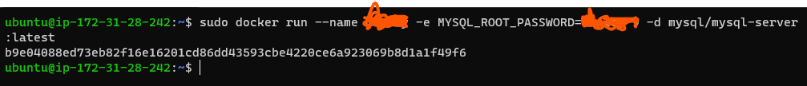

2. Then, check to see if the MySQL container is running: Assuming the container name specified is mysql-server

`docker ps -a`

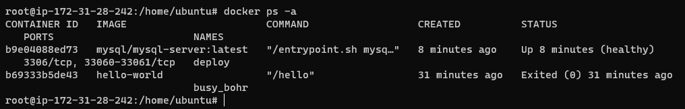

## CONNECTING TO THE MYSQL DOCKER CONTAINER

### **Step 3:** Connecting to the MySQL Docker Container

Approach 1

Connect directly to the container by running the MySQL server:

```
$ docker exec -it mysql bash

or

$ docker exec -it mysql mysql -uroot -p
```

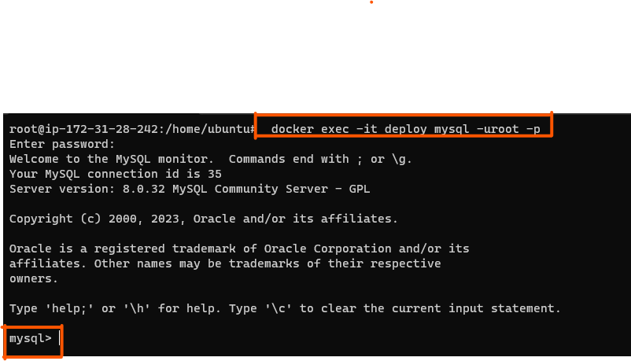

Provide the root password when prompted. With that, you’ve connected the MySQL client to the server.

Finally, change the server root password to protect your database. Exit the the shell with exit command

Flags used

+ exec used to execute a command from bash itself

+ -it makes the execution interactive and allocate a pseudo-TTY

+ bash this is a unix shell and its used as an entry-point to interact with our container

+ mysql The second mysql in the command "docker exec -it mysql mysql -uroot -p" - serves as the entry point to interact with mysql container just like bash or sh

+ -u mysql username

+ -p mysql password

At this stage you are now able to create a docker container but we will need to add a network. So, stop and remove the previous mysql docker container.

```
docker ps -a

docker stop mysql 

docker rm mysql or <container ID>

docker ps -a
```

and also verify that the container is deleted

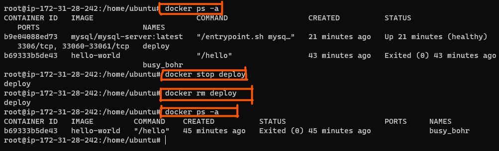

First, create a network:

`docker network create --subnet=172.18.0.0/24 tooling_app_network`

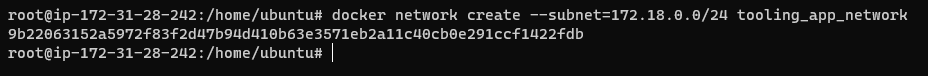

Creating a custom network is not necessary because even if we do not create a network, Docker will use the default network for all the containers you run. By default, the network we created above is of `DRIVER Bridge`. So, also, it is the default network. You can verify this by running the `docker network ls` command.

But there are use cases where this is necessary. For example, if there is a requirement to control the `cidr` range of the containers running the entire application stack. This will be an ideal situation to create a network and specify the `--subnet
`
For clarity’s sake, we will create a network with a subnet dedicated for our project and use it for both MySQL and the application so that they can connect.

**Run the MySQL Server container using the created network**

First, let us create an environment variable to store the root password:

Note: create a password.

`export MYSQL_PW=<root-secret-password>`

verify the environment variable is created

`echo $MYSQL_PW`

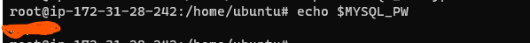

Then, pull the image and run the container, all in one command like below:

`docker run --network tooling_app_network -h mysqlserverhost --name=mysql-server -e MYSQL_ROOT_PASSWORD=$MYSQL_PW  -d mysql/mysql-server:latest`

Flags used

+ -d runs the container in detached mode
+ --network connects a container to a network
+ -h specifies a hostname

If the image is not found locally, it will be downloaded from the registry.

Verify the container is running with :

`docker ps -a`

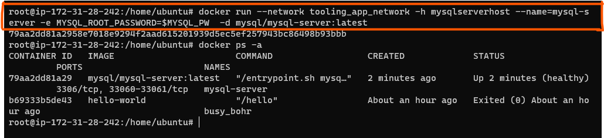

it is best practice not to connect to the MySQL server remotely using the root user. Therefore, we will create an SQL script that will create a user we can use to connect remotely.

Create a file and name it `create_user.sql` and add the below code in the file:

`CREATE USER ''@'%' IDENTIFIED BY '';`

`GRANT ALL PRIVILEGES ON * . * TO ''@'%';`

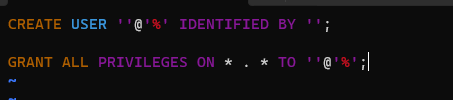

Run the script: Ensure you are in the directory create_user.sql file is located or declare a path

`docker exec -i mysql-server mysql -uroot -p$MYSQL_PW < create_user.sql`

If you see a warning like below, it is acceptable to ignore:

mysql: [Warning] Using a password on the command line interface can be insecure.

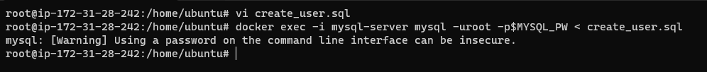

Connecting to the MySQL server from a second container running the MySQL client utility The good thing about this approach is that you do not have to install any client tool on your laptop, and you do not need to connect directly to the container running the MySQL server.

**Run the MySQL Client Container:**

`docker run --network tooling_app_network --name mysql-client -it --rm mysql mysql -h mysqlserverhost -u  -p
`

Flags used:

+ --name gives the container a name

+ -it runs in interactive mode and Allocate a pseudo-TTY

+ --rm automatically removes the container when it exits

+ --network connects a container to a network

+ -h a MySQL flag specifying the MySQL server Container hostname

+ -u user created from the SQL script

+ -p password specified for the user created from the SQL script

these downloaded the libraries but faith to connect because i failed to provide the password 
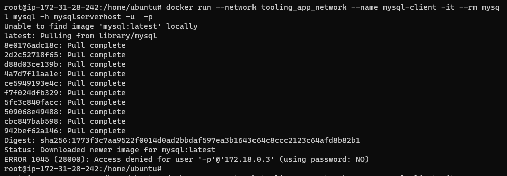

view the succseful connection below:
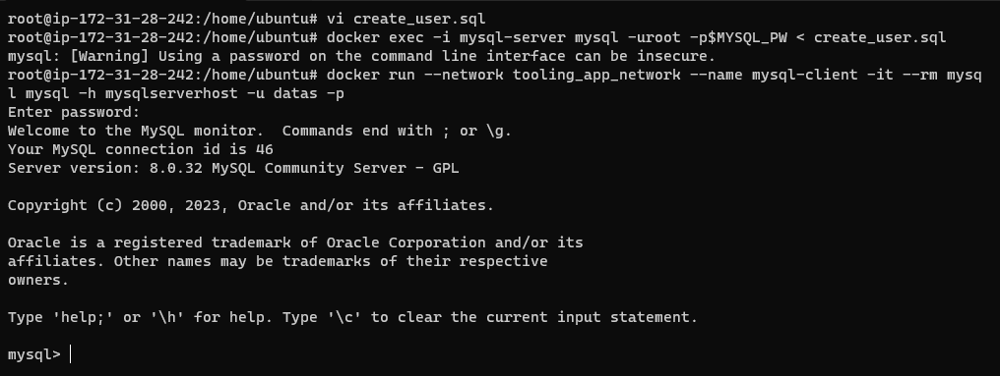

**Prepare database schema**

Now you need to prepare a database schema so that the Tooling application can connect to it.

1. Clone the Tooling-app repository from [here](https://github.com/hammedakinwale/project-20-tooling):

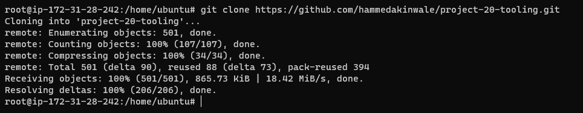

2. On your terminal, export the location of the SQL file

`export tooling_db_schema=tooling_db_schema.sql`

You can find the `tooling_db_schema.sql` in the `html` folder of cloned repo.

Verify that the path is exported

`echo $tooling_db_schema`

3. Use the SQL script to create the database and prepare the schema. With the docker exec command, you can execute a command in a running container.

`docker exec -i mysql-server mysql -uroot -p$MYSQL_PW < $tooling_db_schema`

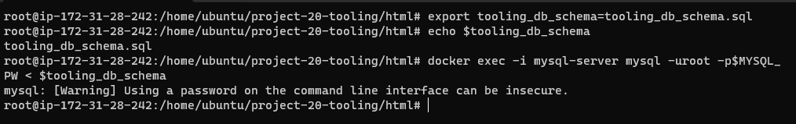

4. Update the .env file with connection details to the database The .env file is located in the html tooling/html/.env folder but not visible in terminal. you can use vi or nano

```
sudo vi .env

MYSQL_IP=mysqlserverhost
MYSQL_USER=<username>
MYSQL_PASS=<client-secret-password>
MYSQL_DBNAME=toolingdb
```

Flags used:

+ MYSQL_IP mysql ip address "leave as mysqlserverhost"
+ MYSQL_USER mysql username for user export as environment variable
+ MYSQL_PASS mysql password for the user exported as environment + varaible
+ MYSQL_DBNAME mysql databse name "toolingdb"

5. Run the Tooling App

Containerization of an application starts with creation of a file with a special name - 'Dockerfile' (without any extensions). This can be considered as a 'recipe' or 'instruction' that tells Docker how to pack your application into a container. In this project, you will build your container from a pre-created Dockerfile, but as a DevOps, you must also be able to write Dockerfiles.

**Note:** Ensure you edit the .env to have the data of your database.

Ensure you are inside the directory "tooling" that has the file Dockerfile and build your container :

`docker build -t tooling:0.0.1 .`

In the above command, we specify a parameter -t, so that the image can be tagged `tooling"0.0.1` - Also, you have to notice the `.` at the end. This is important as that tells Docker to locate the `Dockerfile` in the current directory you are running the command. Otherwise, you would need to specify the absolute path to the `Dockerfile`.

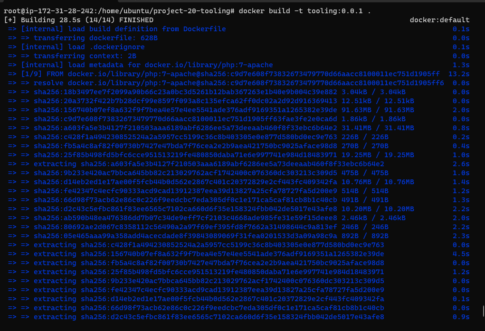
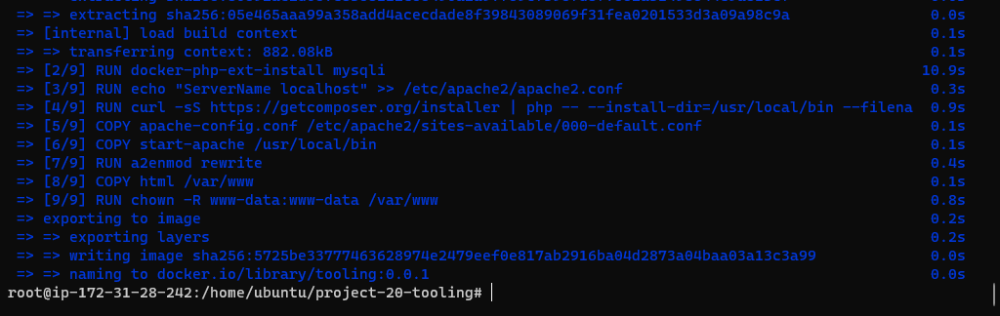

then run the container

`docker run --network tooling_app_network -p 8085:80 -it tooling:0.0.1`

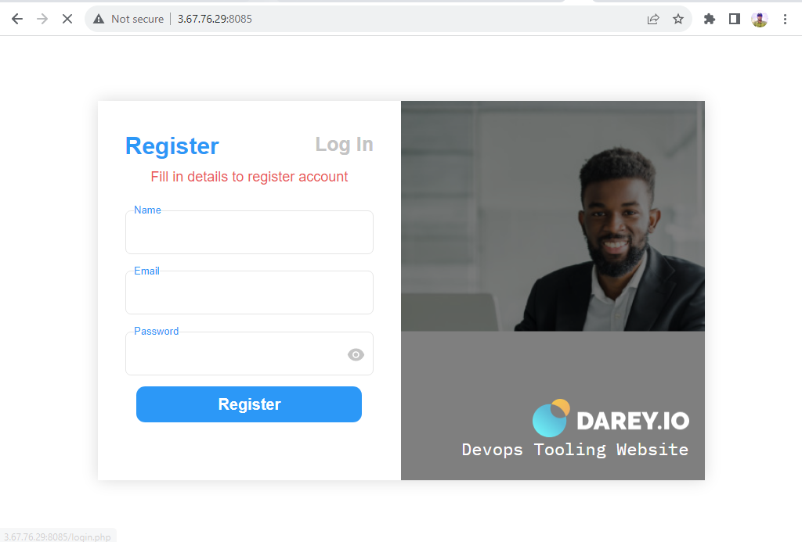

# PRACTICE TASK

Practice Task `No.1` – Implement a POC to migrate the PHP-Todo app into a containerized application.

Download php-todo repository from [here](https://github.com/hammedakinwale/php-todo)

The project below will challenge you a little bit, but the experience there is very valuable for future projects.

**Part 1**

+ Write a Dockerfile for the TODO app
+ Run both database and app on your laptop Docker Engine
+ Access the application from the browser

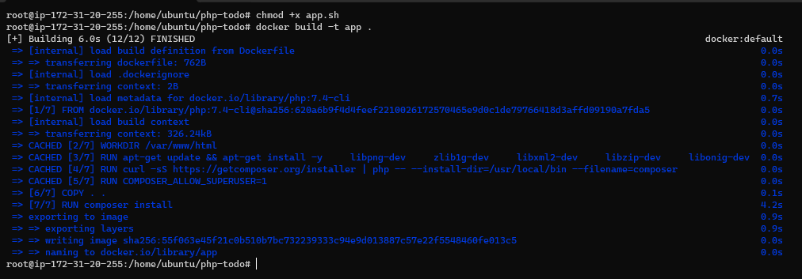
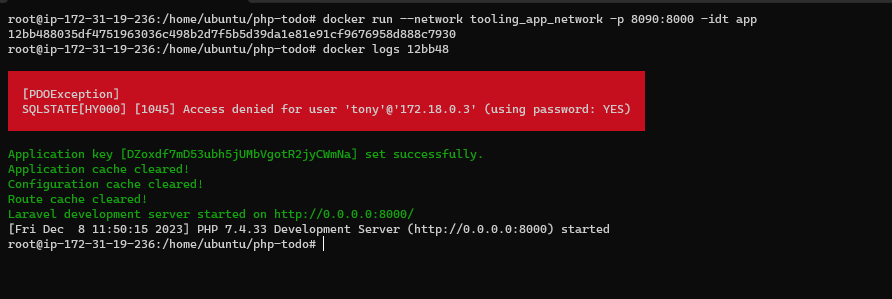
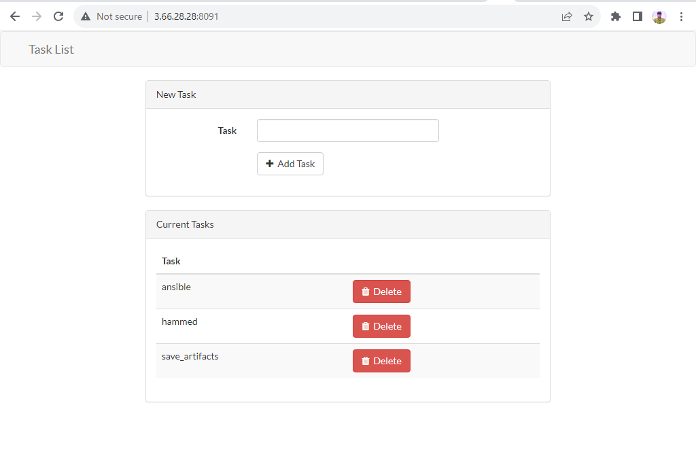

**Part 2**

+ Create an account in Docker [Hub](https://hub.docker.com/)
+ Create a new Docker Hub repository
+ Push the docker images from your PC to the repository

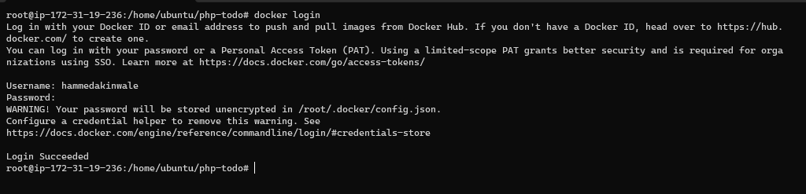
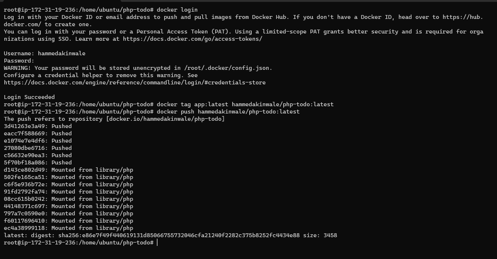
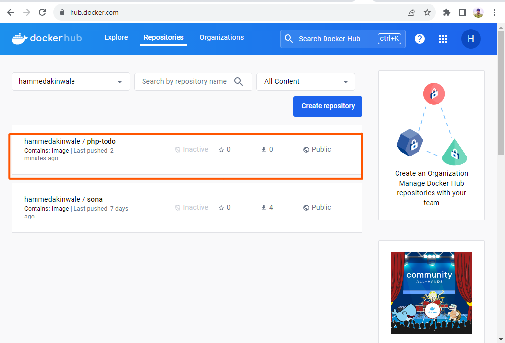

**Part 3**

1. Write a Jenkinsfile that will simulate a Docker Build and a Docker Push to the registry
2. Connect your repo to Jenkins
3. Create a multi-branch pipeline
4. Simulate a CI pipeline from a feature and master branch using previously created Jenkinsfile
5. Ensure that the tagged images from your Jenkinsfile have a prefix that suggests which branch the image was pushed from. For example, feature-0.0.1.
6. Verify that the images pushed from the CI can be found at the registry.

Deployment with [Docker Compose](https://docs.docker.com/compose/)

All we have done until now required quite a lot of effort to create an image and launch an application inside it. We should not have to always run Docker commands on the terminal to get our applications up and running. There are solutions that make it easy to write declarative code in YAML, and get all the applications and dependencies up and running with minimal effort by launching a single command.

In this section, we will refactor the Tooling app POC so that we can leverage the power of Docker Compose.

1. First, install Docker Compose on your workstation [here](https://docs.docker.com/desktop/install)
2. Create a file, name it tooling.yaml
3. Begin to write the Docker Compose definitions with YAML syntax. The YAML file is used for defining services, networks, and volumes:

```
version: "3.9"
services:
  tooling_frontend:
    build: .
    ports:
      - "5000:80"
    volumes:
      - tooling_frontend:/var/www/html
```

The YAML file has declarative fields, and it is vital to understand what they are used for.

`version`: Is used to specify the version of Docker Compose API that the Docker Compose engine will connect to. This field is optional from docker compose version v1.27.0. You can verify your installed version with:

```
docker-compose --version
docker-compose version 1.28.5, build c4eb3a1f
```

+ `service`: A service definition contains a configuration that is applied to each container started for that service. In the snippet above, the only service listed there is tooling_frontend. So, every other field under the tooling_frontend service will execute some commands that relate only to that service. Therefore, all the below-listed fields relate to the tooling_frontend service.
+ build
+ port
+ volumes
+ links

Let us fill up the entire file and test our application:

```
version: "3.9"
services:
  tooling_frontend:
    build: .
    ports:
      - "5000:80"
    volumes:
      - tooling_frontend:/var/www/html
    links:
      - db
  db:
    image: mysql:5.7
    restart: always
    environment:
      MYSQL_DATABASE: <The database name required by Tooling app >
      MYSQL_USER: <The user required by Tooling app >
      MYSQL_PASSWORD: <The password required by Tooling app >
      MYSQL_RANDOM_ROOT_PASSWORD: '1'
    volumes:
      - db:/var/lib/mysql
volumes:
  tooling_frontend:
  db:
```

Run the command to start the containers

`docker-compose -f tooling.yaml  up -d 
`

Verify that the compose is in the running status:

`docker compose ls
`

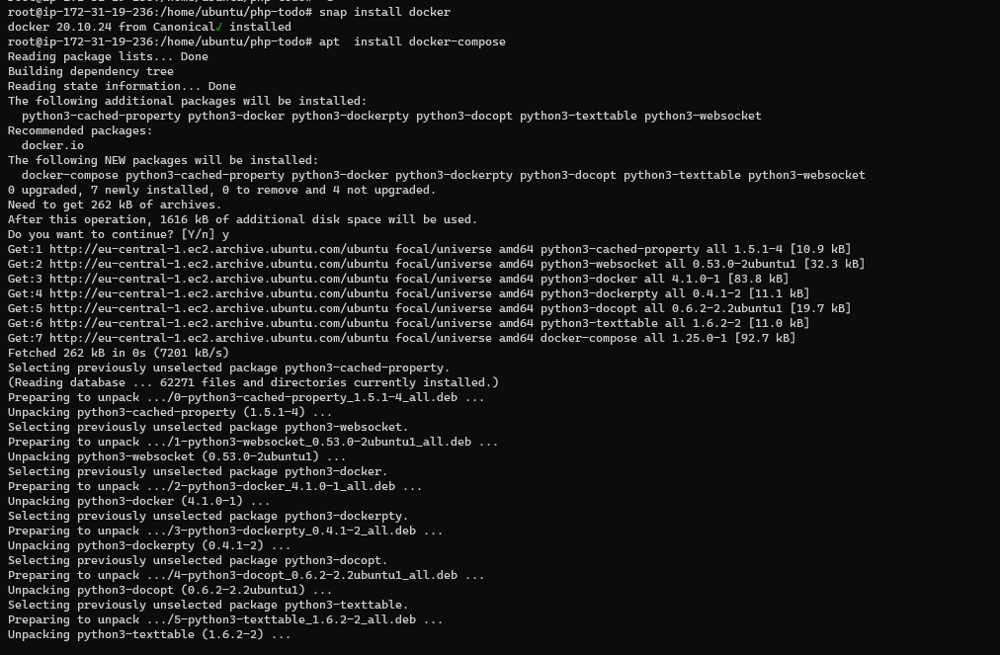
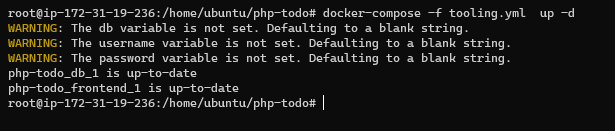
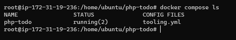