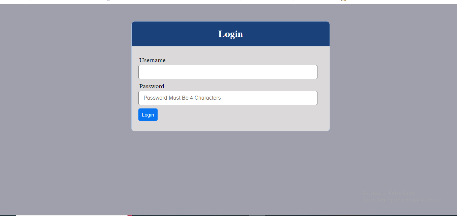

# Automate Infrastructure With IaC using Terraform – Terraform Cloud

## NOTE: you might notice i use WE alot that's me assuming my self working with a team!

### What Terraform Cloud is and why use it

[In previous project](https://github.com/hammedakinwale/Devops-projects/tree/main/22-automating-aws-infrastructure-in-code-using-terrafform-part-3) project, I refactored My terraform codes into modules and as a result the introduction of modules into a codebase helped save time and reduce costly errors by re-using configuration written either by yourself, other members of your team, or other Terraform practitioners who have published modules for you to use.

We require AMIs that are preconfigured with necessary packages for our applications to run on specific servers.


In this project, I will be introducing two new concepts

+ Packer
+ Terraform Cloud

## What is Packer?

Packer is an open source tool for creating identical machine images for multiple platforms from a single source configuration. Packer is lightweight, runs on every major operating systems, and is highly performant, creating machine images for multiple platforms in parallel.

**Step 1. Creating Bastion, Nginx, Tooling and Wordpress AMIs**

We will write packer code which helps us create AMIs for each of the following mentioned servers. A sample of the code can be found here: [packer code setup](https://gitlab.com/devops-projects2853448/packer-iac-ami)

For each of the following `.pkr.hcl` files, we run the following commands

```
- packer fmt <name>.pkr.hcl
- packer validate <name>.pkr.hcl
- packer build <name>.pkr.hcl
```


**Step 2. Setting Up Infrastructures using Terraform Cloud**

In this project, we changed the backend from S3 to a remote backend using Terraform Cloud. TF Cloud manages all state in our applications and carries out tf plan , tf validate and applies our infrastructures as required.

To do this, we setup an organization on terraform cloud and a workspace and link our workspace to our repository. On every commit, a webhook is triggered on terraform cloud and plans or applies our terrraform code based on need.


**Step 3. Ansible Dynamic Inventory**

A dynamic inventory is a script written in Python, PHP, or any other programming language. It comes in handy in cloud environments such as AWS where IP addresses change once a virtual server is stopped and started again.

We make use of dynamic inventory to get Ip address of our servers created based on their tag names and hence we are able to run the required role on each server.


**Step 4. Ansible Dynamic Inventory**

A dynamic inventory is a script written in Python, PHP, or any other programming language. It comes in handy in cloud environments such as AWS where IP addresses change once a virtual server is stopped and started again.

We make use of dynamic inventory to get Ip address of our servers created based on their tag names and hence we are able to run the required role on each server.


**Step 5. Checking Successful**




**Step 6. Destroying Resources**


