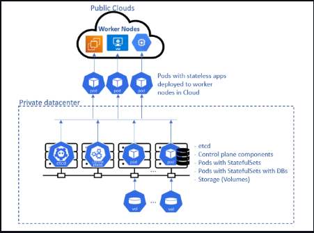

# Deploying Applications Into Kubernetes Cluster

In this project, we will initiate the deployment of applications within a Kubernetes (K8s) cluster. Kubernetes is a complex system with numerous components, working with multiple layers of abstraction that separate your application from the underlying host machines where it is executed.

we will explore and witness the following aspects in action:

+ Implementing the deployment of software applications using YAML manifest files, featuring various Kubernetes objects, including:

+ Pods
+ ReplicaSets
+ Deployments
+ StatefulSets
+ Services (ClusterIP, NodeIP, Loadbalancer)
+ Configmaps
+ Volumes
+ PersistentVolumes
+ PersistentVolumeClaims
+ And more.

+ Understanding the distinctions between stateful and stateless applications.

+ Demonstrating the deployment of MySQL as a StatefulSet and providing a rationale for this choice.

+ Identifying the limitations associated with deploying applications directly using YAML manifests in Kubernetes.

+ Introducing Helm templates, exploring their components, and highlighting the significance of semantic versioning.

+ Converting all the existing .yaml templates into a Helm chart for more streamlined management.

+ Deploying additional tools on AWS Elastic Kubernetes Service (EKS) using Helm charts, which include:

+ Jenkins
+ MySQL
+ Ingress Controllers (Nginx)
+ Cert-Manager
+ Ingress configurations for Jenkins and the primary application

+ Exploring the concept of Hybrid CI/CD by integrating various tools like Gitlab CI/CD and Jenkins. Additionally, we'll delve into GitOps principles using Weaveworks Flux.

When utilizing a Kubernetes cluster, the available options vary depending on its intended purpose.

Numerous organizations choose Managed Service solutions for various compelling reasons, such as:

+ Less administrative overheads
+ Reduced cost of ownership
+ Improved Security
+ Seamless support
+ Periodical updates to a stable and well-tested version
+ Faster cluster spin up

However, there is usually strong reasons why organisations with very strict compliance and security concerns choose to build their own Kubernetes clusters. Most of the companies that go this route will mostly use on-premises data centres. When there is need to store data privately due to its sensitive nature, companies will rather not use a public cloud provider. Because, if they do, they have no idea of the physical location of the data centre in which their data is being persisted. Banks and Governments are typical examples of this.

Some setup options can combine both public and private cloud together. For example, the master nodes, etcd clusters, and some worker nodes that run stateful applications can be configured in private datacentres, while worker nodes that require heavy computations and stateless applications can run in public clouds. This kind of hybrid architecture is ideal to satisfy compliance, while also benefiting from other public cloud capabilities.



We will be using the Elastic Kubernates Service(EKS) for this project. To set up the EKS, we need to install WSL. To install WSL click [here](https://learn.microsoft.com/en-us/windows/wsl/install).

OR

Run the following to enable WSL

`dism.exe /online /enable-feature /featurename:Microsoft-Windows-Subsystem-Linux /all /norestart`


Reboot your system.

After the reboot, open the Microsoft Store, search for your preferred Linux distribution (e.g., Ubuntu), and install it.


Complete the initial setup of the Linux distribution by creating a user and password.

Update the ubuntu packages On the WSL

`$ sudo apt update && sudo pat upgrade`


Install the AWS CLI tool

`sudo apt install awscli`


Download and install eksctl

[To download the latest release on UNIX, run:](https://github.com/eksctl-io/eksctl)

`$ eksctl version`


For the WSL to interact with the AWS we need to install awscli and configure it

`$ sudo apt install awscli`

`aws configure`


Install __pip__

`$ sudo apt install python3-pip`


and then Upgrade the __awscli__

`$ pip install --upgrade awscli`


To verify run any aws command

`$ aws s3 ls`

Setup kubectl

To setup kubectl we will refer to the [kubernetes documentation.](https://www.example.com)

Install kubectl

`$ curl -LO "https://dl.k8s.io/release/$(curl -L -s https://dl.k8s.io/release/stable.txt)/bin/linux/amd64/kubectl"`

Download the kubectl checksum file

```
$ curl -LO "https://dl.k8s.io/release/$(curl -L -s https://dl.k8s.io/release/stable.txt)/bin/linux/amd64/kubectl.sha256"
```

Validate the kubectl binary against the checksum file

`$ echo "$(cat kubectl.sha256) kubectl" | sha256sum --check`

Install kubectl

`$ sudo install -o root -g root -m 0755 kubectl /usr/local/bin/kubectl`

Verify

`$ kubectl version --client`


Now, you have eksctl installed on your Windows system through WSL. You can use it to interact with Amazon EKS clusters.

```
$ eksctl create cluster \
  --name depps \
  --region us-east-1 \
  --nodegroup-name worker \
  --node-type t2.micro \
  --nodes 2
```


Configure kubectl

After the cluster is created, you need to configure kubectl to connect to the cluster. Run the command below:

`$ aws eks --region us-east-1 update-kubeconfig --name depps`

Then run these to get nodes

`$ kubectl get nodes`


Creating A Pod For The Nginx Application

Create nginx pod by applying the manifest file nginx-pod.yml manifest file shown below

```
apiVersion: v1
kind: Pod
metadata:
  name: nginx-pod
  labels: 
    app: nginx-pod
spec:
  containers:
  - image: nginx:latest
    name: nginx-pod
    ports:
    - containerPort: 80
      protocol: TCP
```

Create the pods

`$ kubectl apply -f nginx-pod.yml`

We can access the pod using

`$ kubectl get pod nginx-pod.yml`

access the information about the pod with below script

`$ kubectl describe pod nginx-pod.yml`


ACCESSING THE APP FROM THE BROWSER

The primary objective of any solution is to enable access through either a web portal or application, such as a mobile app. In our current setup, we have a Pod equipped with an Nginx container. However, this Pod can't be accessed directly from a web browser due to its unique IP address.

To resolve this issue, we introduce another Kubernetes component known as a "Service."

A Service acts as an intermediary that receives requests and forwards them to the respective Pod's IP address.

In essence, a Service acts as a gateway that accepts incoming requests on behalf of the Pods and routes them to the appropriate Pod's IP address. If you execute the provided command, you can obtain the IP address of the Pod. Nonetheless, it's important to note that there is no direct means of accessing this Pod from the external world.

`$ kubectl get pod nginx-pod -o wide`


__Expose a Service on a server’s public IP address & static port__

Sometimes, it may be needed to directly access the application using the public IP of the server (when we speak of a K8s cluster we can replace ‘server’ with ‘node’) the Pod is running on. This is when the NodePort service type comes in handy.

A Node port service type exposes the service on a static port on the node’s IP address. NodePorts are in the __30000-32767__ range by default, which means a NodePort is unlikely to match a service’s intended port (for example, 80 may be exposed as 30080).

Create a Service - __nginx-svc.yml__ manifest file

```
apiVersion: v1
kind: Service
metadata:
  name: nginx-service
spec:
  type: NodePort
  selector:
    app: nginx-pod
  ports:
    - protocol: TCP
      port: 80
      nodePort: 30080
```

Create the service

`$ kubectl apply -f nginx-svc.yml`

We can access the svc using

`$ kubectl get svc -o wide`

To access the information about the service

`$ kubectl describe svc nginx-svc.yml`


To access the service,

Allow the inbound traffic in your EC2’s Security Group to the NodePort range 30080


The port number 30080 designates the specific port associated with the node where the Pod is currently scheduled to operate. Should the Pod undergo rescheduling to a different node, it will retain this very port number on its new hosting node. Consequently, if you have multiple Pods concurrently running on diverse nodes, each of them will be accessible via their respective node IP addresses, all employing the same consistent port number.

To delete the pod

`$ kubectl delete nginx-pod`

To delete the service

`$ kubectl delete nginx-service`

CREATE A REPLICA SET

Let us create a `rs.yml` manifest for a ReplicaSet object


The manifest file of ReplicaSet consist of the following fields

+ apiVersion: This field specifies the version of kubernetes Api to which the object belongs. ReplicaSet belongs to apps/v1 apiVersion.
+ kind: This field specify the type of object for which the manifest belongs to. Here, it is ReplicaSet.
+ metadata: This field includes the metadata for the object. It mainly includes two fields: name and labels of the ReplicaSet.
+ spec: This field specifies the label selector to be used to select the Pods, number of replicas of the Pod to be run and the container or list of containers which the Pod will run. In the above example, we are running 3 replicas of nginx container.

Create the nginx replicaset

`$ kubectl apply -f nginx-rs.yml`

`$ kubectl get pods`

To access the information about the pods

`$ kubectl describe pod <pod-id>`

OR

`$ kubectl get pod <pod-id> -o yaml`


Detailed information about the replicaset

`$ kubectl get rs nginx-rs -o yaml`

OR

`$ kubectl get rs nginx-rs -o json`


We can easily scale our ReplicaSet by specifying the desired number of replicas

`$ kubectl scale rs nginx-rs --replicas=<number-of-pods>`


Advanced label matching

As Kubernetes mature as a technology, so does its features and improvements to k8s objects. ReplicationControllers do not meet certain complex business requirements when it comes to using selectors. Imagine if you need to select Pods with multiple lables that represents things like

+ Application tier: such as Frontend, or Backend
+ Environment: such as Dev, SIT, QA, Preprod or Prod

So far, we used a simple selector that just matches a key-value pair and check only equality

```
  selector:
    app: nginx-pod
```

But in some cases, we want ReplicaSet to manage our existing containers that match certain criteria, we can use the same simple label matching or we can use some more complex conditions, such as:

+ in
+ not in
+ not equal
+ etc... Let us create the rs.yml manifest file

```
apiVersion: apps/v1
kind: ReplicaSet
metadata: 
  name: nginx-rs
spec:
  replicas: 2
  selector:
    matchLabels:
      env: prod
    matchExpressions:
    - { key: tier, operator: In, values: [frontend] }
  template:
    metadata:
      name: nginx
      labels: 
        env: prod
        tier: frontend
    spec:
      containers:
      - name: nginx-container
        image: nginx:latest
        ports:
        - containerPort: 80
          protocol: TCP
```

In the above spec file, under the selector, matchLabels and matchExpression are used to specify the key-value pair. The matchLabel works exactly the same way as the equality-based selector, and the matchExpression is used to specify the set based selectors. This feature is the main differentiator between ReplicaSet and previously mentioned obsolete ReplicationController.

Create the replicaset

`$ kubectl apply -f rs.yml`

Get the replication set

`$ kubectl get rs nginx-rs -o wide`


USING AWS LOAD BALANCER TO ACCESS YOUR SERVICE IN KUBERNETES.

We have previously interacted with the Nginx service using ClusterIP and NodeIP. However, there's yet another service type known as LoadBalancer. This particular service not only establishes a Service object within Kubernetes but also sets up an actual external Load Balancer, such as the Elastic Load Balancer (ELB) in AWS, if available.

Create the service and ensure that the selector references the Pods in the replica set.

```
apiVersion: v1
kind: Service
metadata:
  name: nginx-service
spec:
  type: LoadBalancer
  selector:
    tier: frontend
  ports:
    - protocol: TCP
      port: 80 # This is the port the Loadbalancer is listening at
      targetPort: 80 # This is the port the container is listening at
```

Create the nginxlb-svc.yml

`$ kubectl apply -f nginx-elb.yml`

An ELB resource will be created in your AWS console


A Kubernetes component in the control plane called Cloud-controller-manager is responsible for triggering this action. It connects to your specific cloud provider’s (AWS) APIs and create resources such as Load balancers. It will ensure that the resource is appropriately tagged


To get the endpoint for the load balancer

`$ kubectl get svc`


To get information about the nginx-service

`$ kubectl describe svc nginx-service`

OR

`$ kubectl get svc nginx-service -o yaml`


A clusterIP key is updated in the manifest and assigned an IP address. Even though you have specified a Loadbalancer service type, internally it still requires a clusterIP to route the external traffic through. In the ports section, nodePort is still used. This is because Kubernetes still needs to use a dedicated port on the worker node to route the traffic through. Ensure that port range 30000-32767 is opened in your inbound Security Group configuration.

Delete the replicaset and the nginx service

`$ kubectl delete rs nginx-rs`

`$ kubectl delete svc nginx-service`

USING DEPLOYMENT CONTROLLERS

A Deployment is another layer above ReplicaSets and Pods, newer and more advanced level concept than ReplicaSets. It manages the deployment of ReplicaSets and allows for easy updating of a ReplicaSet as well as the ability to roll back to a previous version of deployment. It is declarative and can be used for rolling updates of micro-services, ensuring there is no downtime.

Officially, it is highly recommended to use Deployments to manage replica sets rather than using replica sets directly.

Create a deploy.yml manifest

```
apiVersion: apps/v1
kind: Deployment
metadata:
  name: nginx-deploy
  labels:
    tier: frontend
spec:
  replicas: 3
  selector:
    matchLabels:
      tier: frontend
  template:
    metadata:
      labels:
        tier: frontend
    spec:
      containers:
      - name: nginx
        image: nginx:latest
        ports:
        - containerPort: 80
```

Create the deployment

`$ kubectl apply -f deploy.yaml`

Get the deployment

`$ kubectl get deploy`

Get the replicaset

`$ kubectl get rs`

Get the pods

`$ kubectl get pods`


From the above we found out that two of the pods are pending. To get information about the pod

`$ kubectl describe pod <pod-id>`


The Event will help us with the problem with the pods.

The warning indicates that there are no available nodes to schedule your pods because all nodes are occupied because I used t2.micro to create the clsuter.

Some of the ways to resolve this include:

+ Add more nodes to your cluster.
+ Adjust resource requests and limits.
+ Prioritize pods.
+ Use PodDisruptionBudgets.
+ Scale down or remove unnecessary pods.

I had to update the depoy.yml file to scale down the replicaset to 2.

Connect into one of the Pods' container to run Linux commands

`$ kubectl exec -it nginx-deploy-7d476d754d-wrgsn /bin/bash`

List the files and folders in the Nginx directory

`$ ls -latr /etc/nginx`

We can access the content of the default.conf

`$ cat /etc/nginx/conf.d/default.conf`


Create the nginxlb-svc.yml service and access the nginx from the browser using the loadbalancer endpoint.


The set up looks like this


PERSISTING DATA FOR PODS

Deployments are stateless by design. Hence, any data stored inside the Pod’s container does not persist when the Pod dies.

If you were to update the content of the index.html file inside the container, and the Pod dies, that content will not be lost since a new Pod will replace the dead one.

To see this in action, scale down the pods from 2 to 1

`kubectl scale deployment nginx-deploy --replicas=1`


Connect into the pod and install vim

`$ kubectl exec -itnginx-deploy-7d476d754d-wrgsn /bin/bash`

`# apt update && apt install vim -y`


Update the content of the file and add the code below /usr/share/nginx/html/index.html

`$ vim /usr/share/nginx/html/index.html`

```
<!DOCTYPE html>
<html>
<head>
<title>Welcome Home Hammed!</title>
<style>
    body {
        width: 35em;
        margin: 0 auto;
        font-family: Tahoma, Verdana, Arial, sans-serif;
    }
</style>
</head>
<body>
<h1>Here is the first page of your nginx app!</h1>
<p>Learning by doing is so much fun</p>

<p>Project Based learning at 
<a href="https://darey.io/">www.darey.io</a>.<br/>
Start your Learning today at
<a href="https://darey.io/">www.darey.io</a>.</p>

<p><em>Thanks</em></p>
</body>
</html>
```


Reload the browser to see the changes mad


Now, delete only the running Pod

`$ kubectl delete pod nginx-deploy-7d476d754d-wrgsn`


We will see that the replicaset creates another pod with a different pod ID.

Refresh the web page


You will see that the content that was saved in the container is no longer there. That is because Pods do not store data when they are being recreated – that is why they are called ephemeral or stateless.

Storage is a critical part of running containers, and Kubernetes offers some powerful primitives for managing it. Dynamic volume provisioning, a feature unique to Kubernetes, which allows storage volumes to be created on-demand. Without dynamic provisioning, DevOps engineers must manually make calls to the cloud or storage provider to create new storage volumes, and then create PersistentVolume objects to represent them in Kubernetes. The dynamic provisioning feature eliminates the need for DevOps to pre-provision storage. Instead, it automatically provisions storage when it is requested by users.

To make the data persist in case of a Pod’s failure, you will need to configure the Pod to use following objects:

+ Persistent Volume or pv – is a piece of storage in the cluster that has been provisioned by an administrator or dynamically provisioned using Storage Classes.

+ Persistent Volume Claim or pvc. Persistent Volume Claim is simply a request for storage, hence the "claim" in its name.

In the next project,

+ we will use Terraform to create a Kubernetes EKS cluster in AWS, and use some powerful features such as PV, PVCs, ConfigMaps. -we will also be packaging Kubernetes manifests using Helm

+ Dynamic provisioning of volumes to make Pods stateful, using Kubernetes Statefulset

+ Deploying applications into Kubernetes using Helm Charts And many more awesome technologies.

PROBLEMS YOU MIGHT ENCOUNTERED

you might not be able to connect the kubectl to the kubernetes api server using

you can resolve that by upgrading awscli to latest version with:

`$ pip install --upgrade awscli`


you can destroy the entire cluster with command below:

`eksctl delete cluster <the-cluster-name> --region us-east-1`