# PERSISTING DATA IN KUBERNETES

Now, it is important to understand that containers in Kubernetes are designed to be stateless. This means that data doesn't persist within the containers. Even when you deploy containers within Kubernetes pods, they maintain their statelessness unless you specifically configure your environment to support statefulness.

Create a cluster on EKS

```
eksctl create cluster \
  --name deployment \
  --region us-east-1 \
  --nodegroup-name worker \
  --node-type t2.micro \
  --nodes 2
```

Create a deployment deploy.yml

```
apiVersion: apps/v1
kind: Deployment
metadata:
  name: nginx-deploy
  labels:
    tier: frontend
spec:
  replicas: 1
  selector:
    matchLabels:
      tier: frontend
  template:
    metadata:
      labels:
        tier: frontend
    spec:
      containers:
      - name: nginx
        image: nginx:latest
        ports:
        - containerPort: 80
```

`$ kubectl apply -f deploy.yml`

Verify the pod is running

`$ kubectl get pods`

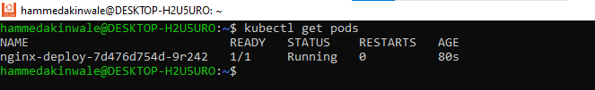

To introduce statefulness in Kubernetes, you need to grasp the workings of volumes, persistent volumes and persistent volume claims.

Volumes

Files stored on the disk within a container are temporary, posing challenges for complex applications running within containers. One issue is the potential loss of files when a container crashes. The kubelet responsible for managing containers, restarts the container but it starts with a clean slate. Another issue arises when multiple containers within the same pod need to share files. The Kubernetes volume abstraction effectively addresses both of these problems.

Docker also incorporates the concept of volumes, though it is somewhat less structured and managed. In Docker, a volume can be a directory on the disk or within another container. Docker offers volume drivers but their functionality is limited.

Kubernetes, on the other hand, supports a wide range of volume types. Within a pod, you can utilize various volume types simultaneously. Ephemeral volume types have a lifespan tied to the pod's existence, while persistent volumes persist even after a pod terminates. When a pod is no longer needed, Kubernetes removes ephemeral volumes but it retains persistent volumes. This means that, regardless of the volume type, data remains intact even when containers are restarted.

At its core, a volume is a directory, potentially containing data, that is accessible to the containers within a pod. The creation, underlying medium, and content of this directory depend on the specific volume type used. As a result, it's crucial to have a good understanding of the various volume types available in Kubernetes so that you can select the most suitable one for your particular use case.

__awsElasticBlockStore__

An awsElasticBlockStore volume mounts an Amazon Web Services (AWS) EBS volume into your pod. The contents of an EBS volume are persisted and the volume is only unmmounted when the pod crashes or terminates. This means that an EBS volume can be pre-populated with data, and that data can be shared between pods.

see how stateless volume works [here](https://github.com/hammedakinwale/Devops-projects/tree/main/26-Deploying-Applications-Into-Kubernetes-Cluster)

__NOTE:__ There are some restrictions when using an awsElasticBlockStore volume:

+ The nodes on which pods are running must be AWS EC2 instances
+ Those instances need to be in the same region and availability zone as the EBS volume
+ EBS only supports a single EC2 instance mounting a volume.

Now that we have the pod running without a volume.

lets create a volume using either AWS Console or aws ec2 create-volume.

Before the volume is created, we need to ensure that the volume exists in the same region and availability zone as the EC2 instance running the pod.

`$ kubectl get pod nginx-deploy-7d476d754d-9r242 -o wide`

Describe the node to get the availability zone

`$ kubectl describe node ip-192-168-21-175.ec2.internal`

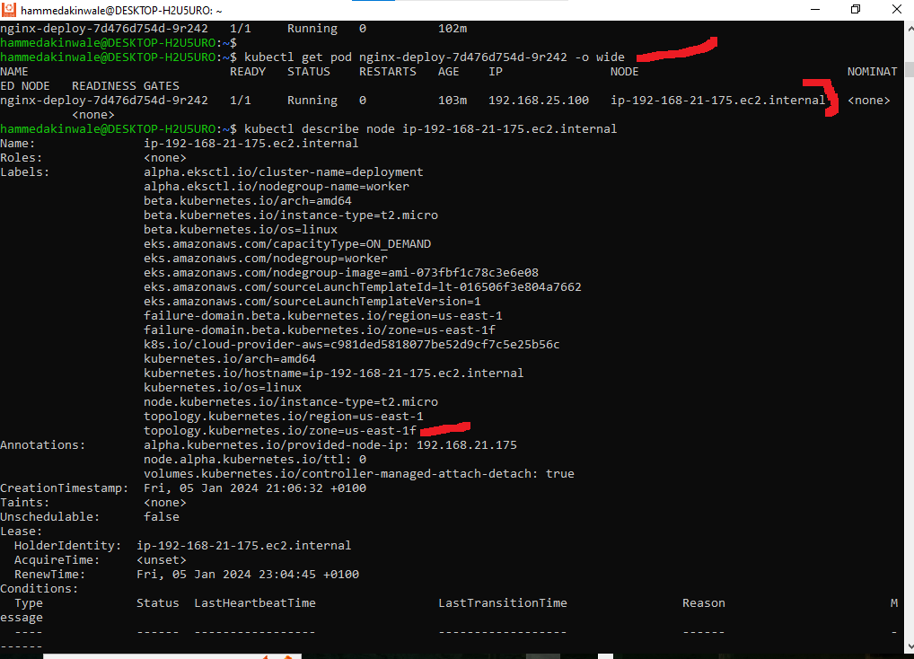

we know the AZ for the node is in us-east-1f. The volume must be created in the same AZ. Choose the size of the required volume.

Create the EBS Volume

`$ aws ec2 create-volume --availability-zone us-east-1f --size 10 --volume-type gp2`

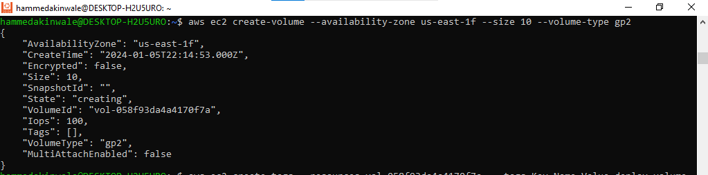

Tag the volume

`$ aws ec2 create-tags --resources vol-058f93da4a4170f7a  --tags Key=Name,Value=deploy-volume Key=Environment,Value=Production`

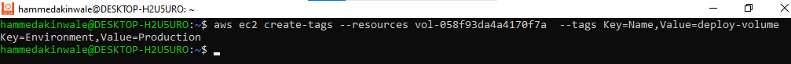
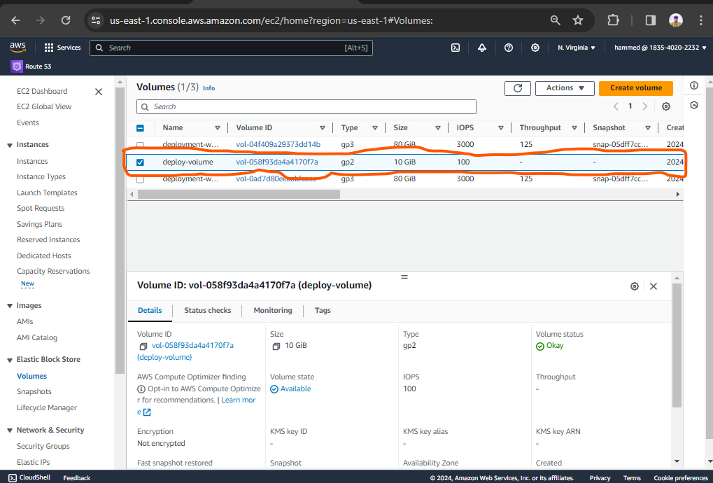

Update the deploy.yml configuration with the volume specificaation.

```
apiVersion: apps/v1
kind: Deployment
metadata:
  name: nginx-deploy
  labels:
    tier: frontend
spec:
  replicas: 1
  selector:
    matchLabels:
      tier: frontend
  template:
    metadata:
      labels:
        tier: frontend
    spec:
      containers:
      - name: nginx
        image: nginx:latest
        ports:
        - containerPort: 80
      volumes:
      - name: nginx-volume
        awsElasticBlockStore:
          volumeID: "vol-058f93da4a4170f7a"
          fsType: ext4
```

The volume section indicates the type of volume to be used to ensure persistence.

Apply the new configuration

`$ kubectl apply -f deploy.yml`

Now, the new pod has a volume attached to it and can be used to run a container for statefuleness.

To verify run

`$ kubectl get deploy`

`$ kubectl get pods`

`$ kubectl describe pods nginx-deploy-7fc7dfc767-bbn8t`

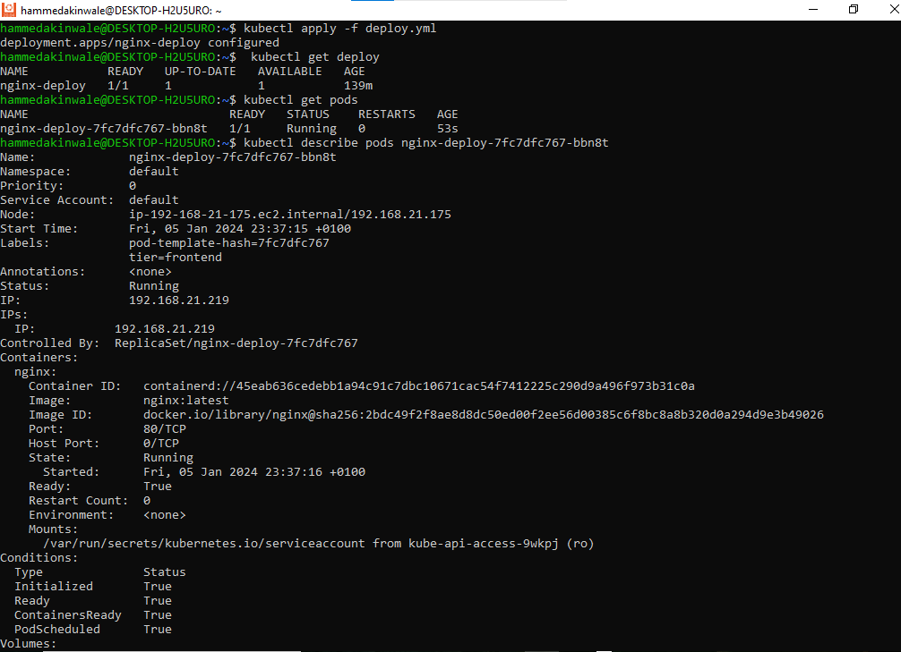

At this stage, although the pod can accommodate a stateful application, the configuration remains unfinished. This is due to the fact that the volume has not yet been attached to any specific file system within the container. The directory /usr/share/nginx/html, which houses the software or website code remains ephemeral, and any modifications to the index.html file will only persist as long as the pod is active. If the pod terminates, all previously written data will be lost.

To finalize the configuration, an additional section must be added to the deployment YAML manifest. The "volumeMounts" section essentially addresses the question, "Where should this volume be mounted inside the container?" Mounting a volume to a directory ensures that all data written to that directory will be stored on the specified volume.

```
apiVersion: apps/v1
kind: Deployment
metadata:
  name: nginx-deploy
  labels:
    tier: frontend
spec:
  replicas: 1
  selector:
    matchLabels:
      tier: frontend
  template:
    metadata:
      labels:
        tier: frontend
    spec:
      containers:
      - name: nginx
        image: nginx:latest
        ports:
        - containerPort: 80
        volumeMounts:
        - name: nginx-volume
          mountPath: /usr/share/nginx/
      volumes:
      - name: nginx-volume
        # This AWS EBS volume must already exist.
        awsElasticBlockStore:
          volumeID: "vol-058f93da4a4170f7a"
          fsType: ext4
```

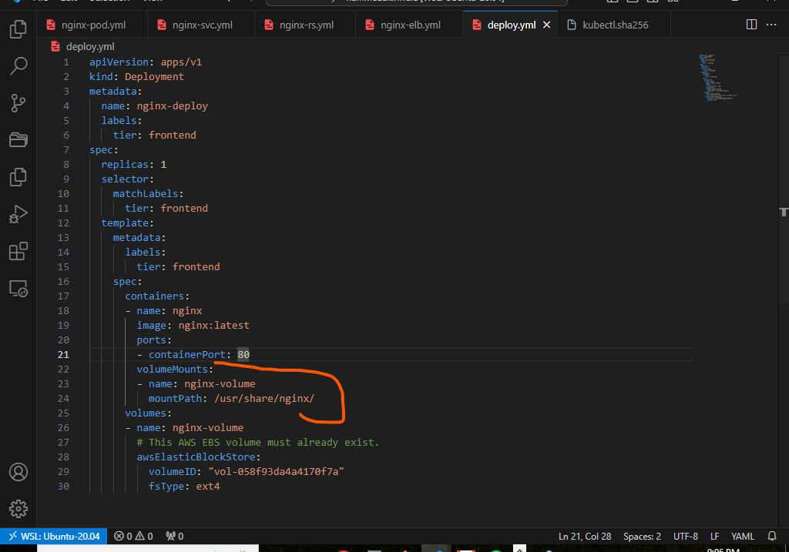

Notice the newly added section in the above.

The name you specify in the volumeMounts section must match the name used in the volumes section. This ensures that the volume is correctly mounted at the specified mount path. While data persistence solves some problems, it introduces new challenges.

Creating a volume currently involves a manual procedure that requires ensuring the volume is in the same Availability Zone as the running pod, followed by an update to the manifest file to include the volume ID. This approach contradicts DevOps principles, introducing unnecessary hurdles for straightforward tasks.

A more refined approach to address this challenge is to leverage Persistent Volumes and Persistent Volume Claims (PVCs).

Within Kubernetes, there exist several elegant methods for data persistence, each tailored to specific use cases.

+ Persistent Volume (PV) and Persistent Volume Claim (PVC): This pair of resources facilitates the effective management of storage. Persistent Volumes are cluster-wide storage resources, while Persistent Volume Claims act as requests for those resources. This dynamic duo allows for a more automated and scalable approach to handling storage.

+ configMap: While not directly related to data persistence, ConfigMaps in Kubernetes serve as a means to store configuration data in key-value pairs. They are an essential tool for managing application settings and configuration in a more organized manner.

__MANAGING VOLUMES DYNAMICALLY WITH PVS AND PVCS__

Kubernetes simplifies storage management by providing API objects that abstract the complexities of tasks such as volume provisioning, storage allocation, and access management. Users need only define manifest files to specify their desired actions.

Persistent Volumes (PVs) are storage plugins with an independent lifecycle, separate from the Pods that utilize them. This resilience ensures that even if a Pod terminates, the PV persists. A PV can be manually provisioned through an administrator's manifest file or dynamically generated if a predefined storage class is available.

Creating a PV manually resembles traditional volume creation through a console. However, the preferred approach is to automate PV creation by adding it to the container specification within deployments. Note that PVs cannot be automatically generated in the absence of a configured storage class in the cluster.

For storage systems like NFS, iSCSI, or cloud provider-specific solutions such as AWS's EBS, PVs can be dynamically generated to create volumes for Pods. This requires the presence of a storage class resource within the cluster for PV provisioning.

During the installation of Amazon EKS (Elastic Kubernetes Service), an out-of-the-box storage class is preconfigured. This default storage class utilizing Amazon's solid-state drives (SSDs) of the gp2 type, is designed to accommodate a diverse array of transactional workloads.

Run the command below to check if storageclass is present in the cluster

`$ kubectl get storageclass`

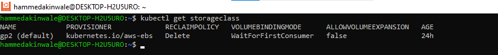

If there is no storage class in your cluster, below manifest is an example of how one would be created

```
kind: StorageClass
apiVersion: storage.k8s.io/v1
metadata:
  name: gp2
  annotations:
    storageclass.kubernetes.io/is-default-class: "true"
provisioner: kubernetes.io/aws-ebs
parameters:
  type: gp2
  fsType: ext4
```

A PersistentVolumeClaim (PVC), in contrast, serves as a demand for storage. Just as Pods utilize resources on a node, PVCs tap into the resources offered by Persistent Volumes (PVs). While Pods can make resource requests specifying CPU and memory requirements, Claims can request specific storage size and [access modes.](https://kubernetes.io/docs/concepts/storage/persistent-volumes/#access-modes) These [access modes.](https://kubernetes.io/docs/concepts/storage/persistent-volumes/#access-modes) modes can be configured as

+ ReadWriteOnce
+ ReadOnlyMany
+ ReadWriteMany
+ ReadWriteOncePod as detailed in the [access modes.](https://kubernetes.io/docs/concepts/storage/persistent-volumes/#access-modes)

Lifecycle of a PV and PVC

Persistent Volumes (PVs) represent resources within a cluster, while Persistent Volume Claims (PVCs) serve as requests for these resources and also act as claims to those resources. The interplay between PVs and PVCs follows a specific lifecycle:

Provisioning:

+ Static/Manual Provisioning: Cluster administrators manually create PVs using a manifest file that contains all the storage details. PVs are not limited to specific namespaces; they are clusterwide resources and are available for use upon request. In contrast, PVCs are namespace-specific.
+ Dynamic Provisioning: When there is no PV that matches a PVC's request, a dynamic PV is created based on the available StorageClass. If no suitable StorageClass exists, the PVC's request for a PV will fail.

Binding:

+ PVCs are exclusively bound to specific PVs in a one-to-one mapping. Claims will remain unbound until a matching volume becomes available. For example, if a cluster has 50Gi PVs and a PVC requests 100Gi, the PVC can only be bound once a 100Gi PV is added to the cluster.

Using:

+ Pods use PVCs as volumes. The cluster identifies the bound volume associated with a claim and mounts it for the Pod. Users can specify the desired access mode when using their claim as a volume in a Pod. Once a user has a bound claim, they retain access to the corresponding PV for as long as they need it.

Storage Object in Use Protection:

+ This feature ensures that PersistentVolumeClaims (PVCs) actively used by Pods and PersistentVolumes (PVs) bound to PVCs are not removed from the system to prevent data loss. If a PVC is in active use by a Pod, its deletion is postponed until it is no longer actively used. The same applies to PVs bound to PVCs; their removal is delayed until they are no longer bound.

Reclaiming:

+ When a user is finished with their volume, they can delete the PVC objects from the API, allowing the resource to be reclaimed. The reclaim policy for a PersistentVolume dictates what happens to the volume after it is released from its claim. Options include:

+ Retain: The volume is manually reclaimed. After a PersistentVolumeClaim is deleted, the PersistentVolume is considered "released" but retains the previous claimant's data.

+ Delete: For volume plugins supporting the Delete reclaim policy, both the PersistentVolume object and the associated external storage asset are removed. Dynamically provisioned volumes inherit the reclaim policy of their StorageClass, typically defaulting to Delete.

NOTES:

+ Expanding the size of PVCs is only possible if the storageClass is configured to allow expansion with the allowVolumeExpansion field set to true in the manifest YAML file.
+ PVs provisioned in a specific availability zone can only be used by pods running in that zone. Attempts to use the PV in a different AZ will result in pending state and a volume node affinity conflict message.
+ PVs are clusterwide resources not limited to namespaces, while PVCs are namespace-scoped.

[Click here.](https://kubernetes.io/docs/concepts/storage/persistent-volumes/#types-of-persistent-volumes) to see types of persistent volumes.

Now lets create some persistence volumes for our nginx deployment. We will use 2 different approaches.

Approach 1

Create a manifest file for a PVC, and based on the gp2 storageClass a PV will be dynamically created

```
    apiVersion: v1
    kind: PersistentVolumeClaim
    metadata:
      name: nginx-volume-claim
    spec:
      accessModes:
      - ReadWriteOnce
      resources:
        requests:
          storage: 2Gi
      storageClassName: gp2
```

Create the manifest file

`$ kubectl apply -f pvc.yml`

`$ kubectl describe pvc nginx-volume-claim`

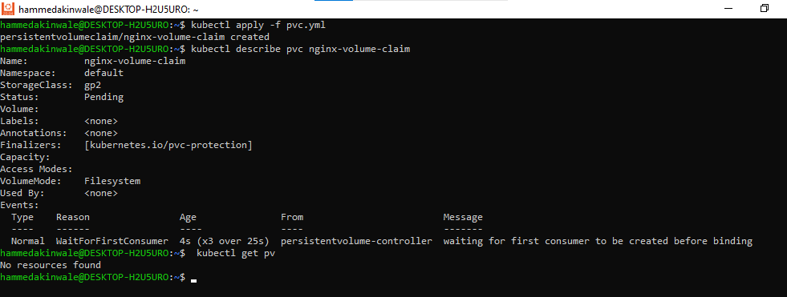

If you run kubectl get pv you will see that no PV is created yet. The waiting for first consumer to be created before binding is a configuration setting from the storageClass.

To proceed, simply apply the new deployment configuration below.

Then configure the Pod spec to use the PVC

```
    apiVersion: apps/v1
    kind: Deployment
    metadata:
      name: nginx-deployment
      labels:
        tier: frontend
    spec:
      replicas: 1
      selector:
        matchLabels:
          tier: frontend
      template:
        metadata:
          labels:
            tier: frontend
        spec:
          containers:
          - name: nginx
            image: nginx:latest
            ports:
            - containerPort: 80
            volumeMounts:
            - name: nginx-volume-claim
              mountPath: "/tmp/hammed"
          volumes:
          - name: nginx-volume-claim
            persistentVolumeClaim:
              claimName: nginx-volume-claim
```

Notice that the volumes section now has a persistentVolumeClaim. With the new deployment manifest, the /tmp/hammed directory will be persisted, and any data written in there will be stored permanetly on the volume, which can be used by another Pod if the current one gets replaced.

CONFIGMAP

ConfigMaps are not intended for data storage but rather serve as a means to manage configuration files, safeguarding them against loss during Pod replacement.

To illustrate this, I will utilize the HTML file provided with Nginx, which can be located in the /usr/share/nginx/html/index.html directory.

to demonstrate this, we will use the HTML file that came with Nginx. This file can be found in /usr/share/nginx/html/index.html  directory.

Let's walk through the following steps to demonstrate a use case for ConfigMaps:

+ Remove the `volumeMounts` and PVC (Persistent Volume Claim) sections from the manifest.
+ Apply the modified configuration using `kubectl`.

Next, port forward the service to ensure you can access the "Welcome to Nginx" page.

Finally, execute a command to access the running container and create a copy of the index.html file, storing it in a suitable location.

Create a deployment deploy.yml and a service nginxlb-svc.yml

`$ kubectl apply -f deploy-pvc.yml`

`$ kubectl apply -f nginxlb-svc.yml`

`$ kubectl get pods`

Get the loadbalancer endpoint

`$ kubectl get svc`

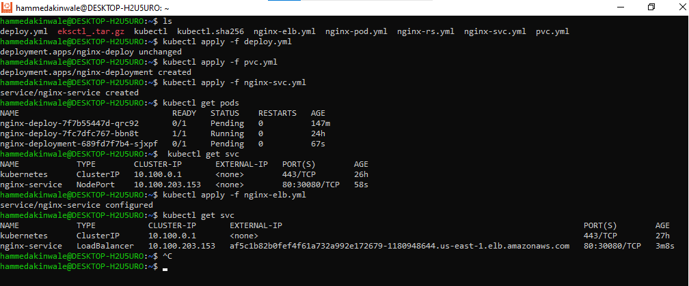
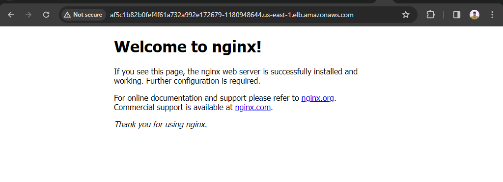

Connect to the container in the pod and access the /usr/share/nginx/html/index.html

`$ kubectl exec -it nginx-deploy-7fc7dfc767-bbn8t -- /bin/bash`

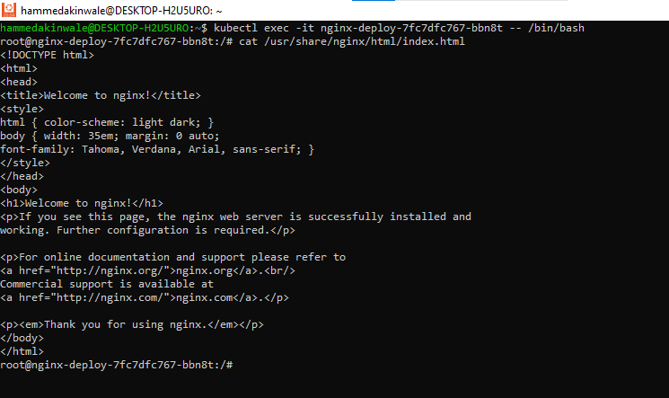

Copy the contents to a file on your local pc because we will need it to create a configmap

Storing Configuration Data Using ConfigMaps

As per the official documentation on ConfigMaps, a ConfigMap is an API resource designed for the storage of non-sensitive data in the form of key-value pairs. ConfigMaps can be utilized by pods to access configuration data through environment variables, command-line arguments, or as configuration files stored in a volume.

For our specific scenario, we will employ a ConfigMap to generate a file within a volume. The corresponding manifest file will appear as follows

```
<!DOCTYPE html>
<html>
<head>
<title>Welcome to nginx!</title>
<style>
html { color-scheme: light dark; }
body { width: 35em; margin: 0 auto;
font-family: Tahoma, Verdana, Arial, sans-serif; }
</style>
</head>
<body>
<h1>Welcome to nginx!</h1>
<p>If you see this page, the nginx web server is successfully installed and
working. Further configuration is required.</p>

<p>For online documentation and support please refer to
<a href="http://nginx.org/">nginx.org</a>.<br/>
Commercial support is available at
<a href="http://nginx.com/">nginx.com</a>.</p>

<p><em>Thank you for using nginx.</em></p>
</body>
</html>
```

Apply the new manifest file

`$ kubectl apply -f nginx-configmap.yml`

Update the deployment file to use the configmap in the volumeMounts section

```
apiVersion: apps/v1
kind: Deployment
metadata:
  name: nginx-deployment
  labels:
    tier: frontend
spec:
  replicas: 1
  selector:
    matchLabels:
      tier: frontend
  template:
    metadata:
      labels:
        tier: frontend
    spec:
      containers:
      - name: nginx
        image: nginx:latest
        ports:
        - containerPort: 80
        volumeMounts:
          - name: config
            mountPath: /usr/share/nginx/html
            readOnly: true
      volumes:
      - name: config
        configMap:
          name: website-index-file
          items:
          - key: index-file
            path: index.html
```

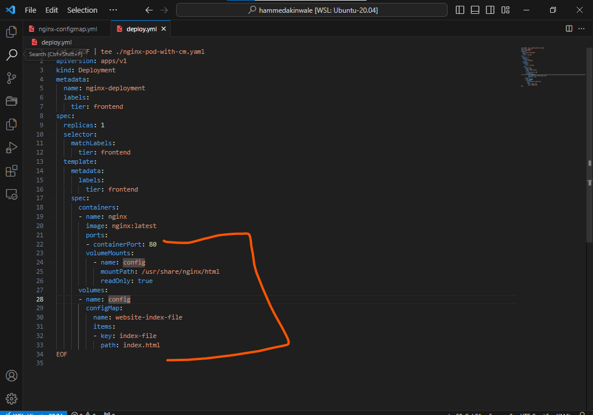

`$ kubectl apply -f deploy.yml`

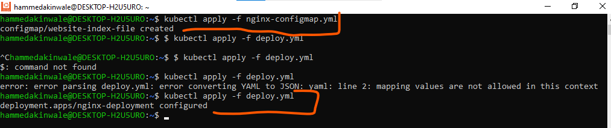

Now the index.html file is no longer ephemeral because it is using a configMap that has been mounted onto the filesystem. This is now evident when you exec into the pod and list the /usr/share/nginx/html directory

`$ ls -ltr  /usr/share/nginx/html`

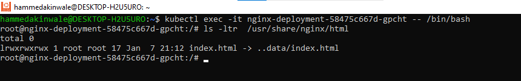

the index.html is now a soft link to ../data.

Accessing the website will have no immediate impact, as it currently loads the same HTML file from the configuration map. However, if you modify the HTML content within the configuration map and subsequently restart the pod, your changes will be preserved.

You can check the available configuration maps by using either of the following commands

`$ kubectl get configmap` OR `$ kubectl get cm`

To modify the ConfigMap, you have two options:

+ You can either update the manifest file

OR

+ Directly edit the Kubernetes object. In this case, we'll choose the latter approach.

To edit the ConfigMap web-index-file using the default system editor, run the following command:

`$ kubectl edit cm website-index-file`

This command will open a text editor, which is typically configured as Vim or your system's default editor. You can now make the desired changes to the content, focusing on modifying only the HTML data section. After making your changes, save the file.

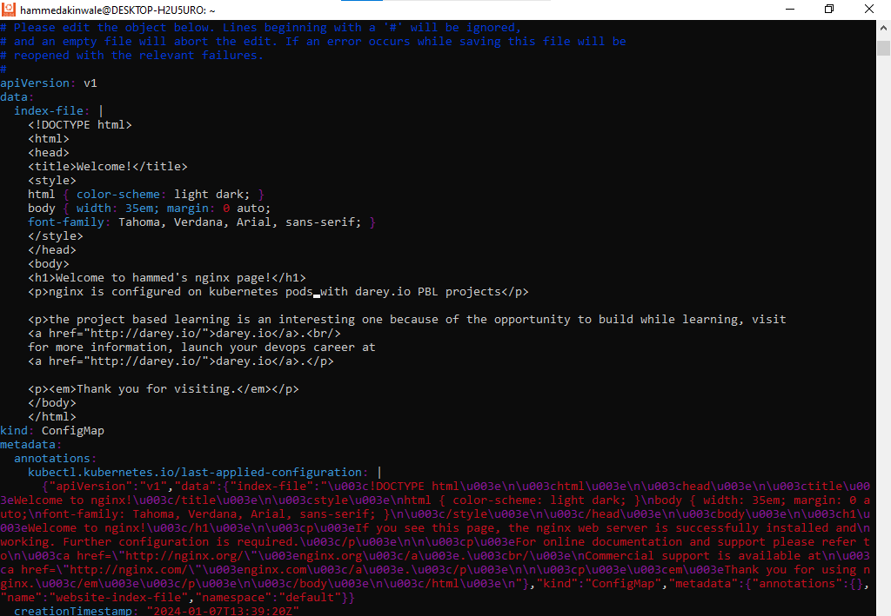
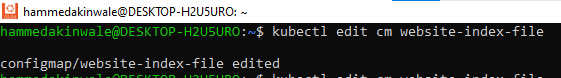

Without restarting the pod, your site should be loaded automatically.

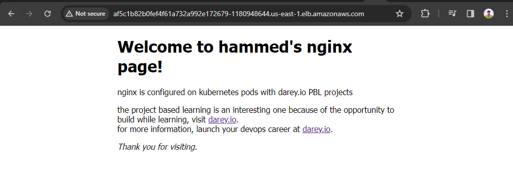

If you wish to restart the deployment for any reason, simply use the command

`$ kubectl rollout restart deploy nginx-deploy`

This will terminate the running pod and spin up a new one.

The content in the browser remains unchanged despite restarting the deployment, which resulted in the termination of the previous pod and the creation of a new one.

To delete the cluster

`$ eksctl delete cluster --name deploy`

