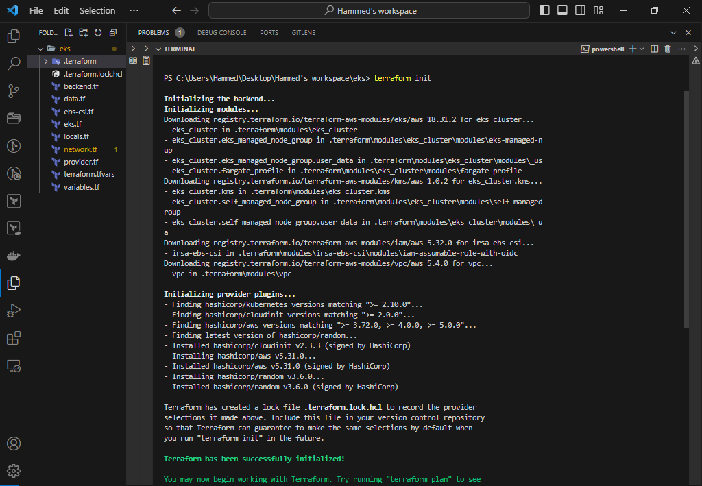

# SETTING UP EKS WITH TERRAFORM & DEPLOYING JENKINS SERVER USING HELM

In this extensive project, our primary emphasis will be on the practical real-world implementation of Kubernetes deployment and management. This involves a series of tasks geared toward guaranteeing the resilience and scalability of our system. The key objectives include:

+ employing Terraform to establish a Kubernetes EKS cluster and dynamically integrate adaptable worker nodes into the system.

+ Furthermore, I intend to deploy multiple applications using HELM, leveraging Kubernetes objects in conjunction with Helm. This approach includes dynamic provisioning of volumes to enable stateful pods.

+ Finally, I will execute the deployment process via CI/CD using Jenkins.

Building EKS with Terraform

Create a directory on your local machine - eks and create an s3 bucket

`$ mkdir eks && cd eks`

`$ aws s3api create-bucket --bucket eks-terraform-deploy --region us-west-1`


Create a file – backend.tf and configured for remote state.

```
terraform {

}
```

Create a file – network.tf and provision Elastic IP for Nat Gateway, VPC, Private and public subnets.

```
# reserve Elastic IP to be used in our NAT gateway
resource "aws_eip" "nat_gw_elastic_ip" {
  vpc = true

  tags = {
    Name            = "${var.cluster_name}-nat-eip"
    iac_environment = var.iac-env-tag
  }
}


module "vpc" {
  source = "terraform-aws-modules/vpc/aws"

  name = "${var.name_prefix}-vpc"
  cidr = var.main_network_block
  azs  = data.aws_availability_zones.available_azs.names

  private_subnets = [
    # this loop will create a one-line list as ["10.0.0.0/20", "10.0.16.0/20", "10.0.32.0/20", ...]
    # with a length depending on how many Zones are available
    for zone_id in data.aws_availability_zones.available_azs.zone_ids :
    cidrsubnet(var.main_network_block, var.subnet_prefix_extension, tonumber(substr(zone_id, length(zone_id) - 1, 1)) - 1)
  ]

  public_subnets = [
    # this loop will create a one-line list as ["10.0.128.0/20", "10.0.144.0/20", "10.0.160.0/20", ...]
    # with a length depending on how many Zones are available
    # there is a zone Offset variable, to make sure no collisions are present with private subnet blocks
    for zone_id in data.aws_availability_zones.available_azs.zone_ids :
    cidrsubnet(var.main_network_block, var.subnet_prefix_extension, tonumber(substr(zone_id, length(zone_id) - 1, 1)) + var.zone_offset - 1)
  ]

  # Enable single NAT Gateway - This is cost effective
  # WARNING: this could create a single point of failure, since we are creating a NAT Gateway in one AZ only
  # feel free to change these options if you need to ensure full Availability without the need of running 'terraform apply'
  # reference: https://registry.terraform.io/modules/terraform-aws-modules/vpc/aws/2.44.0#nat-gateway-scenarios
  enable_nat_gateway     = true
  single_nat_gateway     = true
  one_nat_gateway_per_az = false
  enable_dns_hostnames   = true
  reuse_nat_ips          = true
  external_nat_ip_ids    = [aws_eip.nat_gw_elastic_ip.id]

  # Add VPC/Subnet tags required by EKS
  tags = {
    "kubernetes.io/cluster/${var.cluster_name}" = "shared"
    iac_environment                             = var.iac-env-tag
  }
  public_subnet_tags = {
    "kubernetes.io/cluster/${var.cluster_name}" = "shared"
    "kubernetes.io/role/elb"                    = "1"
    iac_environment                             = var.iac-env-tag
  }
  private_subnet_tags = {
    "kubernetes.io/cluster/${var.cluster_name}" = "shared"
    "kubernetes.io/role/internal-elb"           = "1"
    iac_environment                             = var.iac-env-tag
  }
}
```

The tags added to the subnets is very important. The Kubernetes Cloud Controller Manager (cloud-controller-manager) and AWS Load Balancer Controller (aws-load-balancer-controller) needs to identify the cluster’s. To do that, it querries the cluster’s subnets by using the tags as a filter.

For public and private subnets that use load balancer resources: each subnet must be tagged

```
Key: kubernetes.io/cluster/cluster-name
Value: shared
```

For private subnets that use internal load balancer resources: each subnet must be tagged

```
Key: kubernetes.io/role/internal-elb
Value: 1
```

For public subnets that use internal load balancer resources: each subnet must be tagged

```
Key: kubernetes.io/role/elb
Value: 1
```

Create a file – variables.tf

```
# create some variables
variable "cluster_name" {
  type        = string
  description = "EKS cluster name"
}
variable "iac-env-tag" {
  type        = string
  description = "AWS tag to indicate environment name of each infrastructure object."
}
variable "name_prefix" {
  type        = string
  description = "Prefix to be used on each infrastructure object Name created in AWS."
}
variable "main_network_block" {
  type        = string
  description = "Base CIDR block to be used in our VPC."
}
variable "subnet_prefix_extension" {
  type        = number
  description = "CIDR block bits extension to calculate CIDR blocks of each subnetwork."
}
variable "zone_offset" {
  type        = number
  description = "CIDR block bits extension offset to calculate Public subnets, avoiding collisions with Private subnets."
}
variable "admin_users" {
  type        = list(string)
  description = "List of Kubernetes admins."
}
variable "developer_users" {
  type        = list(string)
  description = "List of Kubernetes developers."
}
variable "asg_instance_types" {
  description = "List of EC2 instance machine types to be used in EKS."
}
variable "autoscaling_minimum_size_by_az" {
  type        = number
  description = "Minimum number of EC2 instances to autoscale our EKS cluster on each AZ."
}
variable "autoscaling_maximum_size_by_az" {
  type        = number
  description = "Maximum number of EC2 instances to autoscale our EKS cluster on each AZ."
}

variable "autoscaling_average_cpu" {
  type        = number
  description = "number of cpu for autoscaling"

}
```

Create a file – data.tf – lists available AZs in the region

```
# get all available AZs in our region
data "aws_availability_zones" "available_azs" {
state = "available"
}
data "aws_caller_identity" "current" {} # used for accesing Account ID and ARN
```

create a file - ebs-csi.tf.

```
data "aws_iam_policy" "ebs_csi_policy" {
  arn = "arn:aws:iam::aws:policy/service-role/AmazonEBSCSIDriverPolicy"
}

module "irsa-ebs-csi" {
  source  = "terraform-aws-modules/iam/aws//modules/iam-assumable-role-with-oidc"
  version = "4.7.0"

  create_role                   = true
  role_name                     = "AmazonEKSTFEBSCSIRole-${var.cluster_name}"
  provider_url                  = module.eks_cluster.oidc_provider
  role_policy_arns              = [data.aws_iam_policy.ebs_csi_policy.arn]
  oidc_fully_qualified_subjects = ["system:serviceaccount:kube-system:ebs-csi-controller-sa"]
}

resource "aws_eks_addon" "ebs-csi" {
  cluster_name             = var.cluster_name
  addon_name               = "aws-ebs-csi-driver"
  service_account_role_arn = module.irsa-ebs-csi.iam_role_arn
  tags = {
    "eks_addon" = "ebs-csi"
    "terraform" = "true"
  }
}
```

Container Storage Interface (CSI) is a standardized interface for container orchestrators like Kubernetes to work with different storage systems, both block and file storage. A CSI driver is a component that enables container orchestrators to interact with specific storage systems or services, such as cloud storage, network-attached storage (NAS), or storage area networks (SAN)

Create a file – eks.tf and provision EKS cluster

```
module "eks_cluster" {
  source  = "terraform-aws-modules/eks/aws"
  version = "~> 18.0"
  cluster_name    = var.cluster_name
  cluster_version = "1.22"
  vpc_id     = module.vpc.vpc_id
  subnet_ids = module.vpc.private_subnets
  cluster_endpoint_private_access = true
  cluster_endpoint_public_access = true

  # Self Managed Node Group(s)
  self_managed_node_group_defaults = {
    instance_type                          = var.asg_instance_types[0]
    update_launch_template_default_version = true
  }
  self_managed_node_groups = local.self_managed_node_groups

  # aws-auth configmap
  create_aws_auth_configmap = true
  manage_aws_auth_configmap = true
  aws_auth_users = concat(local.admin_user_map_users, local.developer_user_map_users)
  tags = {
    Environment = "prod"
    Terraform   = "true"
  }
}
```

To establish local variables in Terraform, you should create a file named locals.tf. Terraform prohibits the direct assignment of variables to other variables, a restriction designed to prevent unnecessary code duplication. To maintain the "Don't Repeat Yourself" (DRY) principle in the Terraform code, it's advisable to utilize locals instead.

```
# render Admin & Developer users list with the structure required by EKS module
locals {
  admin_user_map_users = [
    for admin_user in var.admin_users :
    {
      userarn  = "arn:aws:iam::${data.aws_caller_identity.current.account_id}:user/${admin_user}"
      username = admin_user
      groups   = ["system:masters"]
    }
  ]
  developer_user_map_users = [
    for developer_user in var.developer_users :
    {
      userarn  = "arn:aws:iam::${data.aws_caller_identity.current.account_id}:user/${developer_user}"
      username = developer_user
      groups   = ["${var.name_prefix}-developers"]
    }
  ]

  self_managed_node_groups = {
    worker_group1 = {
      name = "${var.cluster_name}-wg"

      min_size      = var.autoscaling_minimum_size_by_az * length(data.aws_availability_zones.available_azs.zone_ids)
      desired_size      = var.autoscaling_minimum_size_by_az * length(data.aws_availability_zones.available_azs.zone_ids)
      max_size  = var.autoscaling_maximum_size_by_az * length(data.aws_availability_zones.available_azs.zone_ids)
      instance_type = var.asg_instance_types[0].instance_type

      bootstrap_extra_args = "--kubelet-extra-args '--node-labels=node.kubernetes.io/lifecycle=spot'"

      block_device_mappings = {
        xvda = {
          device_name = "/dev/xvda"
          ebs = {
            delete_on_termination = true
            encrypted             = false
            volume_size           = 10
            volume_type           = "gp2"
          }
        }
      }

      use_mixed_instances_policy = true
      mixed_instances_policy = {
        instances_distribution = {
          spot_instance_pools = 4
        }

        override = var.asg_instance_types
      }
    }
  }
}
```

Create a file – terraform.tfvars to set values for variables.

```
cluster_name            = "hammed-eks-tooling"
iac-env-tag             = "development"
name_prefix             = "hammed-eks-tooling"
main_network_block      = "10.0.0.0/16"
subnet_prefix_extension = 4
zone_offset             = 8

# Ensure that these users already exist in AWS IAM. Another approach is that you can introduce an iam.tf file to manage users separately, get the data source and interpolate their ARN.
admin_users                    = ["hammed", "ojo"]
developer_users                = ["akorede", "akinwale"]
asg_instance_types             = [{ instance_type = "t3.medium" }, { instance_type = "t2.medium" }, ]
autoscaling_minimum_size_by_az = 1
autoscaling_maximum_size_by_az = 10
```

Create file – provider.tf

```
provider "aws" {
  region = "us-east-1"
}

provider "random" {
}
```

Open Powershell and run as administrator and install terraform using chocolatey package manager

`$ choco install terraform -y`

Run

`$ terraform init`



`$ Terraform plan`


Create the resources

`$ Terraform apply`

the apply failed at some point


reasonis that for us to connect to the cluster using the kubeconfig, terraform need to connect and set credentials correctly first

to fix these we need to append to:

Append to the file data.tf

```
# get EKS cluster info to configure Kubernetes and Helm providers
data "aws_eks_cluster" "cluster" {
  name = module.eks_cluster.cluster_id
}
data "aws_eks_cluster_auth" "cluster" {
  name = module.eks_cluster.cluster_id
}
```


Append to the file provider.tf


```
# get EKS authentication for being able to manage k8s objects from terraform
provider "kubernetes" {
  host                   = data.aws_eks_cluster.cluster.endpoint
  cluster_ca_certificate = base64decode(data.aws_eks_cluster.cluster.certificate_authority.0.data)
  token                  = data.aws_eks_cluster_auth.cluster.token
}
```


Then run again

`$ terraform init`

`$ Terraform plan`


Then run

`$ terraform apply`


Create kubeconfig file using awscli and connect to the kubectl from terraform workspace and linux machine.

`$ aws eks update-kubeconfig --name hammed-eks-tooling --region us-west-1`


DEPLOY APPLICATIONS WITH HELM

Helm serves as a robust package manager tailored for Kubernetes, the widely embraced open-source container orchestration framework. This tool streamlines the intricate process of deploying and administering applications within Kubernetes clusters. With Helm, you can succinctly define, install, and update even the most intricate Kubernetes applications using a collection of well-organized packages termed "charts."

In practice, We will leverage Helm for deploying the manifest, as opposed to kubectl.

In the real-world scenario, Helm stands out as the preeminent tool for deploying resources within Kubernetes, thanks to its extensive feature set, enabling the bundling of deployments into cohesive units. Instead of juggling multiple YAML files independently, Helm ensures a more organized and efficient approach to managing Kubernetes deployments.

Parameterising YAML manifests using Helm templates

Using Helm templates to parameterize YAML manifests Imagine that you have containerized the Tooling app as an image named "tooling-app" and want to deploy it with Kubernetes. Without Helm, you would have to manually create YAML manifests for the deployment, service and ingress. Then apply them to your Kubernetes cluster using kubectl apply. Initially, your application is at version 1, and the Docker image is labeled as "tooling-app:1.0.0.". A basic deployment manifest might look like this

```
apiVersion: apps/v1
kind: Deployment
metadata:
  name: tooling-app-deployment
  labels:
    app: tooling-app
spec:
  replicas: 3
  strategy: 
    type: RollingUpdate
    rollingUpdate:
      maxUnavailable: 1
  selector:
    matchLabels:
      app: tooling-app
  template:
    metadata:
      labels:
        app: tooling-app
    spec:
      containers:
      - name: tooling-app
        image: "tooling-app:1.0.0"
        ports:
        - containerPort: 80
```

Now, let us consider the scenario where We need to deploy another version of the app, specifically version 1.1.0. If there are no changes required for the service or ingress, the deployment process can be simplified by creating a new version of the deployment manifest. In this new manifest, you would replace the image specified in the 'spec' section with the image of version 1.1.0. Subsequently, you can reapply this modified manifest to the cluster, which will trigger an update of the deployment. This update follows a rolling-update strategy.

However, a notable drawback of this approach is that all the application-specific values, such as labels and image names are intermingled with the low-level, mechanical definition of the deployment manifest.

Helm addresses this issue by separating the configuration of a chart from its fundamental definition. To illustrate, instead of embedding the name of your app or the specific container image within the manifest, Helm allows you to provide these values during the installation of the chart into the cluster.

For instance, a simplified templated version of the previous deployment might resemble the following

```
apiVersion: apps/v1
kind: Deployment
metadata:
  name: {{ .Release.Name }}-deployment
  labels:
    app: "{{ template "name" . }}"
spec:
  replicas: 3
  strategy: 
    type: RollingUpdate
    rollingUpdate:
      maxUnavailable: 1
  selector:
    matchLabels:
      app: "{{ template "name" . }}"
  template:
    metadata:
      labels:
        app: "{{ template "name" . }}"
    spec:
      containers:
      - name: "{{ template "name" . }}"
        image: "{{ .Values.image.name }}:{{ .Values.image.tag }}"
        ports:
        - containerPort: 80
```

This illustration showcases several aspects of Helm templates:

+ The template employs YAML as its foundation, utilizing the {{ }} syntax to specify dynamic sections.

+ Helm offers a range of variables that are populated during installation. For instance, {{.Release.Name}} enables you to modify the resource's name dynamically by using the release name. When you install a Helm chart, it generates a release (a Helm concept, distinct from Kubernetes).

+ You have the flexibility to create helper functions in external files. The {{template "name"}} invocation yields a secure name for the application based on the Helm chart's name, which can be overridden if necessary. Utilizing these helper functions helps minimize redundancy in static values (such as "tooling-app") and reduces the likelihood of typographical errors.

+ You can manually provide runtime configuration. The {{.Values.image.name}} value, for instance, is derived from a predefined set of defaults or from values supplied during the execution of the helm install command. There are various methods to supply the required configuration values for chart installation via Helm. Typically, two approaches are employed:

- A values.yaml file included in the chart itself. This file typically furnishes default configuration values and serves as documentation for the available configuration options.

- When configuring via the command line, you can provide a configuration values file using the -f flag.

setup Helm

According to the [official documentation](https://helm.sh/docs/intro/install/), there are different options to installing Helm

Download the binary

`$ wget https://get.helm.sh/helm-v3.13.1-linux-amd64.tar.gz`


Unarchive

`$ tar -zxvf helm-v3.13.1-linux-amd64.tar.gz`

Find the helm binary in the unpacked directory, and move it to its desired destination to make helm global

`$ sudo mv linux-amd64/helm /usr/local/bin/helm`

verify

`$ helm version`


DEPLOY JENKINS WITH HELM

Utilizing publicly accessible charts to effortlessly employ the requisite tools.

Helm offers a remarkable capability: the ability to deploy pre-packaged applications directly from a public Helm repository with minimal configuration. A prime illustration of this capability is demonstrated when deploying Jenkins

Create a namespace jenkins

`$ kubectl create ns jenkins`

To find pre-packaged applications in the form of Helm Charts, visit the [Artifact Hub](https://artifacthub.io/packages/search).

Search for Jenkins.

Integrate the repository with Helm to simplify the download and deployment process.

`$ helm repo add jenkins https://charts.jenkins.io`

Update helm repo

`$ helm repo update`


Install the chart in the namespace created earlier

`$ helm install jenkins jenkins/jenkins -n jenkins`

Check the helm deployment

`$ helm ls`


Get the pod

`$ kubectl get pods -n jenkins`


We can watch the pods get created by running  the command

`$ watch -x kubectl get pod -n jenkins`

The watch command is used to periodically execute another command and display its output in a continuously updating format. In this case, I am using it with kubectl to monitor the status of resources in a Kubernetes cluster.

Describe the pod

`$ kubectl describe pod jenkins-0 -n jenkins`


Check the logs of the running pod

`$ kubectl logs jenkins-0 -n jenkins`


__Managing kubeconfig files__

Kubectl expects to find the default kubeconfig file in the location ~/.kube/config. But what if you already have another cluster using that same file? It doesn’t make sense to overwrite it. What you will do is to merge all the kubeconfig files together using a kubectl plugin called konfig and select whichever one you need to be active.

Install a package manager for kubectl called krew so it will enable us install plugins to extend the functionality of kubectl. Read more about it [here](https://krew.sigs.k8s.io/docs/user-guide/setup/install/).

Make sure that git is installed.

Run this command to download and install krew:

```
(
  set -x; cd "$(mktemp -d)" &&
  OS="$(uname | tr '[:upper:]' '[:lower:]')" &&
  ARCH="$(uname -m | sed -e 's/x86_64/amd64/' -e 's/\(arm\)\(64\)\?.*/\1\2/' -e 's/aarch64$/arm64/')" &&
  KREW="krew-${OS}_${ARCH}" &&
  curl -fsSLO "https://github.com/kubernetes-sigs/krew/releases/latest/download/${KREW}.tar.gz" &&
  tar zxvf "${KREW}.tar.gz" &&
  ./"${KREW}" install krew
)
```


Add the $HOME/.krew/bin directory to your PATH environment variable. To do this, update your .bashrc or .zshrc file and append the following line:

`$ export PATH="${KREW_ROOT:-$HOME/.krew}/bin:$PATH"`

and restart the shell to check the installation

`$ kubectl krew version`


Install the [konfig plugin](https://github.com/hammedakinwale/konfig-plugin)

`$ kubectl krew install konfig`


it will be available as kubectl konfig so check the version with
`$ kubectl konfig version`


Context refers to a set of configuration details that determine which Kubernetes cluster and namespace you are currently interacting with. Contexts are used to manage multiple Kubernetes clusters and namespaces and switch between them easily. They are particularly helpful when you are working with multiple clusters, such as development, staging, and production environments, or when you need to switch between different namespaces within a cluster.

A Kubernetes context typically includes the following information:

Cluster: This specifies the details of the Kubernetes cluster you want to work with. It includes the cluster's API server address, certificate authority data, and the cluster name.

User: This defines the user's credentials, such as a client certificate and private key or an authentication token.

Namespace: This specifies the default namespace to use within the cluster. The namespace is where your Kubernetes resources, such as pods, services, and deployments, will be created unless you specify otherwise.

You can use the kubectl command-line tool to manage contexts. Here are some common kubectl commands related to contexts:

List available contexts:

`$ kubectl config get-contexts`

Switch to a different context:

`$ kubectl config use-context context-name`

Display the current context. This will let you know the context in which you are using to interact with Kubernetes.

`$ kubectl config current-context`


Contexts are useful for managing and switching between different Kubernetes environments and avoiding accidental changes to the wrong cluster or namespace. They help streamline your workflow when dealing with complex Kubernetes configurations and multiple clusters or namespaces.

Accessing the Jenkins UI From the output we got when we installed the jenkins using helm.


Set up the jenkins through the UI, we need to get the admin password

`$ kubectl exec --namespace jenkins -it svc/jenkins -c jenkins -- /bin/cat /run/secrets/additional/chart-admin-password && echo`

Accessing the jenkins through the UI, we need to port forward.

`$ kubectl --namespace jenkins port-forward svc/jenkins 8080:8080`


Port forwarding in Kubernetes is a way to access a specific port of a container running within a Kubernetes cluster from outside the cluster. It allows you to establish a temporary network connection from your local machine or another system to a specific port of a pod in the Kubernetes cluster, enabling you to interact with the application or service running in that pod. Port forwarding is commonly used for debugging, testing, or accessing services that are not exposed publicly.

Go to the browser and access the Jenkins using 127.0.0.1:8080 or localhost:8080


