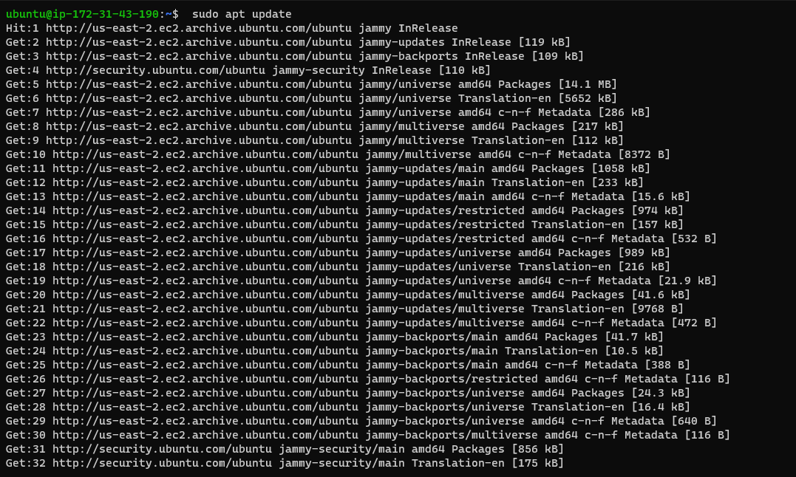
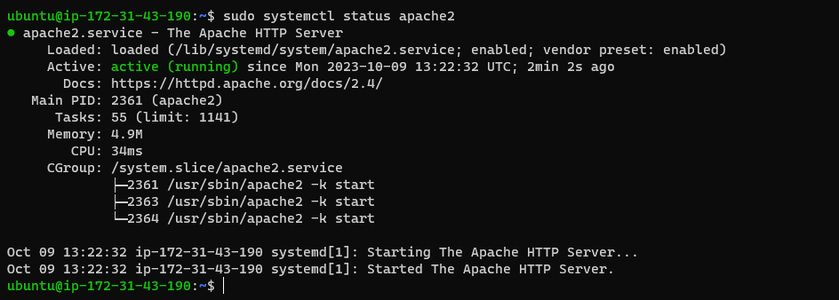

# WEB STACK IMPLEMENTATION (LAMP STACK) IN AWS)
## LAMP STACK IMPLEMENTATION (Linux, Apache, MySQL and PHP)
## PREREQUISITES
+ Cloud Service Providers - AWS, Azure, GCP etc.
+ Launch a Linux Instance (Ubuntu preferably).
+ Priot knowlwdge on how to SSH into a virtual host.

## STEP 1 - INSTALLING APACHE AND UPDATING IT FIREWALL.
we can install apache using Ubuntu's package manager called.

`apt`

Update list of packages in package manager.

`sudo apt update`

when promped type Y to confirm update

### first



### second


Run Apache2 package installation.

`sudo apt install apache2`

when promted pess Y to confirm installation.


After running the above processes, we need to verify that apache2 is running as a service in our OS. To do that we use this command below:

`sudo systemctl status apache2`



before we can recieve any traffic by our server, we need to open TCP port 80 the default port web browsers use to access web pages on the internet.

as we know we have TCP 22 opened on our EC2 machine to access it via SSH, so we need to add a rule to EC2 configuration to open inbound connection through port 80

as Our server is running and we can access it locally and from the internet. Now we need to check how we can access it locally from our  ubuntu shell. To do that we use the command below:

`curl http://localhost:80` or `curl http://127.0.0.1:80`


Now, it's time to test how our Apache HTTP server can respond to requests from the internet, to do so we go to any browser and use the URL below;

`http://<Public-IP-Address>:80`


another way To get the ip address other than checking it on our AWS Web console, we use the command below:

`curl -s http://169.254.169.254/latest/meta-data/public-ipv4`


## STEP 2 - INSTALLING MySQL [DATABASE MANAGEMENT SYSTEM]

We will install MySQL using using Ubuntu's package manager.

`sudo apt install mysql-server`

when prompted confirm installation by typing Y and enter.


After installation, we log in to the MySQL console by typing command below:

`sudo mysql`


It is also recommended to run a security script that comes pre-installed with the MySQL. Before running the script, we have to set a password for the root user, using mysql_native_password as default authentication method. To do that the command below is used;

`ALTER USER 'root'@'localhost' IDENTIFIED WITH mysql_native_password BY 'PassWord.1';`


An exit with `exit`


After running the security script, we'll have to start the interactive script by running the command below:

`sudo mysql_secure_installation`


When finished with the script process, we have to test if we're able to log in to the MySQL console by typing the command below:

`sudo mysql -p`


Then we exit the console the command below:

`exit`


## STEP 3 - INSTALLING PHP.

To install php and other packages together use the command below:

`sudo apt install php libapache2-mod-php php-mysql`


Once the installation is finished, we have to check the PHP version by using the command below:

`php -v`


## STEP 4 - CREATING A VIRTUAL HOST FOR THE WEBSITE USING APACHE

as our installation of lamp is copleted we will have to set up a proper [APACHE VIRTUAL HOST](https://httpd.apache.org/docs/2.4/vhosts/) to hold our website files and folders, to be able to have multiple websites on a single machine and users the website won't have to notice it

We'll set up a domain called projectlamp using the command below:

`sudo mkdir /var/www/projectlamp`


Next we assign ownership of the directory user using the command below:

`sudo chown -R $USER:$USER /var/www/projectlamp`


Next we will assign ownership of the directory user using the command below;

`sudo chown -R $USER:$USER /var/www/projectlamp`


Then we create and open a new configuration file in Apache's site-available directory using the command below:

`sudo vi /etc/apache2/sites-available/projectlamp.conf`

And paste the following command in the file:

<VirtualHost *:80>

```
ServerName projectlamp

ServerAlias <www.projectlamp>

ServerAdmin webmaster@localhost

DocumentRoot /var/www/projectlamp

ErrorLog ${APACHE_LOG_DIR}/error.log

CustomLog ${APACHE_LOG_DIR}/access.log combined
```


Then we use the ls command to show the new file in the present directory:

`sudo ls /etc/apache2/sites-available`


Now, we enable the new virtual host using the command below:

`sudo a2ensite projectlamp`


Next we  disable apache's default website using the command below:

`sudo a2dissite 000-default`


in order to make sure our configuration file doesn't contain syntax errors, we use the command below:

`sudo apache2ctl configtest`


Finally, we will have to reload apache so the changes can take effect using the command below:

`sudo systemctl reload apache2`


After that, we go to our browser to confirm if the website is now active.

After all that, we will go to our browser to confirm if the website is now live.

## STEP 5 - ENABLE PHP ON THE WEBSITE.

To do this we have to change the default behaviour by editing the dir.conf file using the command below:

`sudo vim /etc/apache2/mods-enabled/dir.conf`

from this 


to this


After saving and closing the file, we'll have to reload apache so the changes can take effect by using the command below:

`sudo systemctl reload apache2`


lastly we will create a php script to test that it is correctly installed and configured on our server using the command below:

`vim /var/www/projectlamp/index.php`

And paste in the following scrpts:

**<?php

phpinfo();**

When done with everything we go the browser to refresh the page and a page similar to this will be displayed:


Lastly after we have checked the relevant informations, it is best to remove the file created cause it contains sensitive information about our PHP environment and Ubuntu server. To do so, we use the below command:

`sudo rm /var/www/projectlamp/index.php`

