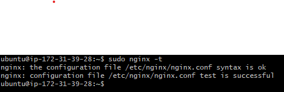
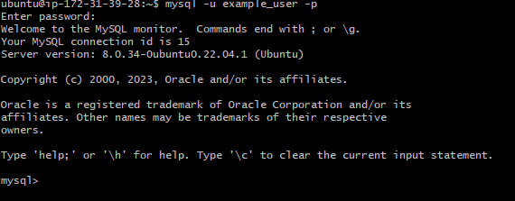
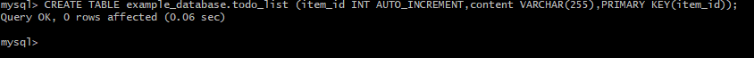

# WEB STACK IMPLEMENTATION [LEMP STACK]

**HINT** : in previuos project we used putty on windows to connect to our EC2 instance, but there is a simpler way that do not require conversion of .pem Key to .ppk using git bash and run the following commen:

`ssh -i <Your-Private-Key.pem> ubuntu@<EC2-public-IP-address>`


## STEP 1 - INSTALLING THE NGINX SERVER

To install nginx, we use the apt package manager by typing the command below:

`sudo apt install nginx`


To confirm that nginx was successfully installed and running as a service in Ubuntu, run the command below:

`sudo systemctl status nginx`


Now we will check if we can access it locally through our Ubuntu shell using the coomand below:

first of all go to aws console to add http rule:

`$ curl http://localhost:80 or $ curl http://127.0.0.1:80`


you can also check your ip address in ubuntu instead of going to aws console with the below command:

`curl -s http://169.254.169.254/latest/meta-data/public-ipv4`


then we go to the browser to check confirm if nginx is successfully installed with the below **URL**

`http://<Public-IP-Address>:80`


the above webpage will be display if the web server is inatall successfully.

## STEP 2 - INSTALLING MySQL.

To install mysql, we use the apt package manager by typing the command below:

`sudo apt install mysql-server`


When mysql installation is finished, log in to the mysql console with the command below:

`sudo mysql`


Then we run a security script that removes insecure default settings and we will set a password for the root user before running the script. To set the password for the root user, we run the scroipt below:

`ALTER USER 'root'@'localhost' IDENTIFIED WITH mysql_native_password BY 'PassWord.1';`


Then we exit the MySQL shell with the command below:

`exit`


After that, then we run the interactive script with the command below:

`sudo mysql_secure_installation`


When finished then we test if we are able to log in to the MySQL console with the command below:

`sudo mysql -p`


exit with the command below:

`exit`


## STEP 3 - INSTALLING PHP

We will install php-fpm and php-mysql by using the apt package manager by running the command below:

`sudo apt install php-fpm php-mysql`


## STEP 4 - CONFIGURING NGINX TO USE PHP PROCESSOR

Before we start, we will create the root web directory for our_domain with the command below:

`sudo mkdir /var/www/projectLEMP`


Next, we will asign the ownership of the directory by running:

`sudo chown -R $USER:$USER /var/www/projectLEMP`


Then we open a new configuration file in Nginx's `sites-available` directory by running the command below:

`sudo nano /etc/nginx/sites-available/projectLEMP`

And pasting pasting in the below bare-bones configurations:

```
#/etc/nginx/sites-available/projectLEMP

server {
        listen 80; server_name projectLEMP <www.projectLEMP>;
        root /var/www/projectLEMP;

        index index.html index.htm index.php;

        location / {
        try_files $uri $uri/ =404;
        }
        location ~ \.php$ {
                include snippets/fastcgi-php.conf;
                fastcgi_pass unix:/var/run/php/php8.1-fpm.sock;
        }
        location ~ /\.ht {
                deny all;
        }
}

```


After that wewill activate our configuration by linking to the config file from Nginx's sites-enabled directory by running the command below:

`sudo ln -s /etc/nginx/sites-available/projectLEMP /etc/nginx/sites-enabled/`


Then we test our configuration for any syntax errors with the command below:

`sudo nginx -t `



Then we also need to disable default Nginx host that is currently configured to listen on port 80, for this run the command below:

`sudo unlink /etc/nginx/sites-enabled/default`


We will reload NGINX to apply these changes and then check that everything is working correctly with the command below:

`sudo systemctl reload nginx`


Now we will create an index.html file in the /var/www/projectLEMP directory to test that our new server block works as expected and echo the following scripts in it:

`sudo echo 'Hello LEMP from hostname' $(curl -s http://169.254.169.254/latest/meta-data/public-hostname) 'with public IP' $(curl -s http://169.254.169.254/latest/meta-data/public-ipv4) > /var/www/projectLEMP/index.html`


and then we will go to the browser and open our website URL using its IP address with the below **URL** :

`http://<Public-IP-Address>:80`


## STEP 5 - TESTING PHP WITH NGINX

at this point our lemp stack is completely installed and fully operational.
we can test it to validate that Nginx can correctly han.php of to our php processor.

We can do this by creating a test PHP file in document root by running the script below:

`nano /var/www/projectLEMP/info.php`

Add the following scripts into it:

`<?php phpinfo();`


Then we can access the page in the browser by visiting the public address followed by /info.php. Then a web page containing detailed information about the server will be displayed:


After checking the relevant information about the PHP server through that page, it is best to remove the file created as it contains sensitive informations by running the command below:

`sudo rm /var/www/your_domain/info.php`


## STEP 6 - RETRIEVING DATA FROM MySQL DATABASE WITH PHP.

First of all we will connect to the MySQL console using the root account by running the command below:


Then we will create a new database, by running the command below:

`CREATE DATABASEexample_database;`


Next, we will create a new user name `example_user` and grant him full privileges on the database just created and password. To do so, run with the command below:

`CREATE USER 'example_user'@'%' IDENTIFIED WITH mysql_native_password BY 'PassWord.1';`


Now we need to give the newly created user permission over the database by running the command below:

`GRANT ALL ON example_database.* TO 'example_user'@'%';`


Then we will exit with the command below:

`exit`


Then we will test if the new user has proper permissions by using the command below:

`mysql -u example_user -p`



Now, we'll create a table named todo_list with the command below:

`CREATE TABLE example_database.todo_list (item_id INT AUTO_INCREMENT,content VARCHAR(255),PRIMARY KEY(item_id));`



After creating the table, we might want to add a few rows in the test table by running this command and repeating it with different values:

`INSERT INTO example_database.todo_list (content) VALUES ("My first important item");`


To confirm that the data was successfully saved to the table we will run the command below:

`SELECT * FROM example_database.todo_list;`


After confirming we will exit with:

`exit`


Now we can create a PHP script that will connect to MySQL and query for our content and pasting the below content into the todo_list.php by running the command below:

`nano /var/www/projectLEMP/todo_list.php`


Then we can access the page in our web browser by pasting the public IP address followed by /todo_list.php:

