# **INTRODUCTION TO SHELL SCRIPTING AND USER INPUT**

## **SHELL SCRIPTING SYNTAX ELEMENTS**

**1.VARIABLES:** Variables are used to store data of different types such as numbers, string and arrays. We can assign a value to a variable using the = operator and access the value using the variable name preceeded by a $ sign.

+ To assign value to a variable we uses the command below:

`name="John"`

+ we retrieve the value from the variable with command below:

`echo $name`

**1.CONTROL FLOW:** Control flow statements allow us to make decision, iterate over list, and execute different commands based on conditions.

Using if-else to execute script based on conditions with the script below:

```
#!/bin/bash

# Example script to check if a number is positive, negative, or zero

read -p "Enter a number: " num

if [ $num -gt 0 ]; then
    echo "The number is positive."
elif [ $num -lt 0 ]; then
    echo "The number is negative."
else
    echo "The number is zero."
fi
```

The code above prompts the user to input a number, and then prints the statement stating whether the number is positive or negative.

+ Iterating through a list using a for loop with script below:

```#!/bin/bash

# Example script to print numbers from 1 to 5 using a for loop

for (( i=1; i<=5; i++ ))
do
    echo $i
done
```

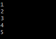

**3. COMMAND SUBSTITUTION** Command substitution allows us to capture the output of a command and use it as a value within our script. We can use the backtick or the $() syntax for command substitution.

+ Using backtick for command substitution;

```
current_date=`date +%Y-%m-%d`
```
## OR

+ Using $() syntax for command substitution;

`current_date=$(date +%Y-%m-%d)`

**4. INPUT AND OUTPUT**

To accept user input, we use the read command, output text to the console using the echo command. Additionally we can redirect input and output using operators like > (send output to a file), < (get input from a file) and | (pipe the output of one command as input to another)

+ Accept user input with command below:

```
echo "Enter your name:"
```
`read name`

The above command prompts the user to input a name, and display the result on the terminal.

+ Output text to the terminal with the command below:

```
echo "Hello World"
```

+ Output the result of a command into a file with the command below:

`echo "hello world" > index.txt`

+ Pass the content of a file as an input to a command with command below:

`grep "pattern" < input.txt`

+ Pass the result of a command as an input to another command with the command below:

`echo "hello world" | grep "pattern"`

**5. FUNCTIONS**

Functions are used to modularize codes and make it more reusable, we can define a function using the function keyword or simply by declaring the function name followed by parentheses.

```
#!/bin/bash

# Define a function to greet the user
greet() {
    echo "Hello, $1! Nice to meet you."
}

# Call the greet function and pass the name as an argument
greet "John"
```

## WRITING OUR FIRST SHELL SCRIPT

**Step 1:** On the terminal we will create a folder called shell-scripting using the command mkdir shell-scripting.

**STEP 2:** We then create a new file called user-input.sh using the command touch user-input.sh.

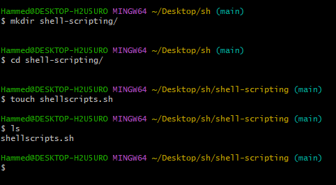


**STEP 3:** After creating, copy and paste the scripts below into the file:

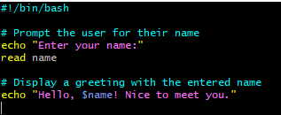

**STEP 4:** Save the file

**STEP 5:** Run the following command `sudo chmod +x user-input.sh` to make the file executable.


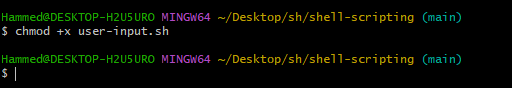

**STEP 6:** To run the script, we use the command `./user-input.sh`.

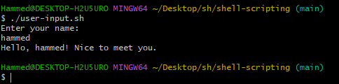

## DIRECTORY MANIPULATION AND NAVIGATION.

**STEP 1:** Create a file named `navigating-linux-filesystem.sh`.


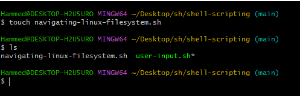

**STEP 2:** Paste the script below in the file;

```#!/bin/bash

# Display current directory
echo "Current directory: $PWD"

# Create a new directory
echo "Creating a new directory..."
mkdir my_directory
echo "New directory created."

# Change to the new directory
echo "Changing to the new directory..."
cd my_directory
echo "Current directory: $PWD"

# Create some files
echo "Creating files..."
touch file1.txt
touch file2.txt
echo "Files created."

# List the files in the current directory
echo "Files in the current directory:"
ls

# Move one level up
echo "Moving one level up..."
cd ..
echo "Current directory: $PWD"

# Remove the new directory and its contents
echo "Removing the new directory..."
rm -rf my_directory
echo "Directory removed."

# List the files in the current directory again
echo "Files in the current directory:"
ls
```

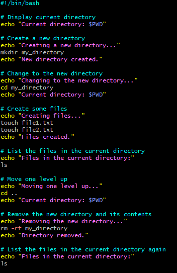

**STEP 3:** Then we make the file executable by running `sudo chmod +x navigating-linux-filesystem.sh`.


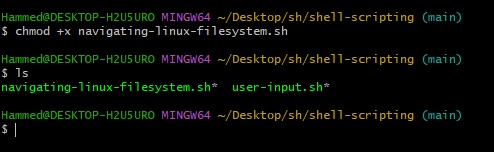

**STEP 4:** To run the script, use the command; `./navigating-linux-filesystem.sh`.

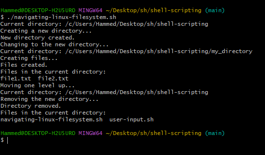

## FILE OPERATIONS AMD SORTING

**STEP 1:** we will Create another shellscript file called `sorting.sh`.

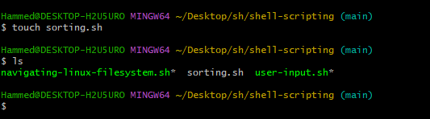

**STEP 2:** Copy and paste the block of code in the newly created file:

```#!/bin/bash

# Create three files
echo "Creating files..."
echo "This is file3." > file3.txt
echo "This is file1." > file1.txt
echo "This is file2." > file2.txt
echo "Files created."

# Display the files in their current order
echo "Files in their current order:"
ls

# Sort the files alphabetically
echo "Sorting files alphabetically..."
ls | sort > sorted_files.txt
echo "Files sorted."

# Display the sorted files
echo "Sorted files:"
cat sorted_files.txt

# Remove the original files
echo "Removing original files..."
rm file1.txt file2.txt file3.txt
echo "Original files removed."

# Rename the sorted file to a more descriptive name
echo "Renaming sorted file..."
mv sorted_files.txt sorted_files_sorted_alphabetically.txt
echo "File renamed."

# Display the final sorted file
echo "Final sorted file:"
cat sorted_files_sorted_alphabetically.txt
```

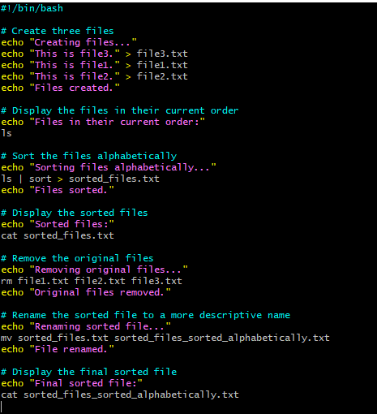

STEP 3: Set the file permision to be executable using the command `sudo chmod +x sorting.sh.`

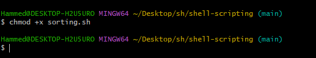

**STEP 4.** Run the script using the command `./sorting.sh`.

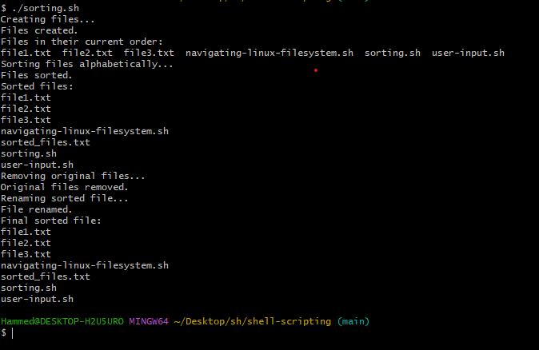

## WORKING WITH NUMBERS AND CALCULATIONS.

**STEP 1:** We create a new file called `calculations.sh`.

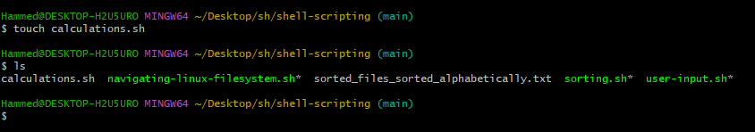

**STEP 2:** Copy and paste block of code in the file.

```#!/bin/bash

# Define two variables with numeric values
num1=10
num2=5

# Perform basic arithmetic operations
sum=$((num1 + num2))
difference=$((num1 - num2))
product=$((num1 * num2))
quotient=$((num1 / num2))
remainder=$((num1 % num2))

# Display the results
echo "Number 1: $num1"
echo "Number 2: $num2"
echo "Sum: $sum"
echo "Difference: $difference"
echo "Product: $product"
echo "Quotient: $quotient"
echo "Remainder: $remainder"

# Perform some more complex calculations
power_of_2=$((num1 ** 2))
square_root=$(awk "BEGIN{ sqrt=$num2; print sqrt }")

# Display the results
echo "Number 1 raised to the power of 2: $power_of_2"
echo "Square root of number 2: $square_root"
```


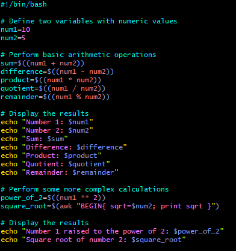

**STEP 3:** Make it an executable with the command `sudo chmod +x calculations.sh.`

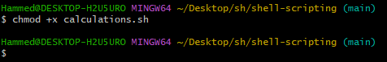

**STEP 4:** to run the script you can type `./calculations.sh` into your terminal.

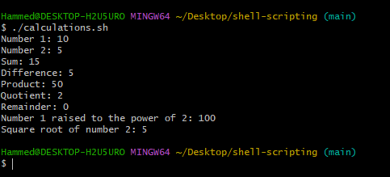

## FILE BACKUP AND TIMESTAMPING.

**STEP 1:** create a file named `backup.sh`.

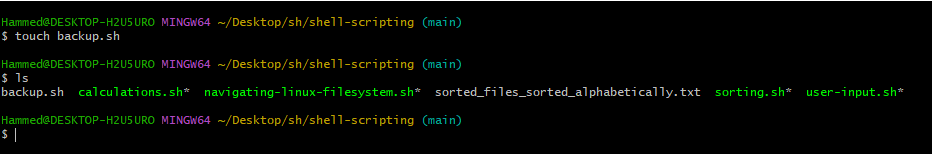

**STEP 2:** Copy and paste the following block of codes into the file.

```#!/bin/bash

# Define the source directory and backup directory
source_dir="/path/to/source_directory"
backup_dir="/path/to/backup_directory"

# Create a timestamp with the current date and time
timestamp=$(date +"%Y%m%d%H%M%S")

# Create a backup directory with the timestamp
backup_dir_with_timestamp="$backup_dir/backup_$timestamp"

# Create the backup directory
mkdir -p "$backup_dir_with_timestamp"

# Copy all files from the source directory to the backup directory
cp -r "$source_dir"/* "$backup_dir_with_timestamp"

# Display a message indicating the backup process is complete
echo "Backup completed. Files copied to: $backup_dir_with_timestamp"
```

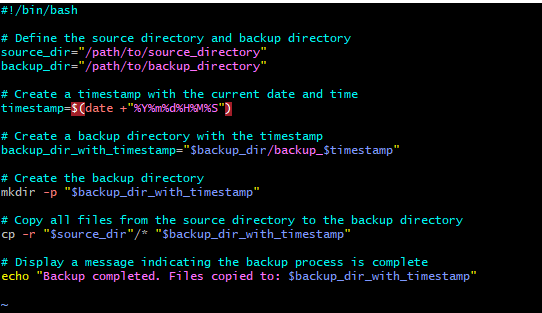

**STEP 3:** Set execute permission on the file using `sudo chmod +x backup.sh`.

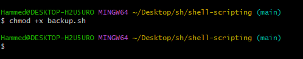

**STEP 4:** Run the the script with the command below:

`./backup.sh`

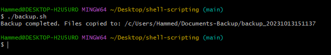