# UNDERSTANDING CLIENT-SERVER ARCHITECTURE

## Client Server Architecture With MySQL

### What is client-server architecture?

Client-server refers to an Architecture in which two or more computers are connected over a network to send and receive request s between each other.

In their communication, each machine has its own role The machine sending the request is referred to as the **CLIENT** and the machine responding(serving) is referred to as the **SERVER**.

## IMPLEMENTING CLIENT-SERVER ARCHITECTURE USING MYSQL DATABASE MANAGEMENT SYSTEM (DBMS)

### To demonstrate basic client-server using MySQL RDBMS

**To create and configure two linux based Virtual servers(EC2 instances on AWS)**

**1.** create two servers:

+ Server A name `mysql-server` for the serving machine
+ Server B name `mysql-client` for the requesting machine

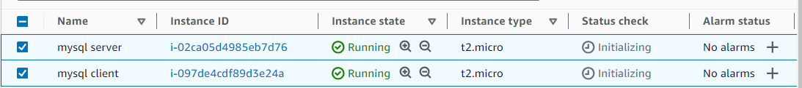

**2.** Connect to the `mysql-server` 

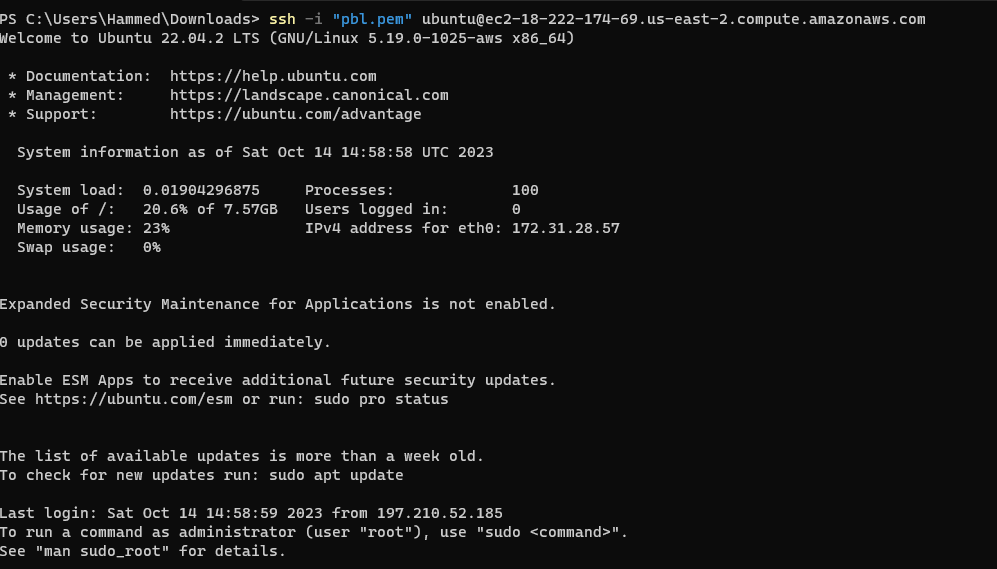

**3.** And Install` mysql-client` software with the command below:

`sudo apt install mysql-client`

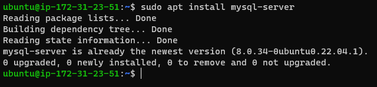

Connect to the `mysql-client` 

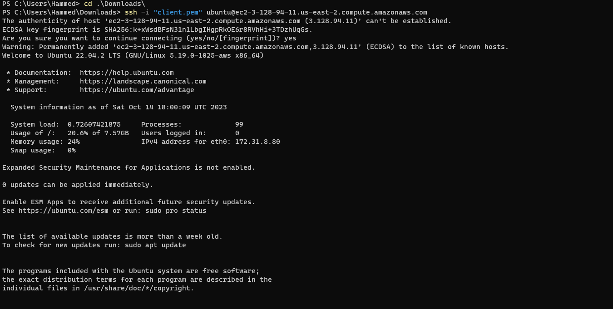

+ And Install MySQL software with the command below:

`sudo apt install mysql-server`

**enable mysql service with `sudo systemctl enable mysql`**

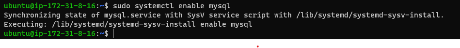

+ install Mysql for the client server with `sudo apt install mysql-client`

**enable mysql service with `sudo systemctl enable mysql`**

**4.** By default both EC2 virtual servers are located in the same local virtual network. for to be able tocommunicate with each other using the local **IP ADRRESS** 

To use **mysql-server** local Ip address to connect from the client

Change the inbound rule to TCP to port 3306 and connect to Clients **Private Ip address**

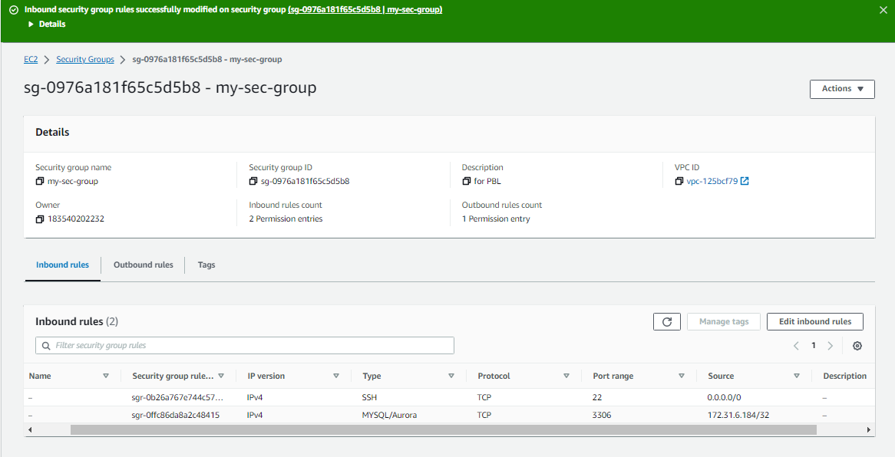

**5.** To connect Client to Server We  need to first of all run the mysql security script `sudo mysql_secure-installation` and configure MySQL-Server to allow connection from remote host with the command below on server console.

` sudo vi /etc/mysql/mysql.conf.d/mysqld.cnf ` and change the value of nind-address to `0.0.0.0` to enable connection from any ip adress.

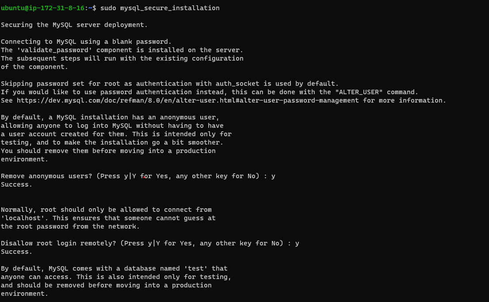

then restart mysql with `sudo systemctl restart mysql`

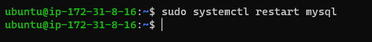

## **AND**

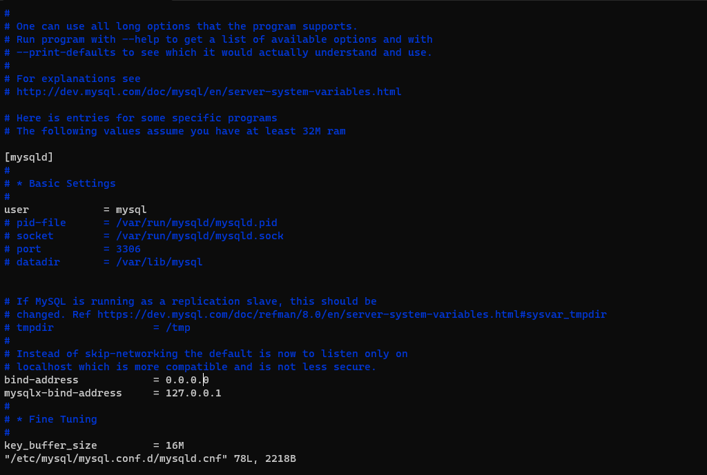

**6.** To Run connect the client-mysql to the Server-mysql without using SSH

Run the code below to create a user called Client and the user should be identified by a password PassWord.2 on the MySQL-Server

Run the code below to create a user called Client and the user should be identified by a password `PassWord.2` on the `MySQL-Server`.

log in with the command belwo:

`sudo mysql`

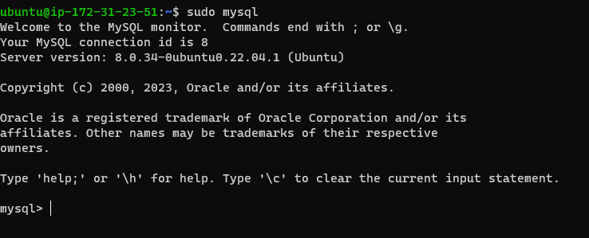

we will create user with  `CREATE USER 'Data_user'@'%' IDENTIFIED WITH mysql_native_password BY 'PassWord.2';
` in mysql console and run.

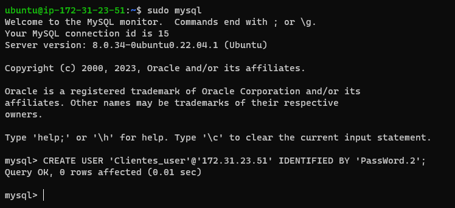

next we will create data base with `CREATE DATABASE test_db;`.

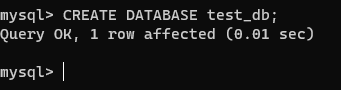

then grant permision to `Data-user` with the below command.

`GRANT ALL ON test_db.* TO 'Data_user'@'%' WITH GRANT OPTION;`

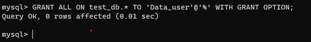

## **AND**
`FLUSH PRIVILEGES;`

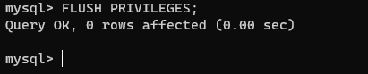

**7.** Then From the client server run `mysql -u Data_user -h ,private ip address> -p`.

**8.** we will check if we have successfully connected to the server with command below.

`show databases;`

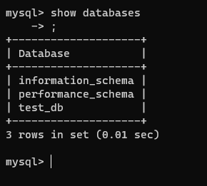

