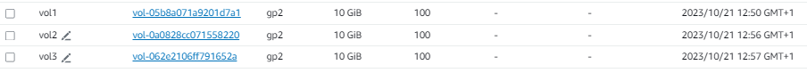
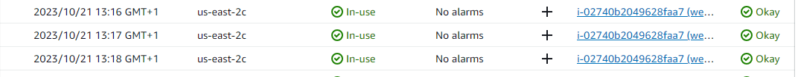
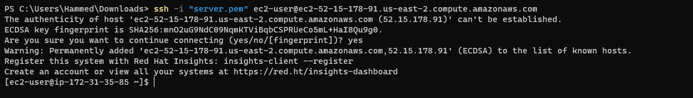
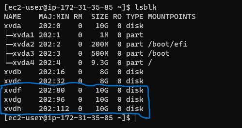
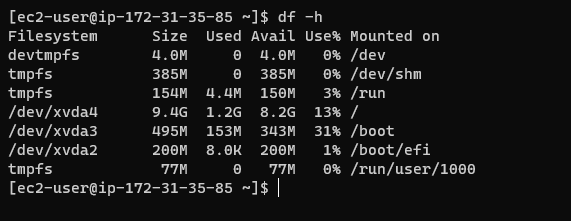
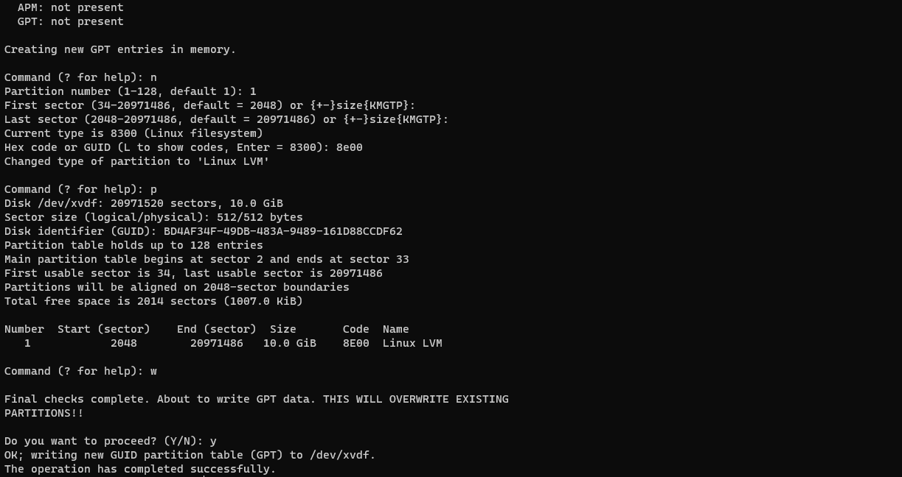

# Implementing Wordpress Website With LVM

## **STEP 1.** Preparing Web Server

**1.** Launch an EC2 instance that will server as "Web server". Create 3 volumes in the same AZ as your Web Server EC2, each of 10GB.

+ Attach all volumes to the web server EC2 instance

+ SSH into webserver EC2 instance

+ and view the disks attached to the instance with `lsblk` command.

+ use `df -h` To see all mounts and free spaces on the server

use `gdisk` to create single partitions on each volume on the server.

