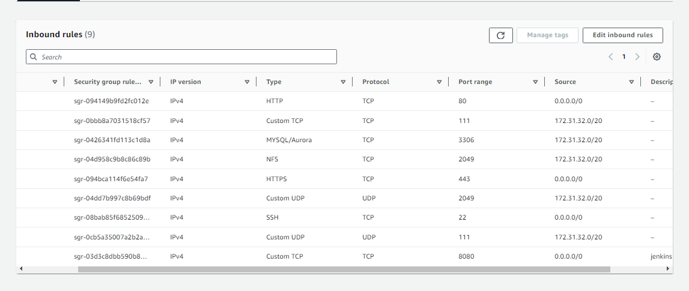

## pipeline script

```
pipeline {
    agent any
    
    tools {
        maven "maven3"
        jdk "jdk17"
    }
    
    environment{
        SCANNER_HOME= tool "sonar-scanner"
    }

    stages {
        stage('Git checkout') {
            steps {
                git 'https://github.com/hammedakinwale/ci-cd-project.git'
                
            }
        }
        
        stage('Compile') {
            steps {
                sh "mvn compile"
            }
        }
        
        stage('Tests') {
            steps {
                sh "mvn test"
            }
        }
        
        stage('Sonarqube Analysis') {
            steps {
                withSonarQubeEnv('sonar') {
                    sh ''' $SCANNER_HOME/bin/sonar-scanner -Dsoner.projectName=sona \
                     -Dsonar.projectKey=sona -Dsonar.java.binaries=. '''

                }
            }
        }
        
        stage('Owasp Scan') {
            steps {
                dependencyCheck additionalArguments: ' --scan ./ ', odcInstallation: 'DC'
                dependencyCheckPublisher pattern: '**/dependency-check-report.xml'
            }
        }
        
        stage('Build Application') {
            steps {
                sh "mvn package"
            }
        }
        
        stage('Build Docker Image') {
            steps {
                script{
                    withDockerRegistry(credentialsId: 'docker-cred', toolName: 'docker') {
                        sh "docker build -t sona:latest ."
                    }
                }
            }
        }
        
         
        stage('Tag & Push Docker Image') {
            steps {
                script{
                    withDockerRegistry(credentialsId: 'docker-cred', toolName: 'docker') {
                        sh "docker tag  sona:latest hammedakinwale/sona:latest"
                        sh "docker push hammedakinwale/sona:latest"
                    }
                }
            }
        }
        
        stage('Deploy Application') {
            steps {
                script{
                    withDockerRegistry(credentialsId: 'docker-cred', toolName: 'docker') {
                        sh "docker run -d -p 8081:8080 hammedakinwale/sona:latest"
                    }
                }
            }
        }
    }
}
```